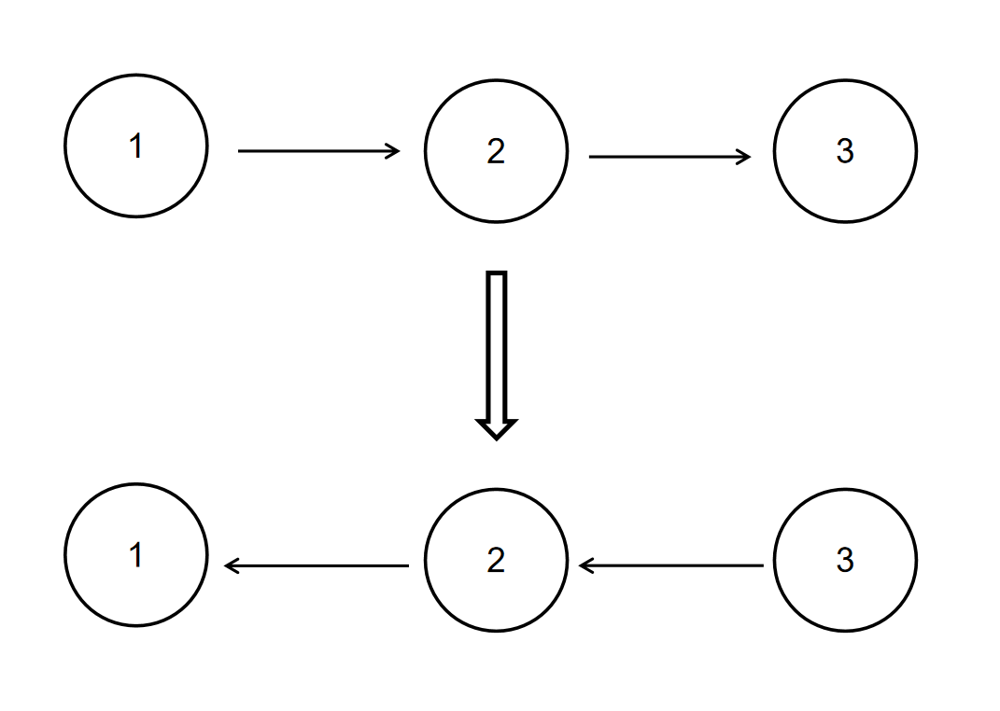

# 反转链表

描述
给定一个单链表的头结点pHead(该头节点是有值的，比如在下图，它的val是1)，长度为n，反转该链表后，返回新链表的表头。

数据范围： `0≤n≤1000`

要求：空间复杂度 `O(1)`

时间复杂度: `O(n)` 

如当输入链表`{1,2,3}`时，经反转后，原链表变为`{3,2,1}`，所以对应的输出为`{3,2,1}`。

以上转换过程如下图所示：



**示例1**

```
输入：{1,2,3}
输出：{3,2,1}
```

**示例2**

```
输入：{}
返回值：{}
说明：空链表则输出空  
```

**解析**

Go 递归实现反转链表 解题思路：

- 递归找到根节点
- 根节点指向上一个节点
- 删除上一个节点的Next
- 返回根节点

**参考**

```go
package main

type ListNode struct{
   Val int
   Next *ListNode
}
func ReverseList(head *ListNode) *ListNode {
    // write code here
	var prev *ListNode

    for head != nil {
	    next := head.Next // 记录下一个节点
		head.Next = prev // 将当前节点指向上一个节点
		prev = head //移动上一个节点
		head = next // 继续
    }
	return prev
}

```