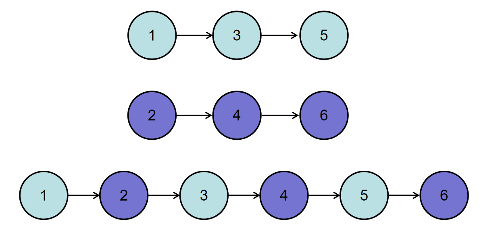
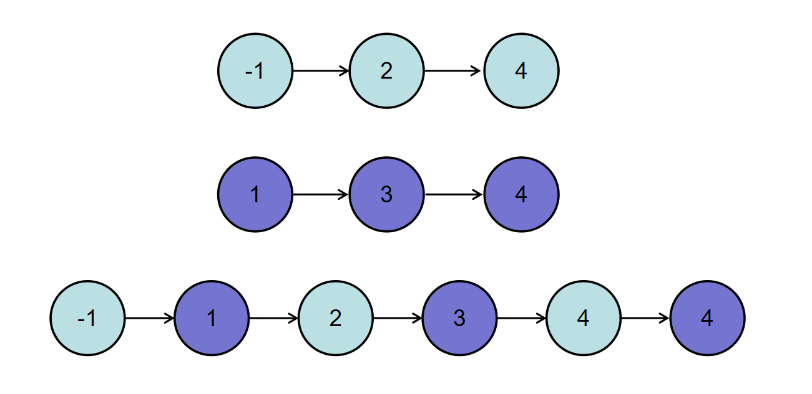

# 合并两个排序的链表

## 描述

输入两个递增的链表，单个链表的长度为n，合并这两个链表并使新链表中的节点仍然是递增排序的。

数据范围：`0≤n≤1000`，`−1000≤节点值≤1000`

要求：空间复杂度 `O(1)`， 时间复杂度 `O(n)`

如输入`{1,3,5}`,`{2,4,6}`时，合并后的链表为`{1,2,3,4,5,6}`，所以对应的输出为`{1,2,3,4,5,6}`，转换过程如下图所示：



或输入`{-1,2,4}`,`{1,3,4}`时，合并后的链表为`{-1,1,2,3,4,4}`，所以对应的输出为`{-1,1,2,3,4,4}`，转换过程如下图所示：



## 示例1

```text
输入： {1,3,5},{2,4,6}
返回值：{1,2,3,4,5,6}
```


## 示例2

```text
输入：{},{}
返回值：{}
```

## 示例3

```text
输入：{-1,2,4},{1,3,4}
返回值：{-1,1,2,3,4,4}
```

## 代码示例

```go
// Merge 合并两个已按升序排序的单链表，并返回合并后的新表头。
// pHead1: 第一个链表的头节点（可能为 nil）
// pHead2: 第二个链表的头节点（可能为 nil）
//
// 算法复杂度：
//   时间复杂度 O(n + m)，其中 n 和 m 分别为两个链表的长度。
//   空间复杂度 O(1)，在原链表上重用节点，不额外申请新节点。
func Merge(pHead1 *ListNode, pHead2 *ListNode) *ListNode {
    // 若其中一个链表为空，直接返回另一个
    if pHead1 == nil {
        return pHead2
    }
    if pHead2 == nil {
        return pHead1
    }

    // 哨兵节点（Dummy Head），用于简化链表头处理逻辑
    dummy := &ListNode{}
    cur := dummy

    // 当两个链表都未遍历完时，每次取较小值接到 cur 后面
    for pHead1 != nil && pHead2 != nil {
        if pHead1.Val <= pHead2.Val {
            cur.Next = pHead1
            pHead1 = pHead1.Next
        } else {
            cur.Next = pHead2
            pHead2 = pHead2.Next
        }
        cur = cur.Next
    }

    // 处理剩余的链表部分：两者最多只会有一个非空
    if pHead1 != nil {
        cur.Next = pHead1
    } else if pHead2 != nil {
        cur.Next = pHead2
    }

    // dummy.Next 为真正的合并后链表头节点
    return dummy.Next
}

```
