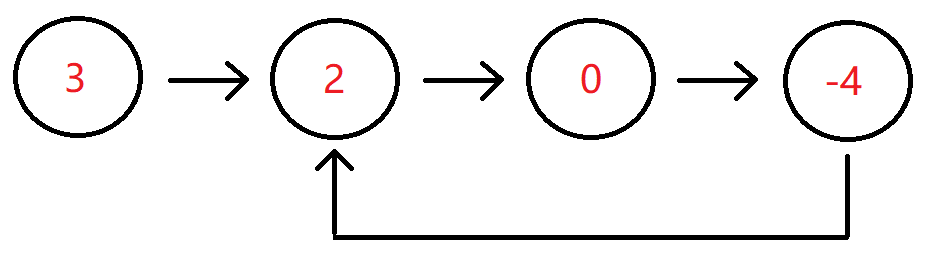

# 判断链表中是否有环


## 描述

判断给定的链表中是否有环。如果有环则返回true，否则返回false。

数据范围：链表长度`0≤n≤10000`，链表中任意节点的值满足 `∣val∣<=100000`

要求：空间复杂度`O(1)`，时间复杂度`O(n)`

输入分为两部分，第一部分为链表，第二部分代表是否有环，然后将组成的head头结点传入到函数里面。-1代表无环，其它的数字代表有环，这些参数解释仅仅是为了方便读者自测调试。实际在编程时读入的是链表的头节点。

例如输入`{3,2,0,-4},1`时，对应的链表结构如下图所示：



可以看出环的入口结点为从头结点开始的第1个结点（注：头结点为第0个结点），所以输出true。

## 示例1

```text
输入：{3,2,0,-4},1
返回值：true
说明：第一部分{3,2,0,-4}代表一个链表，第二部分的1表示，-4到位置1（注：头结点为位置0），即-4->2存在一个链接，组成传入的head为一个带环的链表，返回true           

```


## 示例2

```text
输入： {1},-1
返回值：false
说明：第一部分{1}代表一个链表，-1代表无环，组成传入head为一个无环的单链表，返回false        
```

## 示例3

```text
输入：{-1,-7,7,-4,19,6,-9,-5,-2,-5},6
返回值：true
```

## 示例

```go
/**
 * 判断链表中是否存在环（Floyd 判圈算法）
 *
 * @param head *ListNode 链表头节点
 * @return bool 是否存在环
 *
 * 算法说明：
 *   使用快慢指针（Floyd Cycle Detection）来判断链表是否成环。
 *   - slow 每次走一步
 *   - fast 每次走两步
 *   若 fast 能追上 slow，则链表存在环。
 *
 * 时间复杂度：O(n)
 * 空间复杂度：O(1)
 */
func hasCycle(head *ListNode) bool {
    // 空链表或只有一个节点一定无环
    if head == nil || head.Next == nil {
        return false
    }

    slow := head
    fast := head

    // fast 和 fast.Next 必须同时非空，否则 fast.Next.Next 会 panic
    for fast != nil && fast.Next != nil {
        slow = slow.Next          // 慢指针走一步
        fast = fast.Next.Next     // 快指针走两步

        // 若快慢指针相遇，说明存在环
        if slow == fast {
            return true
        }
    }

    // fast 到达尾部，无环
    return false
}

```