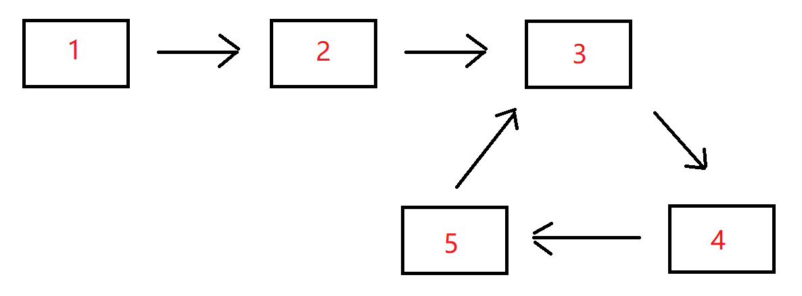

# 链表中环的入口结点

## 描述

给一个长度为n链表，若其中包含环，请找出该链表的环的入口结点，否则，返回null。

数据范围：`n≤10000`， `1<=结点值<=10000`

要求：空间复杂度`O(1)`，时间复杂度`O(n)`

例如，输入`{1,2},{3,4,5}`时，对应的环形链表如下图所示：



可以看到环的入口结点的结点值为3，所以返回结点值为3的结点。

**输入描述：**

输入分为2段，第一段是入环前的链表部分，第二段是链表环的部分，后台会根据第二段是否为空将这两段组装成一个无环或者有环单链表

**返回值描述：**

返回链表的环的入口结点即可，我们后台程序会打印这个结点对应的结点值；若没有，则返回对应编程语言的空结点即可。

## 示例1

```text
输入：{1,2},{3,4,5}
返回值：3
说明：返回环形链表入口结点，我们后台程序会打印该环形链表入口结点对应的结点值，即3   
```

## 示例2

```text
输入：{1},{}
返回值："null"
说明：没有环，返回对应编程语言的空结点，后台程序会打印"null"   
```

## 示例3

```text
输入：{},{2}
返回值：2
说明：环的部分只有一个结点，所以返回该环形链表入口结点，后台程序打印该结点对应的结点值，即2   
```

## 解析答案

要找到链表环的入口节点，需要在 **判断有环之后** 再执行一段经典的 Floyd cycle algorithm 扩展步骤。下面给你一个**工程级、面试必过、解释最清晰的版本**。

核心思想是：

1. **第一次相遇**（slow == fast）后，说明链表有环。
2. 将其中一个指针（通常 slow）**移回链表头**。
3. slow 和 fast 之后都每次走一步。
4. **第二次相遇的节点，就是环的入口节点。**

下面是代码以及深入解释。

```go
/**
 * 返回链表环的入口节点。
 * 若无环则返回 nil。
 *
 * 算法分两阶段：
 * 1. Floyd 快慢指针确认是否有环。
 * 2. 若有环，slow 回到头节点，slow 和 fast 都按一步前进，
 *    再次相遇处即为环的入口。
 *
 * 时间复杂度：O(n)
 * 空间复杂度：O(1)
 */
func detectCycle(head *ListNode) *ListNode {
    if head == nil || head.Next == nil {
        return nil
    }

    slow, fast := head, head

    // 阶段 1：判断是否有环
    found := false
    for fast != nil && fast.Next != nil {
        slow = slow.Next
        fast = fast.Next.Next
        if slow == fast {             // 第一次相遇，确认有环
            found = true
            break
        }
    }

    if !found {
        return nil                    // 无环，直接返回
    }

    // 阶段 2：查找环入口
    // 将 slow 指针移回头部，然后 slow 和 fast 同步（一步一步）前进
    slow = head
    for slow != fast {
        slow = slow.Next
        fast = fast.Next
    }

    return slow                       // 相遇节点即环入口
}
```

---

## 为什么这样能找到入口？

假设：

* 链表起点到环入口距离为 a
* 环内入口到第一次相遇点距离为 b
* 环的总长度为 c
* slow 每次走 1，fast 每次走 2

第一次相遇时：

```
slow 走了 a + b
fast 走了 a + b + k*c  （k 是 fast 绕环的圈数）
```

因为 fast 速度是 slow 的 2 倍：

```
2(a + b) = a + b + k*c
a + b = k*c
a = k*c - b
```

也就是：

> slow 从头走 a 步
> fast 从相遇点走 k*c-b，也就是再走 c-b 步（正好回到环入口）

因此 slow、fast 再次相遇的位置就是入口。
