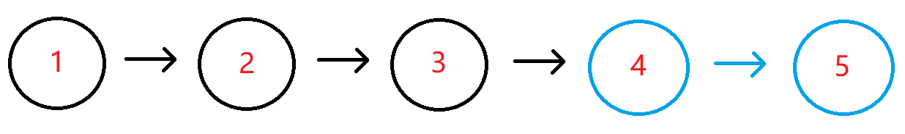

# 链表中倒数最后k个结点

## 描述

输入一个长度为 n 的链表，设链表中的元素的值为 ai ，返回该链表中倒数第k个节点。

如果该链表长度小于k，请返回一个长度为 0 的链表。

数据范围：`0≤n≤10^5`，`0≤ai≤10^9`,`0≤k≤10^9`

要求：空间复杂度`O(n)`，时间复杂度`O(n)`

进阶：空间复杂度`O(1)`，时间复杂度`O(n)`

例如输入`{1,2,3,4,5},2`时，对应的链表结构如下图所示：



其中蓝色部分为该链表的最后2个结点，所以返回倒数第2个结点（也即结点值为4的结点）即可，系统会打印后面所有的节点来比较。

## 示例1

```text
输入：{1,2,3,4,5},2
返回值：{4,5}
说明：返回倒数第2个节点4，系统会打印后面所有的节点来比较。
```

## 示例2

```text
输入：{2},8
返回值：{}
```

## 解析

```go
/**
 * FindKthToTail 返回链表的倒数第 k 个节点。
 * 若 k 超出链表长度或链表为空，则返回 nil。
 *
 * 算法思想：双指针（前后指针法）
 *   1. fast 先向前移动 k 步，使 fast 与 slow 相距 k。
 *   2. 接着 fast 和 slow 一起向前移动，直到 fast 到达链表末尾(nil)。
 *   3. 此时 slow 正好位于倒数第 k 个位置。
 *
 * 时间复杂度：O(n)，仅遍历一次链表。
 * 空间复杂度：O(1)，只使用两个指针。
 */
func FindKthToTail(pHead *ListNode, k int) *ListNode {
    // k 必须大于 0，否则倒数第 k 个节点是无意义的
    if pHead == nil || k <= 0 {
        return nil
    }

    slow := pHead
    fast := pHead

    // 步骤 1：先让 fast 向前走 k 步
    // 若 fast 在 k 步内提前到 nil，说明 k > 链表长度，没有倒数第 k 个节点
    for i := 0; i < k; i++ {
        if fast == nil {
            return nil
        }
        fast = fast.Next
    }

    // 步骤 2：fast、slow 同步向前走，直到 fast 到达末尾
    // 由于 fast 比 slow 多走了 k，最终 slow 停在倒数第 k 个节点
    for fast != nil {
        slow = slow.Next
        fast = fast.Next
    }

    return slow
}
```

---

### 深度解析

假设链表长度为 n，倒数第 k 个节点实际位置是：

```
从头走 (n - k) 步
```

但我们并不想遍历两次链表，所以引入**双指针法**。

### 核心思想

1. fast 先走 k 步
   这使得 `fast` 和 `slow` 之间的距离固定为 k。

2. fast、slow 同时移动
   当 fast 移动到末尾 (`nil`) 时：

```
fast 走了 n 步
slow 走了 n - k 步
```

slow 位置正好是倒数第 k 个节点。

### 示例图（直观理解）

链表：

```
1 → 2 → 3 → 4 → 5
```

找倒数第 k=2 个节点 → 4

步骤：

fast 先走 k=2 步：

```
slow = 1, fast = 3
```

然后一起走：

```
slow=2 fast=4
slow=3 fast=5
slow=4 fast=nil  ← 停止
```

slow 即倒数第 2 个节点。
