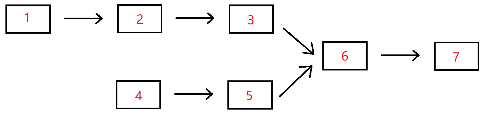

# 两个链表的第一个公共结点

## 描述

输入两个无环的单向链表，找出它们的第一个公共结点，如果没有公共节点则返回空。（注意因为传入数据是链表，所以错误测试数据的提示是用其他方式显示的，保证传入数据是正确的）

数据范围：`n≤1000`

要求：空间复杂度`O(1)`，时间复杂度`O(n)`

例如，输入`{1,2,3},{4,5},{6,7}`时，两个无环的单向链表的结构如下图所示：



可以看到它们的第一个公共结点的结点值为6，所以返回结点值为6的结点。

**输入描述：**

输入分为是3段，第一段是第一个链表的非公共部分，第二段是第二个链表的非公共部分，第三段是第一个链表和第二个链表的公共部分。 后台会将这3个参数组装为两个链表，并将这两个链表对应的头节点传入到函数FindFirstCommonNode里面，用户得到的输入只有pHead1和pHead2。

**返回值描述：**

返回传入的pHead1和pHead2的第一个公共结点，后台会打印以该节点为头节点的链表。


## 示例1

```text
输入：{1,2,3},{4,5},{6,7}
返回值：{6,7}
说明：第一个参数{1,2,3}代表是第一个链表非公共部分，第二个参数{4,5}代表是第二个链表非公共部分，最后的{6,7}表示的是2个链表的公共部分
这3个参数最后在后台会组装成为2个两个无环的单链表，且是有公共节点的        
```
  
## 示例2

```text
输入：{1},{2,3},{}
返回值：{}
说明：2个链表没有公共节点 ,返回null，后台打印{}       
```


## 详细解析

```go
/**
 * FindFirstCommonNode 找出两个单链表的第一个公共节点。
 *
 * 思想（双指针法）：
 *   p1 从 pHead1 出发，p2 从 pHead2 出发。
 *   两个指针每次走一步。
 *   当某个指针走到链表末尾(nil)，就切换到另一个链表的头部继续走。
 *
 * 为什么有效？
 *   假设两链表长度分别为：
 *       A 的长度 = a + c
 *       B 的长度 = b + c
 *   且 c 是公共部分长度。
 *   则：
 *       p1 走的路径 = a + c + b
 *       p2 走的路径 = b + c + a
 *   两者总长度相同，因此一定会在公共节点相遇（或同时为 nil）。
 *
 * 时间复杂度：O(a + b)
 * 空间复杂度：O(1)
 */
func FindFirstCommonNode(pHead1 *ListNode, pHead2 *ListNode) *ListNode {
    if pHead1 == nil || pHead2 == nil {
        return nil
    }

    p1 := pHead1
    p2 := pHead2

    // 两个指针最后会一起到达公共节点或一起到达 nil
    for p1 != p2 {
        // 若走完链表1，则切换到链表2
        if p1 == nil {
            p1 = pHead2
        } else {
            p1 = p1.Next
        }

        // 若走完链表2，则切换到链表1
        if p2 == nil {
            p2 = pHead1
        } else {
            p2 = p2.Next
        }
    }

    return p1
}
```

---

### 原理图解

假设：

```
链表1：A1 → A2 → C1 → C2 → C3
链表2：B1 → B2 → B3 → C1 → C2 → C3
```

p1 路径：

```
A1 → A2 → C1 → C2 → C3 → B1 → B2 → B3 → C1
```

p2 路径：

```
B1 → B2 → B3 → C1 → C2 → C3 → A1 → A2 → C1
```

两个指针在 **C1** 处相遇。

如果无公共节点：

p1 和 p2 都会在最后走完全长并同时变成 `nil`，循环结束返回 nil。
