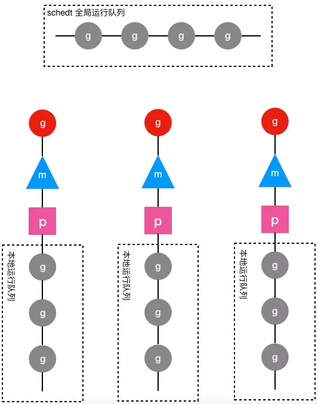

# goroutine调度器概述

## goroutine简介

goroutine是Go语言实现的用户态线程，主要用来解决操作系统线程太“重”的问题，所谓的太重，主要表现在以下两个方面：

- 创建和切换太重：操作系统线程的创建和切换都需要进入内核，而进入内核所消耗的性能代价比较高，开销较大；
- 内存使用太重：一方面，为了尽量避免极端情况下操作系统线程栈的溢出，内核在创建操作系统线程时默认会为其分配一个较大的栈内存（虚拟地址空间，内核并不会一开始就分配这么多的物理内存），然而在绝大多数情况下，系统线程远远用不了这么多内存，这导致了浪费；另一方面，栈内存空间一旦创建和初始化完成之后其大小就不能再有变化，这决定了在某些特殊场景下系统线程栈还是有溢出的风险。

而相对的，用户态的goroutine则轻量得多：

- goroutine是用户态线程，其创建和切换都在用户代码中完成而无需进入操作系统内核，所以其开销要远远小于系统线程的创建和切换；
- goroutine启动时默认栈大小只有2k，这在多数情况下已经够用了，即使不够用，goroutine的栈也会自动扩大，同时，如果栈太大了过于浪费它还能自动收缩，这样既没有栈溢出的风险，也不会造成栈内存空间的大量浪费。

正是因为Go语言中实现了如此轻量级的线程，才使得我们在Go程序中，可以轻易的创建成千上万甚至上百万的goroutine出来并发的执行任务而不用太担心性能和内存等问题。

**注意：** 为了避免混淆，从现在开始，后面出现的所有的线程一词均是指操作系统线程，而goroutine我们不再称之为什么什么线程而是直接使用goroutine这个词。

## 线程模型与调度器

第一章讨论操作系统线程调度的时候我们曾经提到过，goroutine建立在操作系统线程基础之上，它与操作系统线程之间实现了一个多对多(M:N)的两级线程模型。

这里的 M:N 是指M个goroutine运行在N个操作系统线程之上，内核负责对这N个操作系统线程进行调度，而这N个系统线程又负责对这M个goroutine进行调度和运行。

所谓的对goroutine的调度，是指程序代码按照一定的算法在适当的时候挑选出合适的goroutine并放到CPU上去运行的过程，这些负责对goroutine进行调度的程序代码我们称之为goroutine调度器。用极度简化了的伪代码来描述goroutine调度器的工作流程大概是下面这个样子：

```go
// 程序启动时的初始化代码
......
for i := 0; i < N; i++ { // 创建N个操作系统线程执行schedule函数
    create_os_thread(schedule) // 创建一个操作系统线程执行schedule函数
}

//schedule函数实现调度逻辑
func schedule() {
   for { //调度循环
         // 根据某种算法从M个goroutine中找出一个需要运行的goroutine
         g := find_a_runnable_goroutine_from_M_goroutines()
         run_g(g) // CPU运行该goroutine，直到需要调度其它goroutine才返回
         save_status_of_g(g) // 保存goroutine的状态，主要是寄存器的值
    }
}
```

这段伪代码表达的意思是，程序运行起来之后创建了N个由内核调度的操作系统线程（为了方便描述，我们称这些系统线程为工作线程）去执行shedule函数，而schedule函数在一个调度循环中反复从M个goroutine中挑选出一个需要运行的goroutine并跳转到该goroutine去运行，直到需要调度其它goroutine时才返回到schedule函数中通过save_status_of_g保存刚刚正在运行的goroutine的状态然后再次去寻找下一个goroutine。

需要强调的是，这段伪代码对goroutine的调度代码做了高度的抽象、修改和简化处理，放在这里只是为了帮助我们从宏观上了解goroutine的两级调度模型，具体的实现原理和细节将从本章开始进行全面介绍。

## 调度器数据结构概述

第一章我们讨论操作系统线程及其调度时还说过，可以把内核对系统线程的调度简单的归纳为：在执行操作系统代码时，内核调度器按照一定的算法挑选出一个线程并把该线程保存在内存之中的寄存器的值放入CPU对应的寄存器从而恢复该线程的运行。

万变不离其宗，系统线程对goroutine的调度与内核对系统线程的调度原理是一样的，实质都是通过保存和修改CPU寄存器的值来达到切换线程/goroutine的目的。

因此，为了实现对goroutine的调度，需要引入一个数据结构来保存CPU寄存器的值以及goroutine的其它一些状态信息，在Go语言调度器源代码中，这个数据结构是一个名叫g的结构体，它保存了goroutine的所有信息，该结构体的每一个实例对象都代表了一个goroutine，调度器代码可以通过g对象来对goroutine进行调度，当goroutine被调离CPU时，调度器代码负责把CPU寄存器的值保存在g对象的成员变量之中，当goroutine被调度起来运行时，调度器代码又负责把g对象的成员变量所保存的寄存器的值恢复到CPU的寄存器。

要实现对goroutine的调度，仅仅有g结构体对象是不够的，至少还需要一个存放所有（可运行）goroutine的容器，便于工作线程寻找需要被调度起来运行的goroutine，于是Go调度器又引入了schedt结构体，一方面用来保存调度器自身的状态信息，另一方面它还拥有一个用来保存goroutine的运行队列。因为每个Go程序只有一个调度器，所以在每个Go程序中schedt结构体只有一个实例对象，该实例对象在源代码中被定义成了一个共享的全局变量，这样每个工作线程都可以访问它以及它所拥有的goroutine运行队列，我们称这个运行队列为全局运行队列。

既然说到全局运行队列，读者可能猜想到应该还有一个局部运行队列。确实如此，因为全局运行队列是每个工作线程都可以读写的，因此访问它需要加锁，然而在一个繁忙的系统中，加锁会导致严重的性能问题。于是，调度器又为每个工作线程引入了一个私有的局部goroutine运行队列，工作线程优先使用自己的局部运行队列，只有必要时才会去访问全局运行队列，这大大减少了锁冲突，提高了工作线程的并发性。在Go调度器源代码中，局部运行队列被包含在p结构体的实例对象之中，每一个运行着go代码的工作线程都会与一个p结构体的实例对象关联在一起。

除了上面介绍的g、schedt和p结构体，Go调度器源代码中还有一个用来代表工作线程的m结构体，每个工作线程都有唯一的一个m结构体的实例对象与之对应，m结构体对象除了记录着工作线程的诸如栈的起止位置、当前正在执行的goroutine以及是否空闲等等状态信息之外，还通过指针维持着与p结构体的实例对象之间的绑定关系。于是，通过m既可以找到与之对应的工作线程正在运行的goroutine，又可以找到工作线程的局部运行队列等资源。下面是g、p、m和schedt之间的关系图：



上图中圆形图案代表g结构体的实例对象，三角形代表m结构体的实例对象，正方形代表p结构体的实例对象，其中红色的g表示m对应的工作线程正在运行的goroutine，而灰色的g表示处于运行队列之中正在等待被调度起来运行的goroutine。

从上图可以看出，每个m都绑定了一个p，每个p都有一个私有的本地goroutine队列，m对应的线程从本地和全局goroutine队列中获取goroutine并运行之。

前面我们说每个工作线程都有一个m结构体对象与之对应，但并未详细说明它们之间是如何对应起来的，工作线程执行的代码是如何找到属于自己的那个m结构体实例对象的呢？

如果只有一个工作线程，那么就只会有一个m结构体对象，问题就很简单，定义一个全局的m结构体变量就行了。可是我们有多个工作线程和多个m需要一一对应，怎么办呢？还记得第一章我们讨论过的线程本地存储吗？当时我们说过，线程本地存储其实就是线程私有的全局变量，这不正是我们所需要的吗？！只要每个工作线程拥有了各自私有的m结构体全局变量，我们就能在不同的工作线程中使用相同的全局变量名来访问不同的m结构体对象，这完美的解决我们的问题。

具体到goroutine调度器代码，每个工作线程在刚刚被创建出来进入调度循环之前就利用线程本地存储机制为该工作线程实现了一个指向m结构体实例对象的私有全局变量，这样在之后的代码中就使用该全局变量来访问自己的m结构体对象以及与m相关联的p和g对象。

有了上述数据结构以及工作线程与数据结构之间的映射机制，我们可以把前面的调度伪代码写得更丰满一点：

```go
// 程序启动时的初始化代码
......
for i := 0; i < N; i++ { // 创建N个操作系统线程执行schedule函数
     create_os_thread(schedule) // 创建一个操作系统线程执行schedule函数
}


// 定义一个线程私有全局变量，注意它是一个指向m结构体对象的指针
// ThreadLocal用来定义线程私有全局变量
ThreadLocal self *m
//schedule函数实现调度逻辑
func schedule() {
    // 创建和初始化m结构体对象，并赋值给私有全局变量self
    self = initm()  
    for { //调度循环
          if (self.p.runqueue is empty) {
                 // 根据某种算法从全局运行队列中找出一个需要运行的goroutine
                 g := find_a_runnable_goroutine_from_global_runqueue()
           } else {
                 // 根据某种算法从私有的局部运行队列中找出一个需要运行的goroutine
                 g := find_a_runnable_goroutine_from_local_runqueue()
           }
          run_g(g) // CPU运行该goroutine，直到需要调度其它goroutine才返回
          save_status_of_g(g) // 保存goroutine的状态，主要是寄存器的值
     }
}
```


仅仅从上面这个伪代码来看，我们完全不需要线程私有全局变量，只需在schedule函数中定义一个局部变量就行了。但真实的调度代码错综复杂，不光是这个schedule函数会需要访问m，其它很多地方还需要访问它，所以需要使用全局变量来方便其它地方对m的以及与m相关的g和p的访问。

在简单的介绍了Go语言调度器以及它所需要的数据结构之后，下面我们来看一下Go的调度代码中对上述的几个结构体的定义。

## 重要的结构体

下面介绍的这些结构体中的字段非常多，牵涉到的细节也很庞杂，光是看这些结构体的定义我们没有必要也无法真正理解它们的用途，所以在这里我们只需要大概了解一下就行了，看不懂记不住都没有关系，随着后面对代码逐步深入的分析，我们也必将会对这些结构体有越来越清晰的认识。为了节省篇幅，下面各结构体的定义略去了跟调度器无关的成员。另外，这些结构体的定义全部位于Go语言的源代码路径下的[runtime/runtime2.go](https://github.com/golang/go/blob/master/src/runtime/runtime2.go)文件之中。

### stack结构体

stack结构体主要用来记录goroutine所使用的栈的信息，包括栈顶和栈底位置：

```go
// Stack describes a Go execution stack.
// The bounds of the stack are exactly [lo, hi),
// with no implicit data structures on either side.
//用于记录goroutine使用的栈的起始和结束位置
type stack struct {  
    lo uintptr    // 栈顶，指向内存低地址
    hi uintptr    // 栈底，指向内存高地址
}
```

### gobuf结构体

gobuf结构体用于保存goroutine的调度信息，主要包括CPU的几个寄存器的值：

```go
type gobuf struct {
    // The offsets of sp, pc, and g are known to (hard-coded in) libmach.
    //
    // ctxt is unusual with respect to GC: it may be a
    // heap-allocated funcval, so GC needs to track it, but it
    // needs to be set and cleared from assembly, where it's
    // difficult to have write barriers. However, ctxt is really a
    // saved, live register, and we only ever exchange it between
    // the real register and the gobuf. Hence, we treat it as a
    // root during stack scanning, which means assembly that saves
    // and restores it doesn't need write barriers. It's still
    // typed as a pointer so that any other writes from Go get
    // write barriers.
    sp   uintptr  // 保存CPU的rsp寄存器的值
    pc   uintptr  // 保存CPU的rip寄存器的值
    g    guintptr // 记录当前这个gobuf对象属于哪个goroutine
    ctxt unsafe.Pointer
 
    // 保存系统调用的返回值，因为从系统调用返回之后如果p被其它工作线程抢占，
    // 则这个goroutine会被放入全局运行队列被其它工作线程调度，其它线程需要知道系统调用的返回值。
    ret  sys.Uintreg  
    lr   uintptr
 
    // 保存CPU的rip寄存器的值
    bp   uintptr // for GOEXPERIMENT=framepointer
}
```

### g结构体
    
g结构体用于代表一个goroutine，该结构体保存了goroutine的所有信息，包括栈，gobuf结构体和其它的一些状态信息：

```go
// 前文所说的g结构体，它代表了一个goroutine
type g struct {
    // Stack parameters.
    // stack describes the actual stack memory: [stack.lo, stack.hi).
    // stackguard0 is the stack pointer compared in the Go stack growth prologue.
    // It is stack.lo+StackGuard normally, but can be StackPreempt to trigger a preemption.
    // stackguard1 is the stack pointer compared in the C stack growth prologue.
    // It is stack.lo+StackGuard on g0 and gsignal stacks.
    // It is ~0 on other goroutine stacks, to trigger a call to morestackc (and crash).
 
    // 记录该goroutine使用的栈
    stack       stack   // offset known to runtime/cgo
    // 下面两个成员用于栈溢出检查，实现栈的自动伸缩，抢占调度也会用到stackguard0
    stackguard0 uintptr // offset known to liblink
    stackguard1 uintptr // offset known to liblink

    ......
 
    // 此goroutine正在被哪个工作线程执行
    m              *m      // current m; offset known to arm liblink
    // 保存调度信息，主要是几个寄存器的值
    sched          gobuf
 
    ......
    // schedlink字段指向全局运行队列中的下一个g，
    //所有位于全局运行队列中的g形成一个链表
    schedlink      guintptr

    ......
    // 抢占调度标志，如果需要抢占调度，设置preempt为true
    preempt        bool       // preemption signal, duplicates stackguard0 = stackpreempt

   ......
}
```

### m结构体

m结构体用来代表工作线程，它保存了m自身使用的栈信息，当前正在运行的goroutine以及与m绑定的p等信息，详见下面定义中的注释：

```go
type m struct {
    // g0主要用来记录工作线程使用的栈信息，在执行调度代码时需要使用这个栈
    // 执行用户goroutine代码时，使用用户goroutine自己的栈，调度时会发生栈的切换
    g0      *g     // goroutine with scheduling stack

    // 通过TLS实现m结构体对象与工作线程之间的绑定
    tls           [6]uintptr   // thread-local storage (for x86 extern register)
    mstartfn      func()
    // 指向工作线程正在运行的goroutine的g结构体对象
    curg          *g       // current running goroutine
 
    // 记录与当前工作线程绑定的p结构体对象
    p             puintptr // attached p for executing go code (nil if not executing go code)
    nextp         puintptr
    oldp          puintptr // the p that was attached before executing a syscall
   
    // spinning状态：表示当前工作线程正在试图从其它工作线程的本地运行队列偷取goroutine
    spinning      bool // m is out of work and is actively looking for work
    blocked       bool // m is blocked on a note
   
    // 没有goroutine需要运行时，工作线程睡眠在这个park成员上，
    // 其它线程通过这个park唤醒该工作线程
    park          note
    // 记录所有工作线程的一个链表
    alllink       *m // on allm
    schedlink     muintptr

    // Linux平台thread的值就是操作系统线程ID
    thread        uintptr // thread handle
    freelink      *m      // on sched.freem

    ......
}
```

### p结构体

p结构体用于保存工作线程执行go代码时所必需的资源，比如goroutine的运行队列，内存分配用到的缓存等等。

```go
type p struct {
    lock mutex

    status       uint32 // one of pidle/prunning/...
    link            puintptr
    schedtick   uint32     // incremented on every scheduler call
    syscalltick  uint32     // incremented on every system call
    sysmontick  sysmontick // last tick observed by sysmon
    m                muintptr   // back-link to associated m (nil if idle)

    ......

    // Queue of runnable goroutines. Accessed without lock.
    //本地goroutine运行队列
    runqhead uint32  // 队列头
    runqtail uint32     // 队列尾
    runq     [256]guintptr  //使用数组实现的循环队列
    // runnext, if non-nil, is a runnable G that was ready'd by
    // the current G and should be run next instead of what's in
    // runq if there's time remaining in the running G's time
    // slice. It will inherit the time left in the current time
    // slice. If a set of goroutines is locked in a
    // communicate-and-wait pattern, this schedules that set as a
    // unit and eliminates the (potentially large) scheduling
    // latency that otherwise arises from adding the ready'd
    // goroutines to the end of the run queue.
    runnext guintptr

    // Available G's (status == Gdead)
    gFree struct {
        gList
        n int32
    }

    ......
}
```

### schedt结构体

schedt结构体用来保存调度器的状态信息和goroutine的全局运行队列：

```go
type schedt struct {
    // accessed atomically. keep at top to ensure alignment on 32-bit systems.
    goidgen  uint64
    lastpoll uint64

    lock mutex

    // When increasing nmidle, nmidlelocked, nmsys, or nmfreed, be
    // sure to call checkdead().

    // 由空闲的工作线程组成链表
    midle        muintptr // idle m's waiting for work
    // 空闲的工作线程的数量
    nmidle       int32    // number of idle m's waiting for work
    nmidlelocked int32    // number of locked m's waiting for work
    mnext        int64    // number of m's that have been created and next M ID
    // 最多只能创建maxmcount个工作线程
    maxmcount    int32    // maximum number of m's allowed (or die)
    nmsys        int32    // number of system m's not counted for deadlock
    nmfreed      int64    // cumulative number of freed m's

    ngsys uint32 // number of system goroutines; updated atomically

    // 由空闲的p结构体对象组成的链表
    pidle      puintptr // idle p's
    // 空闲的p结构体对象的数量
    npidle     uint32
    nmspinning uint32 // See "Worker thread parking/unparking" comment in proc.go.

    // Global runnable queue.
    // goroutine全局运行队列
    runq     gQueue
    runqsize int32

    ......

    // Global cache of dead G's.
    // gFree是所有已经退出的goroutine对应的g结构体对象组成的链表
    // 用于缓存g结构体对象，避免每次创建goroutine时都重新分配内存
    gFree struct {
        lock          mutex
        stack        gList // Gs with stacks
        noStack   gList // Gs without stacks
        n              int32
    }
 
    ......
}
```

## 重要的全局变量

```go
allgs     []*g     // 保存所有的g
allm       *m    // 所有的m构成的一个链表，包括下面的m0
allp       []*p    // 保存所有的p，len(allp) == gomaxprocs

ncpu             int32   // 系统中cpu核的数量，程序启动时由runtime代码初始化
gomaxprocs int32   // p的最大值，默认等于ncpu，但可以通过GOMAXPROCS修改

sched      schedt     // 调度器结构体对象，记录了调度器的工作状态

m0  m       // 代表进程的主线程
g0   g        // m0的g0，也就是m0.g0 = &g0
```

在程序初始化时，这些全变量都会被初始化为0值，指针会被初始化为nil指针，切片初始化为nil切片，int被初始化为数字0，结构体的所有成员变量按其本类型初始化为其类型的0值。所以程序刚启动时allgs，allm和allp都不包含任何g,m和p。

> 原文： <https://mp.weixin.qq.com/s?__biz=MzU1OTg5NDkzOA==&mid=2247483761&idx=1&sn=15949fbeb48985c6c3781583df6956e6&scene=19#wechat_redirect>


