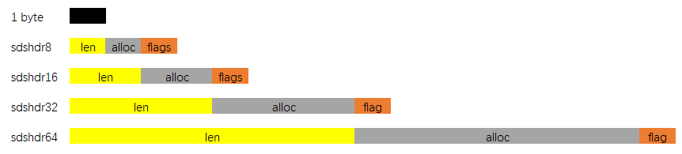
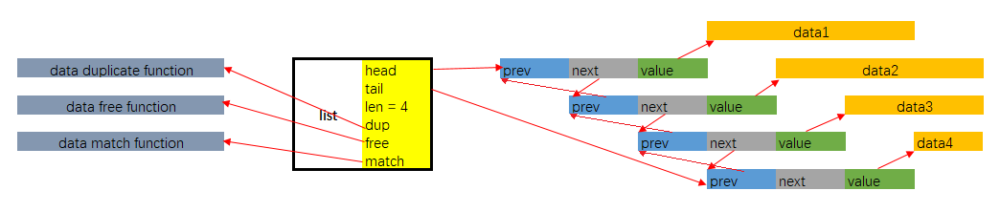
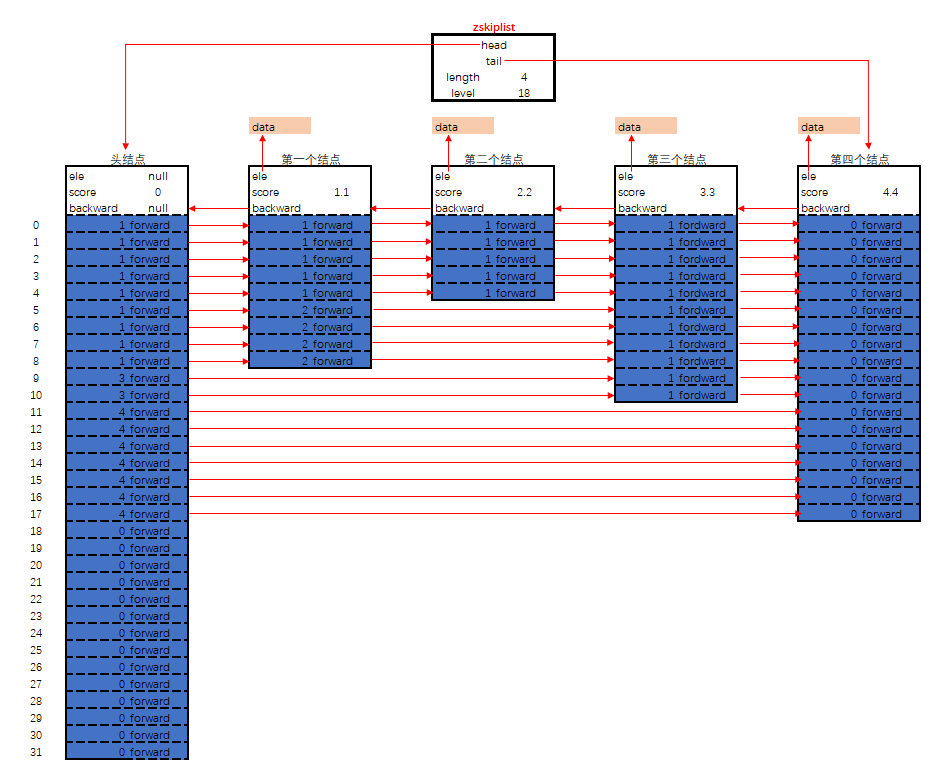
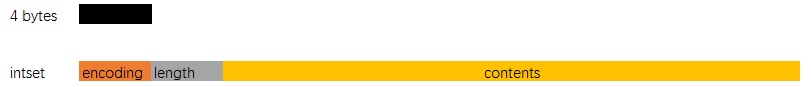
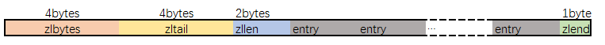
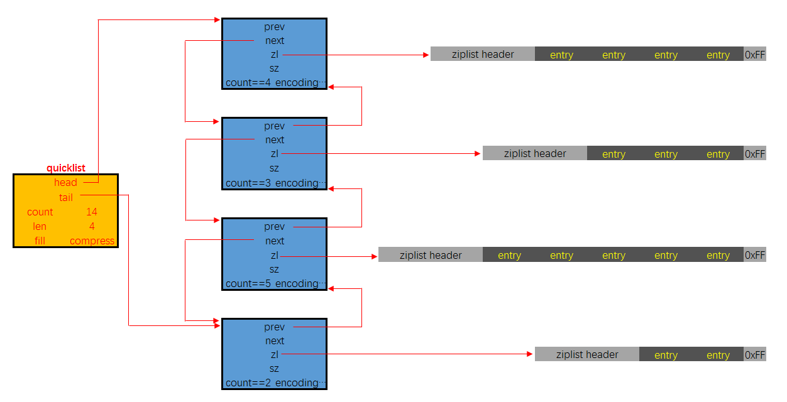
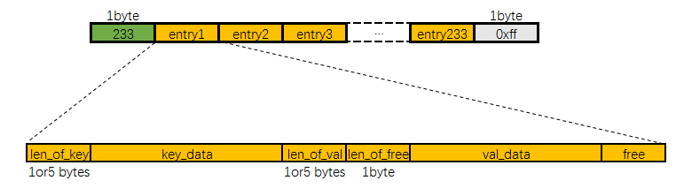

# Redis中的数据结构

原文地址  [Redis中的数据结构](https://www.cnblogs.com/neooelric/p/9621736.html)

## 1. 底层数据结构, 与Redis Value Type之间的关系

对于Redis的使用者来说, Redis作为Key-Value型的内存数据库, 其Value有多种类型.

- String
- Hash
- List
- Set
- ZSet

这些Value的类型, 只是"Redis的用户认为的, Value存储数据的方式". 而在具体实现上, 各个Type的Value到底如何存储, 这对于Redis的使用者来说是不公开的.

举个粟子: 使用下面的命令创建一个Key-Value

```bash
SET "Hello" "World"
```

对于Redis的使用者来说, `Hello`这个Key, 对应的Value是String类型, 其值为五个ASCII字符组成的二进制数据. 但具体在底层实现上, 这五个字节是如何存储的, 是不对用户公开的. 即, Value的Type, 只是表象, 具体数据在内存中以何种数据结构存放, 这对于用户来说是不必要了解的.

Redis对使用者暴露了五种`Value Type`, 其底层实现的数据结构有8种, 分别是:

- SDS - simple synamic string - 支持自动动态扩容的字节数组
- list - 平平无奇的链表
- dict - 使用双哈希表实现的, 支持平滑扩容的字典
- zskiplist - 附加了后向指针的跳跃表
- intset - 用于存储整数数值集合的自有结构
- ziplist - 一种实现上类似于TLV, 但比TLV复杂的, 用于存储任意数据的有序序列的数据结构
- quicklist - 一种以ziplist作为结点的双链表结构, 实现的非常苟
- zipmap - 一种用于在小规模场合使用的轻量级字典结构

而衔接"底层数据结构"与"Value Type"的桥梁的, 则是Redis实现的另外一种数据结构: `redisObject`. Redis中的Key与Value在表层都是一个`redisObject`实例, 故该结构有所谓的"类型", 即是`ValueType`. 对于每一种`Value Type`类型的`redisObject`, 其底层至少支持两种不同的底层数据结构来实现. 以应对在不同的应用场景中, Redis的运行效率, 或内存占用.


## 2. 底层数据结构

### 2.1 SDS - simple dynamic string

这是一种用于存储二进制数据的一种结构, 具有动态扩容的特点. 其实现位于src/sds.h与src/sds.c中, 其关键定义如下:

```cgo
typedef char *sds;

/* Note: sdshdr5 is never used, we just access the flags byte directly.
 * However is here to document the layout of type 5 SDS strings. */
struct __attribute__ ((__packed__)) sdshdr5 {
    unsigned char flags; /* 3 lsb of type, and 5 msb of string length */
    char buf[];
};
struct __attribute__ ((__packed__)) sdshdr8 {
    uint8_t len; /* used */
    uint8_t alloc; /* excluding the header and null terminator */
    unsigned char flags; /* 3 lsb of type, 5 unused bits */
    char buf[];
};
struct __attribute__ ((__packed__)) sdshdr16 {
    uint16_t len; /* used */
    uint16_t alloc; /* excluding the header and null terminator */
    unsigned char flags; /* 3 lsb of type, 5 unused bits */
    char buf[];
};
struct __attribute__ ((__packed__)) sdshdr32 {
    uint32_t len; /* used */
    uint32_t alloc; /* excluding the header and null terminator */
    unsigned char flags; /* 3 lsb of type, 5 unused bits */
    char buf[];
};
struct __attribute__ ((__packed__)) sdshdr64 {
    uint64_t len; /* used */
    uint64_t alloc; /* excluding the header and null terminator */
    unsigned char flags; /* 3 lsb of type, 5 unused bits */
    char buf[];
};
```

SDS的总体概览如下图:


其中sdshdr是头部, buf是真实存储用户数据的地方. 另外注意, 从命名上能看出来, 这个数据结构除了能存储二进制数据, 显然是用于设计作为字符串使用的, 所以在buf中, 用户数据后总跟着一个\0. 即图中 "数据" + "\0" 是为所谓的buf

SDS有五种不同的头部. 其中sdshdr5实际并未使用到. 所以实际上有四种不同的头部, 分别如下:




- len分别以uint8, uint16, uint32, uint64表示用户数据的长度(不包括末尾的\0)
- alloc分别以uint8, uint16, uint32, uint64表示整个SDS, 除过头部与末尾的\0, 剩余的字节数.
- flag始终为一字节, 以低三位标示着头部的类型, 高5位未使用.

当在程序中持有一个SDS实例时, 直接持有的是数据区的头指针, 这样做的用意是: 通过这个指针, 向前偏一个字节, 就能取到flag, 通过判断flag低三位的值, 能迅速判断: 头部的类型, 已用字节数, 总字节数, 剩余字节数. 这也是为什么sds类型即是char *指针类型别名的原因.

创建一个SDS实例有三个接口, 分别是:

```cgo
// 创建一个不含数据的sds: 
//  头部    3字节 sdshdr8
//  数据区  0字节
//  末尾    \0 占一字节
sds sdsempty(void);
// 带数据创建一个sds:
//  头部    按initlen的值, 选择最小的头部类型
//  数据区  从入参指针init处开始, 拷贝initlen个字节
//  末尾    \0 占一字节
sds sdsnewlen(const void *init, size_t initlen);
// 带数据创建一个sds:
//  头部    按strlen(init)的值, 选择最小的头部类型
//  数据区  入参指向的字符串中的所有字符, 不包括末尾 \0
//  末尾    \0 占一字节
sds sdsnew(const char *init);
```

- 所有创建sds实例的接口, 都不会额外分配预留内存空间
- `sdsnewlen`用于带二进制数据创建sds实例, sdsnew用于带字符串创建sds实例. 接口返回的sds可以直接传入libc中的字符串输出函数中进行操作, 由于无论其中存储的是用户的二进制数据, 还是字符串, 其末尾都带一个\0, 所以至少调用libc中的字符串输出函数是安全的.

在对SDS中的数据进行修改时, 若剩余空间不足, 会调用sdsMakeRoomFor函数用于扩容空间, 这是一个很低级的API, 通常情况下不应当由SDS的使用者直接调用. 其实现中核心的几行如下:

```cgo
sds sdsMakeRoomFor(sds s, size_t addlen) {
    ...
    /* Return ASAP if there is enough space left. */
    if (avail >= addlen) return s;

    len = sdslen(s);
    sh = (char*)s-sdsHdrSize(oldtype);
    newlen = (len+addlen);
    if (newlen < SDS_MAX_PREALLOC)
        newlen *= 2;
    else
        newlen += SDS_MAX_PREALLOC;
    ...
}
```

可以看到, 在扩充空间时

- 先保证至少有addlen可用
- 然后再进一步扩充, 在总体占用空间不超过阈值`SDS_MAC_PREALLOC`时, 申请空间再翻一倍. 若总体空间已经超过了阈值, 则步进增长`SDS_MAC_PREALLOC`. 这个阈值的默认值为 `1024 * 1024`

SDS也提供了接口用于移除所有未使用的内存空间. `sdsRemoveFreeSpace`, 该接口没有间接的被任何SDS其它接口调用, 即默认情况下, SDS不会自动回收预留空间. 在SDS的使用者需要节省内存时, 由使用者自行调用:

```cgo
sds sdsRemoveFreeSpace(sds s);
```

总结:

- SDS除了是某些Value Type的底层实现, 也被大量使用在Redis内部, 用于替代C-Style字符串. 所以默认的创建SDS实例接口, 不分配额外的预留空间. 因为多数字符串在程序运行期间是不变的. 而对于变更数据区的API, 其内部则是调用了 sdsMakeRoomFor, 每一次扩充空间, 都会预留大量的空间. 这样做的考量是: 如果一个SDS实例中的数据被变更了, 那么很有可能会在后续发生多次变更.
- SDS的API内部不负责清除未使用的闲置内存空间, 因为内部API无法判断这样做的合适时机. 即便是在操作数据区的时候导致数据区占用内存减少时, 内部API也不会清除闲置内在空间. 清除闲置内存空间责任应当由SDS的使用者自行担当.
- 用SDS替代C-Style字符串时, 由于其头部额外存储了数据区的长度信息, 所以字符串的求长操作时间复杂度为O(1)


### 2.2 list

这是普通的链表实现, 链表结点不直接持有数据, 而是通过void *指针来间接的指向数据. 其实现位于 src/adlist.h与src/adlist.c中, 关键定义如下:

```cgo
typedef struct listNode {
    struct listNode *prev;
    struct listNode *next;
    void *value;
} listNode;

typedef struct listIter {
    listNode *next;
    int direction;
} listIter;

typedef struct list {
    listNode *head;
    listNode *tail;
    void *(*dup)(void *ptr);
    void (*free)(void *ptr);
    int (*match)(void *ptr, void *key);
    unsigned long len;
} list;
```

其内存布局如下图所示:



这是一个平平无奇的链表的实现. list在Redis除了作为一些Value Type的底层实现外, 还广泛用于Redis的其它功能实现中, 作为一种数据结构工具使用. 在list的实现中, 除了基本的链表定义外, 还额外增加了:

- 迭代器`listIter`的定义, 与相关接口的实现.
- 由于list中的链表结点本身并不直接持有数据, 而是通过value字段, 以void *指针的形式间接持有, 所以数据的生命周期并不完全与链表及其结点一致. 这给了list的使用者相当大的灵活性. 比如可以多个结点持有同一份数据的地址. 但与此同时, 在对链表进行销毁, 结点复制以及查找匹配时, 就需要list的使用者将相关的函数指针赋值于list.dup, list.free, list.match字段.

### 2.3 dict

dict是Redis底层数据结构中实现最为复杂的一个数据结构, 其功能类似于C++标准库中的std::unordered_map, 其实现位于 src/dict.h 与 src/dict.c中, 其关键定义如下:

```cgo
typedef struct dictEntry {
    void *key;
    union {
        void *val;
        uint64_t u64;
        int64_t s64;
        double d;
    } v;
    struct dictEntry *next;
} dictEntry;

typedef struct dictType {
    uint64_t (*hashFunction)(const void *key);
    void *(*keyDup)(void *privdata, const void *key);
    void *(*valDup)(void *privdata, const void *obj);
    int (*keyCompare)(void *privdata, const void *key1, const void *key2);
    void (*keyDestructor)(void *privdata, void *key);
    void (*valDestructor)(void *privdata, void *obj);
} dictType;

/* This is our hash table structure. Every dictionary has two of this as we
 * implement incremental rehashing, for the old to the new table. */
typedef struct dictht {
    dictEntry **table;
    unsigned long size;
    unsigned long sizemask;
    unsigned long used;
} dictht;

typedef struct dict {
    dictType *type;
    void *privdata;
    dictht ht[2];
    long rehashidx; /* rehashing not in progress if rehashidx == -1 */
    unsigned long iterators; /* number of iterators currently running */
} dict;

/* If safe is set to 1 this is a safe iterator, that means, you can call
 * dictAdd, dictFind, and other functions against the dictionary even while
 * iterating. Otherwise it is a non safe iterator, and only dictNext()
 * should be called while iterating. */
typedef struct dictIterator {
    dict *d;
    long index;
    int table, safe;
    dictEntry *entry, *nextEntry;
    /* unsafe iterator fingerprint for misuse detection. */
    long long fingerprint;
} dictIterator;
```

其内存布局如下所示:


- dict中存储的键值对, 是通过dictEntry这个结构间接持有的, k通过指针间接持有键, v通过指针间接持有值. 注意, 若值是整数值的话, 是直接存储在v字段中的, 而不是间接持有. 同时next指针用于指向, 在bucket索引值冲突时, 以链式方式解决冲突, 指向同索引的下一个dictEntry结构.
- 传统的哈希表实现, 是一块连续空间的顺序表, 表中元素即是结点. 在dictht.table中, 结点本身是散布在内存中的, 顺序表中存储的是dictEntry的指针
- 哈希表即是dictht结构, 其通过table字段间接的持有顺序表形式的bucket, bucket的容量存储在size字段中, 为了加速将散列值转化为bucket中的数组索引, 引入了sizemask字段, 计算指定键在哈希表中的索引时, 执行的操作类似于dict->type->hashFunction(键) & dict->ht[x].sizemask. 从这里也可以看出来, bucket的容量适宜于为2的幂次, 这样计算出的索引值能覆盖到所有bucket索引位.
- dict即为字典. 其中type字段中存储的是本字典使用到的各种函数指针, 包括散列函数, 键与值的复制函数, 释放函数, 以及键的比较函数. privdata是用于存储用户自定义数据. 这样, 字典的使用者可以最大化的自定义字典的实现, 通过自定义各种函数实现, 以及可以附带私有数据, 保证了字典有很大的调优空间.
- 字典为了支持平滑扩容, 定义了ht[2]这个数组字段. 其用意是这样的:
    1. 一般情况下, 字典dict仅持有一个哈希表dictht的实例, 即整个字典由一个bucket实现.
    2. 随着插入操作, bucket中出现冲突的概率会越来越大, 当字典中存储的结点数目, 与bucket数组长度的比值达到一个阈值(1:1)时, 字典为了缓解性能下降, 就需要扩容
    3. 扩容的操作是平滑的, 即在扩容时, 字典会持有两个dictht的实例, ht[0]指向旧哈希表, ht[1]指向扩容后的新哈希表. 平滑扩容的重点在于两个策略:
    4. 后续每一次的插入, 替换, 查找操作, 都插入到ht[1]指向的哈希表中
    5. 每一次插入, 替换, 查找操作执行时, 会将旧表ht[0]中的一个bucket索引位持有的结点链表, 迁移到ht[1]中去. 迁移的进度保存在rehashidx这个字段中.在旧表中由于冲突而被链接在同一索引位上的结点, 迁移到新表后, 可能会散布在多个新表索引中去.
    6. 当迁移完成后, ht[0]指向的旧表会被释放, 之后会将新表的持有权转交给ht[0], 再重置ht[1]指向NULL
- 这种平滑扩容的优点有两个:

    1. 平滑扩容过程中, 所有结点的实际数据, 即dict->ht[0]->table[rehashindex]->k与dict->ht[0]->table[rehashindex]->v分别指向的实际数据, 内存地址都不会变化. 没有发生键数据与值数据的拷贝或移动, 扩容整个过程仅是各种指针的操作. 速度非常快
    2. 扩容操作是步进式的, 这保证任何一次插入操作都是顺畅的, dict的使用者是无感知的. 若扩容是一次性的, 当新旧bucket容量特别大时, 迁移所有结点必然会导致耗时陡增.

除了字典本身的实现外, 其中还顺带实现了一个迭代器, 这个迭代器中有字段safe以标示该迭代器是"安全迭代器"还是"非安全迭代器", 所谓的安全与否, 指是的这种场景:
设想在运行迭代器的过程中, 字典正处于平滑扩容的过程中. 在平滑扩容的过程中时, 旧表一个索引位上的, 由冲突而链起来的多个结点, 迁移到新表后, 可能会散布到新表的多个索引位上. 且新的索引位的值可能比旧的索引位要低.

遍历操作的重点是, 保证在迭代器遍历操作开始时, 字典中持有的所有结点, 都会被遍历到. 而若在遍历过程中, 一个未遍历的结点, 从旧表迁移到新表后, 索引值减小了, 那么就可能会导致这个结点在遍历过程中被遗漏.

所以, 所谓的"安全"迭代器, 其在内部实现时: 在迭代过程中, 若字典正处于平滑扩容过程, 则暂停结点迁移, 直至迭代器运行结束. 这样虽然不能保证在迭代过程中插入的结点会被遍历到, 但至少保证在迭代起始时, 字典中持有的所有结点都会被遍历到.

这也是为什么dict结构中有一个iterators字段的原因: 该字段记录了运行于该字典上的安全迭代器的数目. 若该数目不为0, 字典是不会继续进行结点迁移平滑扩容的.

下面是字典的扩容操作中的核心代码, 我们以插入操作引起的扩容为例:

**先是插入操作的外部逻辑:**

1. 如果插入时, 字典正处于平滑扩容过程中, 那么无论本次插入是否成功, 先迁移一个bucket索引中的结点至新表
2. 在计算新插入结点键的bucket索引值时, 内部会探测哈希表是否需要扩容(若当前不在平滑扩容过程中)

```cgo
int dictAdd(dict *d, void *key, void *val)
{
    dictEntry *entry = dictAddRaw(d,key,NULL);          // 调用dictAddRaw

    if (!entry) return DICT_ERR;
    dictSetVal(d, entry, val);
    return DICT_OK;
}

dictEntry *dictAddRaw(dict *d, void *key, dictEntry **existing)
{
    long index;
    dictEntry *entry;
    dictht *ht;

    if (dictIsRehashing(d)) _dictRehashStep(d); // 若在平滑扩容过程中, 先步进迁移一个bucket索引

    /* Get the index of the new element, or -1 if
     * the element already exists. */

    // 在计算键在bucket中的索引值时, 内部会检查是否需要扩容
    if ((index = _dictKeyIndex(d, key, dictHashKey(d,key), existing)) == -1)
        return NULL;

    /* Allocate the memory and store the new entry.
     * Insert the element in top, with the assumption that in a database
     * system it is more likely that recently added entries are accessed
     * more frequently. */
    ht = dictIsRehashing(d) ? &d->ht[1] : &d->ht[0];
    entry = zmalloc(sizeof(*entry));
    entry->next = ht->table[index];
    ht->table[index] = entry;
    ht->used++;

    /* Set the hash entry fields. */
    dictSetKey(d, entry, key);
    return entry;
}

```

下面是计算bucket索引值的函数, 内部会探测该哈希表是否需要扩容, 如果需要扩容(结点数目与bucket数组长度比例达到1:1), 就使字典进入平滑扩容过程:

```cgo
static long _dictKeyIndex(dict *d, const void *key, uint64_t hash, dictEntry **existing)
{
    unsigned long idx, table;
    dictEntry *he;
    if (existing) *existing = NULL;

    /* Expand the hash table if needed */
    if (_dictExpandIfNeeded(d) == DICT_ERR) // 探测是否需要扩容, 如果需要, 则开始扩容
        return -1;
    for (table = 0; table <= 1; table++) {
        idx = hash & d->ht[table].sizemask;
        /* Search if this slot does not already contain the given key */
        he = d->ht[table].table[idx];
        while(he) {
            if (key==he->key || dictCompareKeys(d, key, he->key)) {
                if (existing) *existing = he;
                return -1;
            }
            he = he->next;
        }
        if (!dictIsRehashing(d)) break;
    }
    return idx;
}

/* Expand the hash table if needed */
static int _dictExpandIfNeeded(dict *d)
{
    /* Incremental rehashing already in progress. Return. */
    if (dictIsRehashing(d)) return DICT_OK; // 如果正在扩容过程中, 则什么也不做

    /* If the hash table is empty expand it to the initial size. */
    // 若字典中本无元素, 则初始化字典, 初始化时的bucket数组长度为4
    if (d->ht[0].size == 0) return dictExpand(d, DICT_HT_INITIAL_SIZE);

    /* If we reached the 1:1 ratio, and we are allowed to resize the hash
     * table (global setting) or we should avoid it but the ratio between
     * elements/buckets is over the "safe" threshold, we resize doubling
     * the number of buckets. */
    // 若字典中元素的个数与bucket数组长度比值大于1:1时, 则调用dictExpand进入平滑扩容状态
    if (d->ht[0].used >= d->ht[0].size &&
        (dict_can_resize ||
         d->ht[0].used/d->ht[0].size > dict_force_resize_ratio))
    {
        return dictExpand(d, d->ht[0].used*2);
    }
    return DICT_OK;
}

int dictExpand(dict *d, unsigned long size)
{
    dictht n; /* the new hash table */  // 新建一个dictht结构
    unsigned long realsize = _dictNextPower(size);  

    /* the size is invalid if it is smaller than the number of
     * elements already inside the hash table */
    if (dictIsRehashing(d) || d->ht[0].used > size)
        return DICT_ERR;

    /* Rehashing to the same table size is not useful. */
    if (realsize == d->ht[0].size) return DICT_ERR;

    /* Allocate the new hash table and initialize all pointers to NULL */
    n.size = realsize;
    n.sizemask = realsize-1;
    n.table = zcalloc(realsize*sizeof(dictEntry*));// 初始化dictht下的table, 即bucket数组
    n.used = 0;

    /* Is this the first initialization? If so it's not really a rehashing
     * we just set the first hash table so that it can accept keys. */
    // 若是新字典初始化, 直接把dictht结构挂在ht[0]中
    if (d->ht[0].table == NULL) {
        d->ht[0] = n;
        return DICT_OK;
    }

    // 否则, 把新dictht结构挂在ht[1]中, 并开启平滑扩容(置rehashidx为0, 字典处于非扩容状态时, 该字段值为-1)
    /* Prepare a second hash table for incremental rehashing */
    d->ht[1] = n;
    d->rehashidx = 0;
    return DICT_OK;
}
```

下面是平滑扩容的实现:

```cgo
static void _dictRehashStep(dict *d) {
    // 若字典上还运行着安全迭代器, 则不迁移结点
    // 否则每次迁移一个旧bucket索引上的所有结点
    if (d->iterators == 0) dictRehash(d,1); 
}

int dictRehash(dict *d, int n) {
    int empty_visits = n*10; /* Max number of empty buckets to visit. */
    if (!dictIsRehashing(d)) return 0;

    while(n-- && d->ht[0].used != 0) {
        dictEntry *de, *nextde;

        /* Note that rehashidx can't overflow as we are sure there are more
         * elements because ht[0].used != 0 */
        assert(d->ht[0].size > (unsigned long)d->rehashidx);
        // 在旧bucket中, 找到下一个非空的索引位
        while(d->ht[0].table[d->rehashidx] == NULL) {
            d->rehashidx++;
            if (--empty_visits == 0) return 1;
        }
        // 取出该索引位上的结点链表
        de = d->ht[0].table[d->rehashidx];
        /* Move all the keys in this bucket from the old to the new hash HT */
        // 把所有结点迁移到新bucket中去
        while(de) {
            uint64_t h;

            nextde = de->next;
            /* Get the index in the new hash table */
            h = dictHashKey(d, de->key) & d->ht[1].sizemask;
            de->next = d->ht[1].table[h];
            d->ht[1].table[h] = de;
            d->ht[0].used--;
            d->ht[1].used++;
            de = nextde;
        }
        d->ht[0].table[d->rehashidx] = NULL;
        d->rehashidx++;
    }

    /* Check if we already rehashed the whole table... */
    // 检查是否旧表中的所有结点都被迁移到了新表
    // 如果是, 则置先释放原旧bucket数组, 再置ht[1]为ht[0]
    // 最后再置rehashidx=-1, 以示字典不处于平滑扩容状态
    if (d->ht[0].used == 0) {
        zfree(d->ht[0].table);
        d->ht[0] = d->ht[1];
        _dictReset(&d->ht[1]);
        d->rehashidx = -1;
        return 0;
    }

    /* More to rehash... */
    return 1;
}
```

**总结:**

字典的实现很复杂, 主要是实现了平滑扩容逻辑
用户数据均是以指针形式间接由dictEntry结构持有, 故在平滑扩容过程中, 不涉及用户数据的拷贝
有安全迭代器可用, 安全迭代器保证, 在迭代起始时, 字典中的所有结点, 都会被迭代到, 即使在迭代过程中对字典有插入操作
字典内部使用的默认散列函数其实也非常有讲究, 不过限于篇幅, 这里不展开讲. 并且字典的实现给了使用者非常大的灵活性(dictType结构与dict.privdata字段), 对于一些特定场合使用的键数据, 用户可以自行选择更高效更特定化的散列函数

### 2.4 zskiplist

zskiplist是Redis实现的一种特殊的跳跃表. 跳跃表是一种基于线性表实现简单的搜索结构, 其最大的特点就是: 实现简单, 性能能逼近各种搜索树结构. 血统纯正的跳跃表的介绍在维基百科中即可查阅. 在Redis中, 在原版跳跃表的基础上, 进行了一些小改动, 即是现在要介绍的zskiplist结构.

其定义在src/server.h中, 如下:

```cgo
/* ZSETs use a specialized version of Skiplists */
typedef struct zskiplistNode {
    sds ele;
    double score;
    struct zskiplistNode *backward;
    struct zskiplistLevel {
        struct zskiplistNode *forward;
        unsigned int span;
    } level[];
} zskiplistNode;

typedef struct zskiplist {
    struct zskiplistNode *header, *tail;
    unsigned long length;
    int level;
} zskiplist;
```

其内存布局如下图:



zskiplist的核心设计要点为:

1. 头结点不持有任何数据, 且其level[]的长度为32
2. 每个结点, 除了持有数据的ele字段, 还有一个字段score, 其标示着结点的得分, 结点之间凭借得分来判断先后顺序, 跳跃表中的结点按结点的得分升序排列.
3. 每个结点持有一个backward指针, 这是原版跳跃表中所没有的. 该指针指向结点的前一个紧邻结点.
4. 每个结点中最多持有32个zskiplistLevel结构. 实际数量在结点创建时, 按幂次定律随机生成(不超过32). 每个zskiplistLevel中有两个字段.
5. forward字段指向比自己得分高的某个结点(不一定是紧邻的), 并且, 若当前zskiplistLevel实例在level[]中的索引为X, 则其forward字段指向的结点, 其level[]字段的容量至少是X+1. 这也是上图中, 为什么forward指针总是画的水平的原因.
6. span字段代表forward字段指向的结点, 距离当前结点的距离. 紧邻的两个结点之间的距离定义为1.
7. zskiplist中持有字段level, 用以记录所有结点(除过头结点外), level[]数组最长的长度.

跳跃表主要用于, 在给定一个分值的情况下, 查找与该分值最接近的结点. 搜索时, 伪代码如下:

```cgo
int level = zskiplist->level - 1;
zskiplistNode p = zskiplist->head;

while(1 && p)
{
    zskiplistNode q = (p->level)[level]->forward:
    if(q->score > 分值)
    {
        if(level > 0)
        {
            level--;
        }
        else
        {
            return :
                q为整个跳跃表中, 分值大于指定分值的第一个结点
                q->backward为整个跳跃表中, 分值小于或等于指定分值的最后一个结点
        }
    }
    else
    {
        p = q;
    }
}
```

跳跃表的实现比较简单, 最复杂的操作即是插入与删除结点, 需要仔细处理邻近结点的所有level[]中的所有zskiplistLevel结点中的forward与span的值的变更.

另外, 关于新创建的结点, 其`level[]`数组长度的随机算法, 在接口zslInsert的实现中, 核心代码片断如下:


```cgo
zskiplistNode *zslInsert(zskiplist *zsl, double score, sds ele) {
    //...

    level = zslRandomLevel();   // 随机生成新结点的, level[]数组的长度
        if (level > zsl->level) {   
        // 若生成的新结点的level[]数组的长度比当前表中所有结点的level[]的长度都大
        // 那么头结点中需要新增几个指向该结点的指针
        // 并刷新ziplist中的level字段
        for (i = zsl->level; i < level; i++) {
            rank[i] = 0;
            update[i] = zsl->header;
            update[i]->level[i].span = zsl->length;
        }
        zsl->level = level;
    }
    x = zslCreateNode(level,score,ele); // 创建新结点
    //... 执行插入操作
}

// 按幂次定律生成小于32的随机数的函数
// 宏 ZSKIPLIST_MAXLEVEL 的定义为32, 宏 ZSKIPLIST_P 被设定为 0.25
// 即 
//      level == 1的概率为 75%
//      level == 2的概率为 75% * 25%
//      level == 3的概率为 75% * 25% * 25%
//      ...
//      level == 31的概率为 0.75 * 0.25^30
//      而
//      level == 32的概率为 0.75 * sum(i = 31 ~ +INF){ 0.25^i }
int zslRandomLevel(void) {
    int level = 1;
    while ((random()&0xFFFF) < (ZSKIPLIST_P * 0xFFFF))
        level += 1;
    return (level<ZSKIPLIST_MAXLEVEL) ? level : ZSKIPLIST_MAXLEVEL;
}
```

### 2.5 intset

这是一个用于存储在序的整数的数据结构, 也底层数据结构中最简单的一个, 其定义与实现在src/intest.h与src/intset.c中, 关键定义如下:

```cgo
typedef struct intset {
    uint32_t encoding;
    uint32_t length;
    int8_t contents[];
} intset;

#define INTSET_ENC_INT16 (sizeof(int16_t))
#define INTSET_ENC_INT32 (sizeof(int32_t))
#define INTSET_ENC_INT64 (sizeof(int64_t))
```

inset结构中的encoding的取值有三个, 分别是宏INTSET_ENC_INT16, INTSET_ENC_INT32, INTSET_ENC_INT64. length代表其中存储的整数的个数, contents指向实际存储数值的连续内存区域. 其内存布局如下图所示:




- intset中各字段, 包括contents中存储的数值, 都是以主机序(小端字节序)存储的. 这意味着Redis若运行在PPC这样的大端字节序的机器上时, 存取数据都会有额外的字节序转换开销
- 当encoding == INTSET_ENC_INT16时, contents中以int16_t的形式存储着数值. 类似的, 当encoding == INTSET_ENC_INT32时, contents中以int32_t的形式存储着数值.
- 但凡有一个数值元素的值超过了int32_t的取值范围, 整个intset都要进行升级, 即所有的数值都需要以int64_t的形式存储. 显然升级的开销是很大的.
- intset中的数值是以升序排列存储的, 插入与删除的复杂度均为O(n). 查找使用二分法, 复杂度为O(log_2(n))
- intset的代码实现中, 不预留空间, 即每一次插入操作都会调用zrealloc接口重新分配内存. 每一次删除也会调用zrealloc接口缩减占用的内存. 省是省了, 但内存操作的时间开销上升了.
- intset的编码方式一经升级, 不会再降级.

总之, intset适合于如下数据的存储:

- 所有数据都位于一个稳定的取值范围中. 比如均位于int16_t或int32_t的取值范围中
- 数据稳定, 插入删除操作不频繁. 能接受O(lgn)级别的查找开销

### 2.6 ziplist

ziplist是Redis底层数据结构中, 最苟的一个结构. 它的设计宗旨就是: 省内存, 从牙缝里省内存. 设计思路和TLV一致, 但为了从牙缝里节省内存, 做了很多额外工作.

ziplist的内存布局与intset一样: 就是一块连续的内存空间. 但区域划分比较复杂, 概览如下图:




- 和intset一样, ziplist中的所有值都是以小端序存储的
- zlbytes字段的类型是uint32_t, 这个字段中存储的是整个ziplist所占用的内存的字节数
- zltail字段的类型是uint32_t, 它指的是ziplist中最后一个entry的偏移量. 用于快速定位最后一个entry, 以快速完成pop等操作
- zllen字段的类型是uint16_t, 它指的是整个ziplit中entry的数量. 这个值只占16位, 所以蛋疼的地方就来了: 如果ziplist中entry的数目小于65535, 那么该字段中存储的就是实际entry的值. 若等于或超过65535, 那么该字段的值固定为65535, 但实际数量需要一个个entry的去遍历所有entry才能得到.
- zlend是一个终止字节, 其值为全F, 即0xff. ziplist保证任何情况下, 一个entry的首字节都不会是255

在画图展示entry的内存布局之前, 先讲一下entry中都存储了哪些信息:

- 每个entry中存储了它前一个entry所占用的字节数. 这样支持ziplist反向遍历.
- 每个entry用单独的一块区域, 存储着当前结点的类型: 所谓的类型, 包括当前结点存储的数据是什么(二进制, 还是数值), 如何编码(如果是数值, 数值如何存储, 如果是二进制数据, 二进制数据的长度)
- 最后就是真实的数据了

entry的内存布局如下所示:


`prevlen`即是"前一个entry所占用的字节数", 它本身是一个变长字段, 规约如下:

- 若前一个entry占用的字节数小于 254, 则prevlen字段占一字节
- 若前一个entry占用的字节数等于或大于 254, 则prevlen字段占五字节: 第一个字节值为 254, 即0xfe, 另外四个字节, 以uint32_t存储着值.

`encoding`字段的规约就复杂了许多

- 若数据是二进制数据, 且二进制数据长度小于64字节(不包括64), 那么encoding占一字节. 在这一字节中, 高两位值固定为0, 低六位值以无符号整数的形式存储着二进制数据的长度. 即 00xxxxxx, 其中低六位bitxxxxxx是用二进制保存的数据长度.
- 若数据是二进制数据, 且二进制数据长度大于或等于64字节, 但小于16384(不包括16384)字节, 那么encoding占用两个字节. 在这两个字节16位中, 第一个字节的高两位固定为01, 剩余的14个位, 以小端序无符号整数的形式存储着二进制数据的长度, 即 01xxxxxx, yyyyyyyy, 其中yyyyyyyy是高八位, xxxxxx是低六位.
- 若数据是二进制数据, 且二进制数据的长度大于或等于16384字节, 但小于2^32-1字节, 则encoding占用五个字节. 第一个字节是固定值10000000, 剩余四个字节, 按小端序uint32_t的形式存储着二进制数据的长度. 这也是ziplist能存储的二进制数据的最大长度, 超过2^32-1字节的二进制数据, ziplist无法存储.
- 若数据是整数值, 则encoding和data的规约如下:
    1. 首先, 所有存储数值的entry, 其encoding都仅占用一个字节. 并且最高两位均是11
    2. 若数值取值范围位于[0, 12]中, 则encoding和data挤在同一个字节中. 即为1111 0001~1111 1101, 高四位是固定值, 低四位的值从0001至1101, 分别代表 0 ~ 12这十五个数值
    3. 若数值取值范围位于[-128, -1] [13, 127]中, 则encoding == 0b 1111 1110. 数值存储在紧邻的下一个字节, 以int8_t形式编码
    4. 若数值取值范围位于[-32768, -129] [128, 32767]中, 则encoding == 0b 1100 0000. 数值存储在紧邻的后两个字节中, 以小端序int16_t形式编码
    5. 若数值取值范围位于[-8388608, -32769] [32768, 8388607]中, 则encoding == 0b 1111 0000. 数值存储在紧邻的后三个字节中, 以小端序存储, 占用三个字节.
    6. 若数值取值范围位于[-2^31, -8388609] [8388608, 2^31 - 1]中, 则encoding == 0b 1101 0000. 数值存储在紧邻的后四个字节中, 以小端序int32_t形式编码
    7. 若数值取值均不在上述范围, 但位于int64_t所能表达的范围内, 则encoding == 0b 1110 0000, 数值存储在紧邻的后八个字节中, 以小端序int64_t形式编码

在大规模数值存储中, ziplist几乎不浪费内存空间, 其苟的程序到达了字节级别, 甚至对于[0, 12]区间的数值, 连data里的那一个字节也要省下来. 显然, ziplist是一种特别节省内存的数据结构, 但它的缺点也十分明显:

- 和intset一样, ziplist也不预留内存空间, 并且在移除结点后, 也是立即缩容, 这代表每次写操作都会进行内存分配操作.
- ziplist最蛋疼的一个问题是: 结点如果扩容, 导致结点占用的内存增长, 并且超过254字节的话, 可能会导致链式反应: 其后一个结点的entry.prevlen需要从一字节扩容至五字节. 最坏情况下, 第一个结点的扩容, 会导致整个ziplist表中的后续所有结点的entry.prevlen字段扩容. 虽然这个内存重分配的操作依然只会发生一次, 但代码中的时间复杂度是o(N)级别, 因为链式扩容只能一步一步的计算. 但这种情况的概率十分的小, 一般情况下链式扩容能连锁反映五六次就很不幸了. 之所以说这是一个蛋疼问题, 是因为, 这样的坏场景下, 其实时间复杂度并不高: 依次计算每个entry新的空间占用, 也就是o(N), 总体占用计算出来后, 只执行一次内存重分配, 与对应的memmove操作, 就可以了. 蛋疼说的是: 代码特别难写, 难读. 下面放一段处理插入结点时处理链式反应的代码片断, 大家自行感受一下:

```cgo
unsigned char *__ziplistInsert(unsigned char *zl, unsigned char *p, unsigned char *s, unsigned int slen) {
    size_t curlen = intrev32ifbe(ZIPLIST_BYTES(zl)), reqlen;
    unsigned int prevlensize, prevlen = 0;
    size_t offset;
    int nextdiff = 0;
    unsigned char encoding = 0;
    long long value = 123456789; /* initialized to avoid warning. Using a value
                                    that is easy to see if for some reason
                                    we use it uninitialized. */
    zlentry tail;

    /* Find out prevlen for the entry that is inserted. */
    if (p[0] != ZIP_END) {
        ZIP_DECODE_PREVLEN(p, prevlensize, prevlen);
    } else {
        unsigned char *ptail = ZIPLIST_ENTRY_TAIL(zl);
        if (ptail[0] != ZIP_END) {
            prevlen = zipRawEntryLength(ptail);
        }
    }

    /* See if the entry can be encoded */
    if (zipTryEncoding(s,slen,&value,&encoding)) {
        /* 'encoding' is set to the appropriate integer encoding */
        reqlen = zipIntSize(encoding);
    } else {
        /* 'encoding' is untouched, however zipStoreEntryEncoding will use the
         * string length to figure out how to encode it. */
        reqlen = slen;
    }
    /* We need space for both the length of the previous entry and
     * the length of the payload. */
    reqlen += zipStorePrevEntryLength(NULL,prevlen);
    reqlen += zipStoreEntryEncoding(NULL,encoding,slen);

    /* When the insert position is not equal to the tail, we need to
     * make sure that the next entry can hold this entry's length in
     * its prevlen field. */
    int forcelarge = 0;
    nextdiff = (p[0] != ZIP_END) ? zipPrevLenByteDiff(p,reqlen) : 0;
    if (nextdiff == -4 && reqlen < 4) {
        nextdiff = 0;
        forcelarge = 1;
    }

    /* Store offset because a realloc may change the address of zl. */
    offset = p-zl;
    zl = ziplistResize(zl,curlen+reqlen+nextdiff);
    p = zl+offset;

    /* Apply memory move when necessary and update tail offset. */
    if (p[0] != ZIP_END) {
        /* Subtract one because of the ZIP_END bytes */
        memmove(p+reqlen,p-nextdiff,curlen-offset-1+nextdiff);

        /* Encode this entry's raw length in the next entry. */
        if (forcelarge)
            zipStorePrevEntryLengthLarge(p+reqlen,reqlen);
        else
            zipStorePrevEntryLength(p+reqlen,reqlen);

        /* Update offset for tail */
        ZIPLIST_TAIL_OFFSET(zl) =
            intrev32ifbe(intrev32ifbe(ZIPLIST_TAIL_OFFSET(zl))+reqlen);

        /* When the tail contains more than one entry, we need to take
         * "nextdiff" in account as well. Otherwise, a change in the
         * size of prevlen doesn't have an effect on the *tail* offset. */
        zipEntry(p+reqlen, &tail);
        if (p[reqlen+tail.headersize+tail.len] != ZIP_END) {
            ZIPLIST_TAIL_OFFSET(zl) =
                intrev32ifbe(intrev32ifbe(ZIPLIST_TAIL_OFFSET(zl))+nextdiff);
        }
    } else {
        /* This element will be the new tail. */
        ZIPLIST_TAIL_OFFSET(zl) = intrev32ifbe(p-zl);
    }

    /* When nextdiff != 0, the raw length of the next entry has changed, so
     * we need to cascade the update throughout the ziplist */
    if (nextdiff != 0) {
        offset = p-zl;
        zl = __ziplistCascadeUpdate(zl,p+reqlen);
        p = zl+offset;
    }

    /* Write the entry */
    p += zipStorePrevEntryLength(p,prevlen);
    p += zipStoreEntryEncoding(p,encoding,slen);
    if (ZIP_IS_STR(encoding)) {
        memcpy(p,s,slen);
    } else {
        zipSaveInteger(p,value,encoding);
    }
    ZIPLIST_INCR_LENGTH(zl,1);
    return zl;
}

unsigned char *__ziplistCascadeUpdate(unsigned char *zl, unsigned char *p) {
    size_t curlen = intrev32ifbe(ZIPLIST_BYTES(zl)), rawlen, rawlensize;
    size_t offset, noffset, extra;
    unsigned char *np;
    zlentry cur, next;

    while (p[0] != ZIP_END) {
        zipEntry(p, &cur);
        rawlen = cur.headersize + cur.len;
        rawlensize = zipStorePrevEntryLength(NULL,rawlen);

        /* Abort if there is no next entry. */
        if (p[rawlen] == ZIP_END) break;
        zipEntry(p+rawlen, &next);

        /* Abort when "prevlen" has not changed. */
        if (next.prevrawlen == rawlen) break;

        if (next.prevrawlensize < rawlensize) {
            /* The "prevlen" field of "next" needs more bytes to hold
             * the raw length of "cur". */
            offset = p-zl;
            extra = rawlensize-next.prevrawlensize;
            zl = ziplistResize(zl,curlen+extra);
            p = zl+offset;

            /* Current pointer and offset for next element. */
            np = p+rawlen;
            noffset = np-zl;

            /* Update tail offset when next element is not the tail element. */
            if ((zl+intrev32ifbe(ZIPLIST_TAIL_OFFSET(zl))) != np) {
                ZIPLIST_TAIL_OFFSET(zl) =
                    intrev32ifbe(intrev32ifbe(ZIPLIST_TAIL_OFFSET(zl))+extra);
            }

            /* Move the tail to the back. */
            memmove(np+rawlensize,
                np+next.prevrawlensize,
                curlen-noffset-next.prevrawlensize-1);
            zipStorePrevEntryLength(np,rawlen);

            /* Advance the cursor */
            p += rawlen;
            curlen += extra;
        } else {
            if (next.prevrawlensize > rawlensize) {
                /* This would result in shrinking, which we want to avoid.
                 * So, set "rawlen" in the available bytes. */
                zipStorePrevEntryLengthLarge(p+rawlen,rawlen);
            } else {
                zipStorePrevEntryLength(p+rawlen,rawlen);
            }

            /* Stop here, as the raw length of "next" has not changed. */
            break;
        }
    }
    return zl;
}
```

这种代码的特点就是: 最好由作者去维护, 最好一次性写对. 因为读起来真的费劲, 改起来也很费劲.

### 2.7 quicklist

如果说ziplist是整个Redis中为了节省内存, 而写的最苟的数据结构, 那么称quicklist就是在最苟的基础上, 再苟了一层. 这个结构是Redis在3.2版本后新加的, 在3.2版本之前, 我们可以讲, dict是最复杂的底层数据结构, ziplist是最苟的底层数据结构. 在3.2版本之后, 这两个记录被双双刷新了.

这是一种, 以ziplist为结点的, 双端链表结构. 宏观上, quicklist是一个链表, 微观上, 链表中的每个结点都是一个ziplist.

它的定义与实现分别在src/quicklist.h与src/quicklist.c中, 其中关键定义如下:

```cgo
/* Node, quicklist, and Iterator are the only data structures used currently. */

/* quicklistNode is a 32 byte struct describing a ziplist for a quicklist.
 * We use bit fields keep the quicklistNode at 32 bytes.
 * count: 16 bits, max 65536 (max zl bytes is 65k, so max count actually < 32k).
 * encoding: 2 bits, RAW=1, LZF=2.
 * container: 2 bits, NONE=1, ZIPLIST=2.
 * recompress: 1 bit, bool, true if node is temporarry decompressed for usage.
 * attempted_compress: 1 bit, boolean, used for verifying during testing.
 * extra: 12 bits, free for future use; pads out the remainder of 32 bits */
typedef struct quicklistNode {
    struct quicklistNode *prev;
    struct quicklistNode *next;
    unsigned char *zl;
    unsigned int sz;             /* ziplist size in bytes */
    unsigned int count : 16;     /* count of items in ziplist */
    unsigned int encoding : 2;   /* RAW==1 or LZF==2 */
    unsigned int container : 2;  /* NONE==1 or ZIPLIST==2 */
    unsigned int recompress : 1; /* was this node previous compressed? */
    unsigned int attempted_compress : 1; /* node can't compress; too small */
    unsigned int extra : 10; /* more bits to steal for future usage */
} quicklistNode;

/* quicklistLZF is a 4+N byte struct holding 'sz' followed by 'compressed'.
 * 'sz' is byte length of 'compressed' field.
 * 'compressed' is LZF data with total (compressed) length 'sz'
 * NOTE: uncompressed length is stored in quicklistNode->sz.
 * When quicklistNode->zl is compressed, node->zl points to a quicklistLZF */
typedef struct quicklistLZF {
    unsigned int sz; /* LZF size in bytes*/
    char compressed[];
} quicklistLZF;

/* quicklist is a 40 byte struct (on 64-bit systems) describing a quicklist.
 * 'count' is the number of total entries.
 * 'len' is the number of quicklist nodes.
 * 'compress' is: -1 if compression disabled, otherwise it's the number
 *                of quicklistNodes to leave uncompressed at ends of quicklist.
 * 'fill' is the user-requested (or default) fill factor. */
typedef struct quicklist {
    quicklistNode *head;
    quicklistNode *tail;
    unsigned long count;        /* total count of all entries in all ziplists */
    unsigned long len;          /* number of quicklistNodes */
    int fill : 16;              /* fill factor for individual nodes */
    unsigned int compress : 16; /* depth of end nodes not to compress;0=off */
} quicklist;

typedef struct quicklistIter {
    const quicklist *quicklist;
    quicklistNode *current;
    unsigned char *zi;
    long offset; /* offset in current ziplist */
    int direction;
} quicklistIter;

typedef struct quicklistEntry {
    const quicklist *quicklist;
    quicklistNode *node;
    unsigned char *zi;
    unsigned char *value;
    long long longval;
    unsigned int sz;
    int offset;
} quicklistEntry;
```

这里定义了五个结构体:

- quicklistNode, 宏观上, quicklist是一个链表, 这个结构描述的就是链表中的结点. 它通过zl字段持有底层的ziplist. 简单来讲, 它描述了一个ziplist实例
- quicklistLZF, ziplist是一段连续的内存, 用LZ4算法压缩后, 就可以包装成一个quicklistLZF结构. 是否压缩quicklist中的每个ziplist实例是一个可配置项. 若这个配置项是开启的, 那么quicklistNode.zl字段指向的就不是一个ziplist实例, 而是一个压缩后的quicklistLZF实例
- quicklist. 这就是一个双链表的定义. head, tail分别指向头尾指针. len代表链表中的结点. count指的是整个quicklist中的所有ziplist中的entry的数目. fill字段影响着每个链表结点中ziplist的最大占用空间, compress影响着是否要对每个ziplist以LZ4算法进行进一步压缩以更节省内存空间.
- quicklistIter是一个迭代器
- quicklistEntry是对ziplist中的entry概念的封装. quicklist作为一个封装良好的数据结构, 不希望使用者感知到其内部的实现, 所以需要把ziplist.entry的概念重新包装一下.

quicklist的内存布局图如下所示:



下面是有关quicklist的更多额外信息:

quicklist.fill的值影响着每个链表结点中, ziplist的长度.

1. 当数值为负数时, 代表以字节数限制单个ziplist的最大长度. 具体为:
    1. -1 不超过4kb
    2. -2 不超过 8kb
    3. -3 不超过 16kb
    4. -4 不超过 32kb
    5. -5 不超过 64kb
    6. 当数值为正数时, 代表以entry数目限制单个ziplist的长度. 值即为数目. 由于该字段仅占16位, 所以以entry数目限制ziplist的容量时, 最大值为2^15个
2. quicklist.compress的值影响着quicklistNode.zl字段指向的是原生的ziplist, 还是经过压缩包装后的quicklistLZF
    1. 0 表示不压缩, zl字段直接指向ziplist
    2. 1 表示quicklist的链表头尾结点不压缩, 其余结点的zl字段指向的是经过压缩后的quicklistLZF
    3. 2 表示quicklist的链表头两个, 与末两个结点不压缩, 其余结点的zl字段指向的是经过压缩后的quicklistLZF
    4. 以此类推, 最大值为2^16
3. quicklistNode.encoding字段, 以指示本链表结点所持有的ziplist是否经过了压缩. 1代表未压缩, 持有的是原生的ziplist, 2代表压缩过
4. quicklistNode.container字段指示的是每个链表结点所持有的数据类型是什么. 默认的实现是ziplist, 对应的该字段的值是2, 目前Redis没有提供其它实现. 所以实际上, 该字段的值恒为2
5. quicklistNode.recompress字段指示的是当前结点所持有的ziplist是否经过了解压. 如果该字段为1即代表之前被解压过, 且需要在下一次操作时重新压缩.

`quicklist`的具体实现代码篇幅很长, 这里就不贴代码片断了, 从内存布局上也能看出来, 由于每个结点持有的ziplist是有上限长度的, 所以在与操作时要考虑的分支情况比较多. 想想都蛋疼.

quicklist有自己的优点, 也有缺点, 对于使用者来说, 其使用体验类似于线性数据结构, list作为最传统的双链表, 结点通过指针持有数据, 指针字段会耗费大量内存. ziplist解决了耗费内存这个问题. 但引入了新的问题: 每次写操作整个ziplist的内存都需要重分配. quicklist在两者之间做了一个平衡. 并且使用者可以通过自定义quicklist.fill, 根据实际业务情况, 经验主义调参.

### 2.8 zipmap

dict作为字典结构, 优点很多, 扩展性强悍, 支持平滑扩容等等, 但对于字典中的键值均为二进制数据, 且长度都很小时, dict的中的一坨指针会浪费不少内存, 因此Redis又实现了一个轻量级的字典, 即为zipmap.

zipmap适合使用的场合是:

- 键值对量不大, 单个键, 单个值长度小
- 键值均是二进制数据, 而不是复合结构或复杂结构. dict支持各种嵌套, 字典本身并不持有数据, 而仅持有数据的指针. 但zipmap是直接持有数据的.

zipmap的定义与实现在src/zipmap.h与src/zipmap.c两个文件中, 其定义与实现均未定义任何struct结构体, 因为zipmap的内存布局就是一块连续的内存空间. 其内存布局如下所示:




- zipmap起始的第一个字节存储的是zipmap中键值对的个数. 如果键值对的个数大于254的话, 那么这个字节的值就是固定值254, 真实的键值对个数需要遍历才能获得.
- zipmap的最后一个字节是固定值0xFF
- zipmap中的每一个键值对, 称为一个entry, 其内存占用如上图, 分别六部分:
    1. len_of_key, 一字节或五字节. 存储的是键的二进制长度. 如果长度小于254, 则用1字节存储, 否则用五个字节存储, 第一个字节的值固定为0xFE, 后四个字节以小端序uint32_t类型存储着键的二进制长度.
    2. key_data为键的数据
    3. len_of_val, 一字节或五字节, 存储的是值的二进制长度. 编码方式同len_of_key
    4. len_of_free, 固定值1字节, 存储的是entry中未使用的空间的字节数. 未使用的空间即为图中的free, 它一般是由于键值对中的值被替换发生的. 比如, 键值对hello <-> word被修改为hello <-> w后, 就空了四个字节的闲置空间
    5. val_data, 为值的数据
    6. free, 为闲置空间. 由于len_of_free的值最大只能是254, 所以如果值的变更导致闲置空间大于254的话, zipmap就会回收内存空间.


