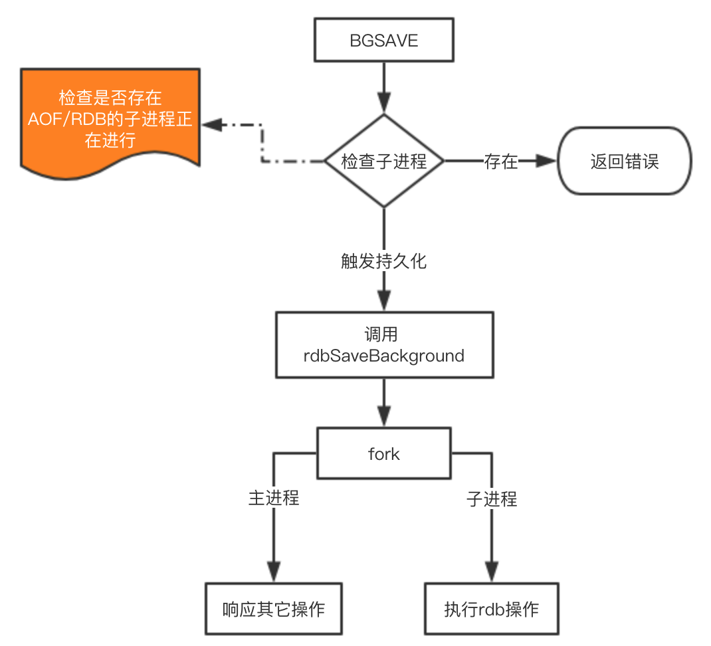
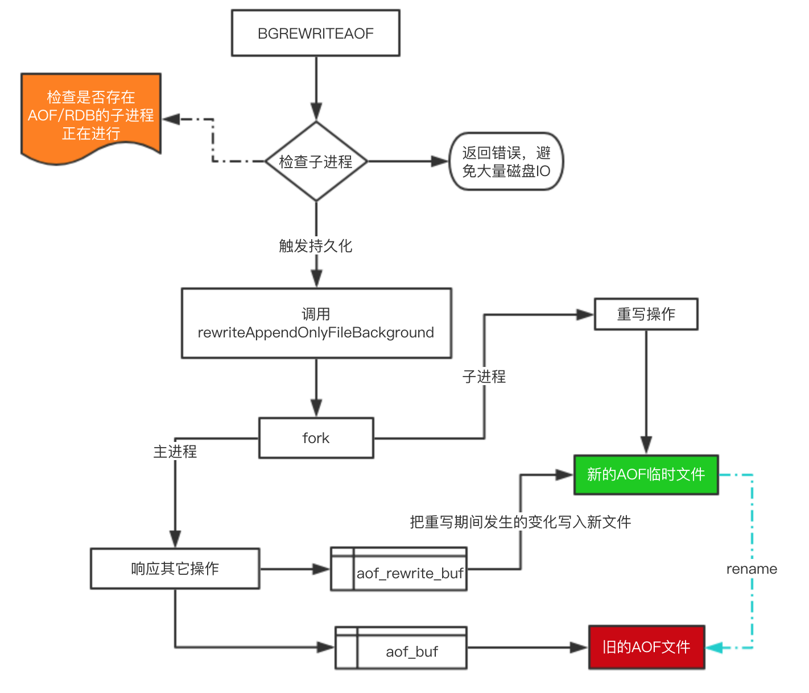
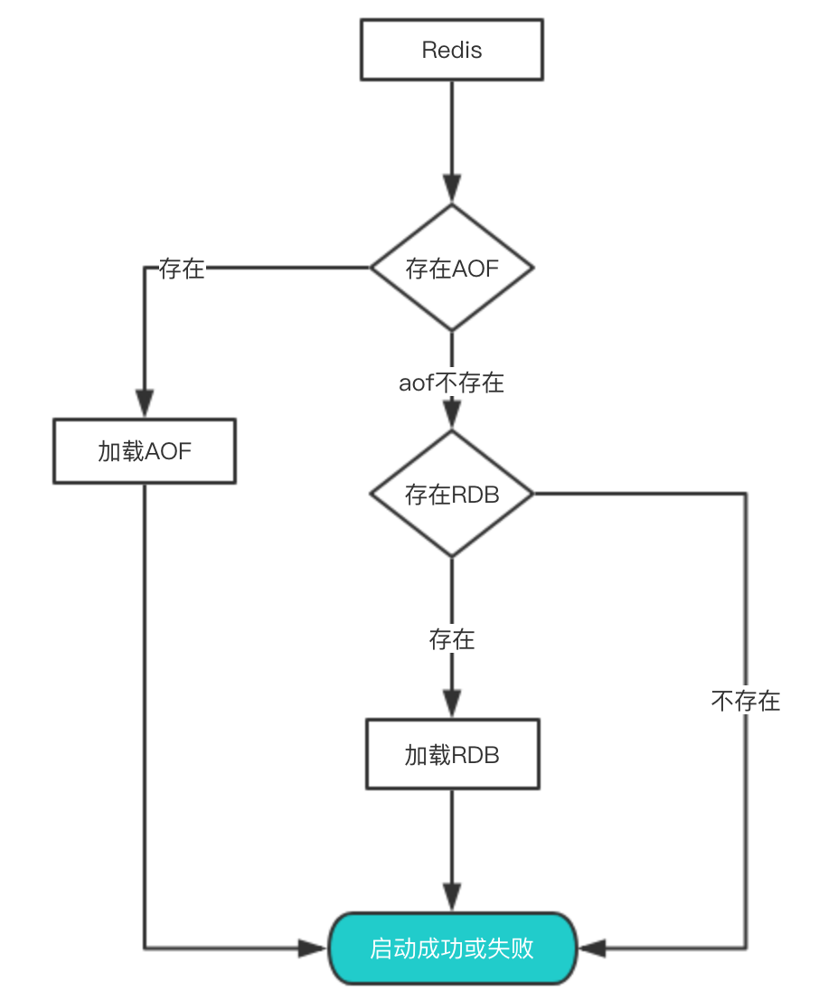

# Redis持久化的原理及优化

Redis为持久化提供了两种方式：

- RDB：在指定的时间间隔能对你的数据进行快照存储。
- AOF：记录每次对服务器写的操作,当服务器重启的时候会重新执行这些命令来恢复原始的数据。

本文将通过下面内容的介绍，希望能够让大家更全面、清晰的认识这两种持久化方式，同时理解这种保存数据的思路，应用于自己的系统设计中。

- 持久化的配置
- RDB与AOF持久化的工作原理
- 如何从持久化中恢复数据
- 关于性能与实践建议

## 持久化的配置

为了使用持久化的功能，我们需要先知道该如何开启持久化的功能。

### RDB的持久化配置

```bash
# 时间策略
save 900 1
save 300 10
save 60 10000

# 文件名称
dbfilename dump.rdb

# 文件保存路径
dir /home/work/app/redis/data/

# 如果持久化出错，主进程是否停止写入
stop-writes-on-bgsave-error yes

# 是否压缩
rdbcompression yes

# 导入时是否检查
rdbchecksum yes
```

配置其实非常简单，这里说一下持久化的时间策略具体是什么意思。

- save 900 1 表示900s内如果有1条是写入命令，就触发产生一次快照，可以理解为就进行一次备份
- save 300 10 表示300s内有10条写入，就产生快照

下面的类似，那么为什么需要配置这么多条规则呢？因为Redis每个时段的读写请求肯定不是均衡的，为了平衡性能与数据安全，我们可以自由定制什么情况下触发备份。所以这里就是根据自身Redis写入情况来进行合理配置。

`stop-writes-on-bgsave-error yes` 这个配置也是非常重要的一项配置，这是当备份进程出错时，主进程就停止接受新的写入操作，是为了保护持久化的数据一致性问题。如果自己的业务有完善的监控系统，可以禁止此项配置， 否则请开启。

关于压缩的配置 `rdbcompression yes` ，建议没有必要开启，毕竟Redis本身就属于CPU密集型服务器，再开启压缩会带来更多的CPU消耗，相比硬盘成本，CPU更值钱。

当然如果你想要禁用RDB配置，也是非常容易的，只需要在save的最后一行写上：`save ""`

### AOF的配置

```bash

# 是否开启aof
appendonly yes

# 文件名称
appendfilename "appendonly.aof"

# 同步方式
appendfsync everysec

# aof重写期间是否同步
no-appendfsync-on-rewrite no

# 重写触发配置
auto-aof-rewrite-percentage 100
auto-aof-rewrite-min-size 64mb

# 加载aof时如果有错如何处理
aof-load-truncated yes

# 文件重写策略
aof-rewrite-incremental-fsync yes
```

复制代码还是重点解释一些关键的配置：

`appendfsync everysec` 它其实有三种模式:

- always：把每个写命令都立即同步到aof，很慢，但是很安全
- everysec：每秒同步一次，是折中方案
- no：redis不处理交给OS来处理，非常快，但是也最不安全

一般情况下都采用 `everysec` 配置，这样可以兼顾速度与安全，最多损失1s的数据。

`aof-load-truncated yes` 如果该配置启用，在加载时发现aof尾部不正确是，会向客户端写入一个log，但是会继续执行，如果设置为 `no` ，发现错误就会停止，必须修复后才能重新加载。

## 工作原理

关于原理部分，我们主要来看RDB与AOF是如何完成持久化的，他们的过程是如何。

在介绍原理之前先说下Redis内部的定时任务机制，定时任务执行的频率可以在配置文件中通过 hz 10 来设置（这个配置表示1s内执行10次，也就是每100ms触发一次定时任务）。该值最大能够设置为：500，但是不建议超过：100，因为值越大说明执行频率越频繁越高，这会带来CPU的更多消耗，从而影响主进程读写性能。

定时任务使用的是Redis自己实现的 TimeEvent，它会定时去调用一些命令完成定时任务，这些任务可能会阻塞主进程导致Redis性能下降。因此我们在配置Redis时，一定要整体考虑一些会触发定时任务的配置，根据实际情况进行调整。

### RDB的原理

在Redis中RDB持久化的触发分为两种：自己手动触发与Redis定时触发。

**针对RDB方式的持久化，手动触发可以使用：**

- save：会阻塞当前Redis服务器，直到持久化完成，线上应该禁止使用。
- bgsave：该触发方式会fork一个子进程，由子进程负责持久化过程，因此阻塞只会发生在fork子进程的时候。

**而自动触发的场景主要是有以下几点：**

- 根据我们的 `save m n` 配置规则自动触发；
- 从节点全量复制时，主节点发送`rdb`文件给从节点完成复制操作，主节点会触发 `bgsave`；
- 执行 debug reload 时；
- 执行  shutdown时，如果没有开启aof，也会触发。

由于 save 基本不会被使用到，我们重点看看 bgsave 这个命令是如何完成RDB的持久化的。



这里注意的是 fork 操作会阻塞，导致Redis读写性能下降。我们可以控制单个Redis实例的最大内存，来尽可能降低Redis在fork时的事件消耗。以及上面提到的自动触发的频率减少fork次数，或者使用手动触发，根据自己的机制来完成持久化。

### AOF的原理

AOF的整个流程大体来看可以分为两步，一步是命令的实时写入（如果是 `appendfsync everysec` 配置，会有`1s`损耗），第二步是对aof文件的重写。
对于增量追加到文件这一步主要的流程是：`命令写入=>追加到aof_buf =>同步到aof磁盘`。那么这里为什么要先写入buf在同步到磁盘呢？如果实时写入磁盘会带来非常高的磁盘IO，影响整体性能。
aof重写是为了减少aof文件的大小，可以手动或者自动触发，关于自动触发的规则请看上面配置部分。fork的操作也是发生在重写这一步，也是这里会对主进程产生阻塞。
手动触发： `bgrewriteaof`，自动触发 就是根据配置规则来触发，当然自动触发的整体时间还跟Redis的定时任务频率有关系。

下面来看看重写的一个流程图：



对于上图有四个关键点补充一下：

在重写期间，由于主进程依然在响应命令，为了保证最终备份的完整性；因此它依然会写入旧的AOF file中，如果重写失败，能够保证数据不丢失。
为了把重写期间响应的写入信息也写入到新的文件中，因此也会为子进程保留一个buf，防止新写的file丢失数据。
重写是直接把当前内存的数据生成对应命令，并不需要读取老的AOF文件进行分析、命令合并。
AOF文件直接采用的文本协议，主要是兼容性好、追加方便、可读性高可认为修改修复。


> 不能是RDB还是AOF都是先写入一个临时文件，然后通过 rename 完成文件的替换工作。

## 从持久化中恢复数据

数据的备份、持久化做完了，我们如何从这些持久化文件中恢复数据呢？如果一台服务器上有既有RDB文件，又有AOF文件，该加载谁呢？
其实想要从这些文件中恢复数据，只需要重新启动Redis即可。我们还是通过图来了解这个流程：




启动时会先检查AOF文件是否存在，如果不存在就尝试加载RDB。那么为什么会优先加载AOF呢？因为AOF保存的数据更完整，通过上面的分析我们知道AOF基本上最多损失1s的数据。

## 性能与实践

通过上面的分析，我们都知道RDB的快照、AOF的重写都需要fork，这是一个重量级操作，会对Redis造成阻塞。因此为了不影响Redis主进程响应，我们需要尽可能降低阻塞。

- 降低fork的频率，比如可以手动来触发RDB生成快照、与AOF重写；
- 控制Redis最大使用内存，防止fork耗时过长；
- 使用更牛逼的硬件；
- 合理配置Linux的内存分配策略，避免因为物理内存不足导致fork失败。

在线上我们到底该怎么做？我提供一些自己的实践经验。

- 如果Redis中的数据并不是特别敏感或者可以通过其它方式重写生成数据，可以关闭持久化，如果丢失数据可以通过其它途径补回；
- 自己制定策略定期检查Redis的情况，然后可以手动触发备份、重写数据；
- 单机如果部署多个实例，要防止多个机器同时运行持久化、重写操作，防止出现内存、CPU、IO资源竞争，让持久化变为串行；
- 可以加入主从机器，利用一台从机器进行备份处理，其它机器正常响应客户端的命令；
- RDB持久化与AOF持久化可以同时存在，配合使用。


> 作者：大愚Talk
> 链接：https://juejin.im/post/5b70dfcf518825610f1f5c16
> 来源：掘金
> 著作权归作者所有。商业转载请联系作者获得授权，非商业转载请注明出处。