# MySQL数据库经典面试题解析

## 1. MySQL 索引使用有哪些注意事项呢？

可以从三个维度回答这个问题：索引哪些情况会失效，索引不适合哪些场景，索引规则

### 索引哪些情况会失效

- 查询条件包含or，可能导致索引失效
- 如何字段类型是字符串，where时一定用引号括起来，否则索引失效
- like通配符可能导致索引失效。
- 联合索引，查询时的条件列不是联合索引中的第一个列，索引失效。
- 在索引列上使用mysql的内置函数，索引失效。
- 对索引列运算（如，+、-、*、/），索引失效。
- 索引字段上使用（！= 或者 < >，not in）时，可能会导致索引失效。
- 索引字段上使用is null， is not null，可能导致索引失效。
- 左连接查询或者右连接查询查询关联的字段编码格式不一样，可能导致索引失效。
- mysql估计使用全表扫描要比使用索引快,则不使用索引。

### 索引不适合哪些场景

- 数据量少的不适合加索引
- 更新比较频繁的也不适合加索引
- 区分度低的字段不适合加索引（如性别）

### 索引的一些潜规则

- 覆盖索引
- 回表
- 索引数据结构（B+树）
- 最左前缀原则
- 索引下推

## 2. MySQL 遇到过死锁问题吗，你是如何解决的？

我排查死锁的一般步骤是酱紫的：

- 查看死锁日志show engine innodb status;
- 找出死锁Sql
- 分析sql加锁情况
- 模拟死锁案发
- 分析死锁日志
- 分析死锁结果

## 3. 日常工作中你是怎么优化SQL的？

可以从这几个维度回答这个问题：

- 加索引
- 避免返回不必要的数据
- 适当分批量进行
- 优化sql结构
- 分库分表
- 读写分离

## 4. 说说分库与分表的设计

分库分表方案，分库分表中间件，分库分表可能遇到的问题

### 分库分表方案:

- 水平分库：以字段为依据，按照一定策略（hash、range等），将一个库中的数据拆分到多个库中。
- 水平分表：以字段为依据，按照一定策略（hash、range等），将一个表中的数据拆分到多个表中。
- 垂直分库：以表为依据，按照业务归属不同，将不同的表拆分到不同的库中。
- 垂直分表：以字段为依据，按照字段的活跃性，将表中字段拆到不同的表（主表和扩展表）中。

### 常用的分库分表中间件：

- sharding-jdbc（当当）
- Mycat
- TDDL（淘宝）
- Oceanus(58同城数据库中间件)
- vitess（谷歌开发的数据库中间件）
- Atlas(Qihoo 360)

### 分库分表可能遇到的问题

- 事务问题：需要用分布式事务啦
- 跨节点Join的问题：解决这一问题可以分两次查询实现
- 跨节点的count,order by,group by以及聚合函数问题：分别在各个节点上得到结果后在应用程序端进行合并。
- 数据迁移，容量规划，扩容等问题
- ID问题：数据库被切分后，不能再依赖数据库自身的主键生成机制啦，最简单可以考虑UUID
- 跨分片的排序分页问题（后台加大pagesize处理？）

## 5. InnoDB与MyISAM的区别

- InnoDB支持事务，MyISAM不支持事务
- InnoDB支持外键，MyISAM不支持外键
- InnoDB 支持 MVCC(多版本并发控制)，MyISAM 不支持
- `select count(*) from table`时，MyISAM更快，因为它有一个变量保存了整个表的总行数，可以直接读取，InnoDB就需要全表扫描。
- Innodb不支持全文索引，而MyISAM支持全文索引（5.7以后的InnoDB也支持全文索引）
- InnoDB支持表、行级锁，而MyISAM支持表级锁。
- InnoDB表必须有主键，而MyISAM可以没有主键
- Innodb表需要更多的内存和存储，而MyISAM可被压缩，存储空间较小，。
- Innodb按主键大小有序插入，MyISAM记录插入顺序是，按记录插入顺序保存。
- InnoDB 存储引擎提供了具有提交、回滚、崩溃恢复能力的事务安全，与 MyISAM 比 InnoDB 写的效率差一些，并且会占用更多的磁盘空间以保留数据和索引
- InnoDB 属于索引组织表，使用共享表空间和多表空间储存数据。MyISAM用`.frm`、`.MYD`、`.MTI`来储存表定义，数据和索引。

## 6. 数据库索引的原理，为什么要用 B+树，为什么不用二叉树？

可以从几个维度去看这个问题，查询是否够快，效率是否稳定，存储数据多少，以及查找磁盘次数，为什么不是二叉树，为什么不是平衡二叉树，为什么不是B树，而偏偏是B+树呢？

### 为什么不是一般二叉树？

如果二叉树特殊化为一个链表，相当于全表扫描。平衡二叉树相比于二叉查找树来说，查找效率更稳定，总体的查找速度也更快。

### 为什么不是平衡二叉树呢？

我们知道，在内存比在磁盘的数据，查询效率快得多。如果树这种数据结构作为索引，那我们每查找一次数据就需要从磁盘中读取一个节点，也就是我们说的一个磁盘块，但是平衡二叉树可是每个节点只存储一个键值和数据的，如果是B树，可以存储更多的节点数据，树的高度也会降低，因此读取磁盘的次数就降下来啦，查询效率就快啦。

### 那为什么不是B树而是B+树呢？

- 1）B+树非叶子节点上是不存储数据的，仅存储键值，而B树节点中不仅存储键值，也会存储数据。innodb中页的默认大小是16KB，如果不存储数据，那么就会存储更多的键值，相应的树的阶数（节点的子节点树）就会更大，树就会更矮更胖，如此一来我们查找数据进行磁盘的IO次数有会再次减少，数据查询的效率也会更快。
- 2）B+树索引的所有数据均存储在叶子节点，而且数据是按照顺序排列的，链表连着的。那么B+树使得范围查找，排序查找，分组查找以及去重查找变得异常简单。


## 7. 聚集索引与非聚集索引的区别

- 一个表中只能拥有一个聚集索引，而非聚集索引一个表可以存在多个。
- 聚集索引，索引中键值的逻辑顺序决定了表中相应行的物理顺序；非聚集索引，索引中索引的逻辑顺序与磁盘上行的物理存储顺序不同。
- 索引是通过二叉树的数据结构来描述的，我们可以这么理解聚簇索引：索引的叶节点就是数据节点。而非聚簇索引的叶节点仍然是索引节点，只不过有一个指针指向对应的数据块。
- 聚集索引：物理存储按照索引排序；非聚集索引：物理存储不按照索引排序；

何时使用聚集索引或非聚集索引？

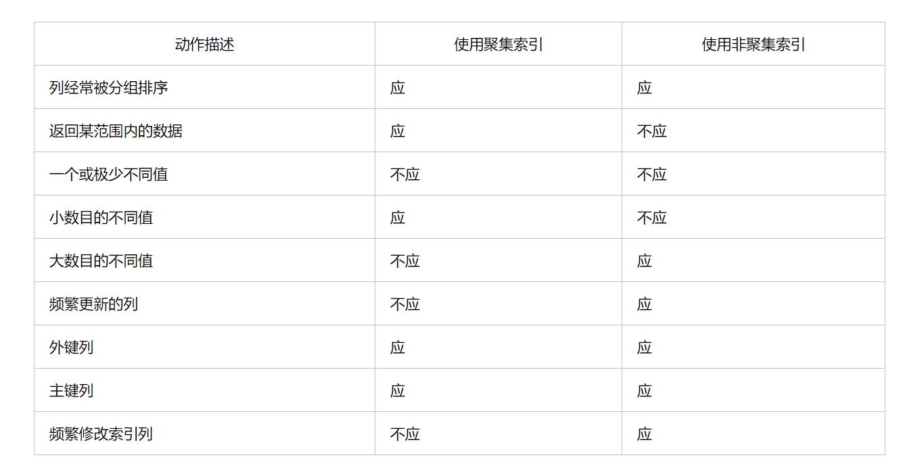


## 8. limit 1000000 加载很慢的话，你是怎么解决的呢？

方案一：如果id是连续的，可以这样，返回上次查询的最大记录(偏移量)，再往下limit

```sql
select id，name from employee where id>1000000 limit 10.
```

方案二：在业务允许的情况下限制页数：

建议跟业务讨论，有没有必要查这么后的分页啦。因为绝大多数用户都不会往后翻太多页。

方案三：order by + 索引（id为索引）

```sql
select id，name from employee order by id  limit 1000000，10
```

```sql
SELECT a.* FROM employee a, (select id from employee where 条件 LIMIT 1000000,10 ) b where a.id=b.id
```

方案四：利用延迟关联或者子查询优化超多分页场景。（先快速定位需要获取的id段，然后再关联）

## 9. 如何选择合适的分布式主键方案呢？

- 数据库自增长序列或字段。
- UUID。
- Redis生成ID
- Twitter的snowflake算法
- 利用zookeeper生成唯一ID
- MongoDB的ObjectId

## 10. 事务的隔离级别有哪些？MySQL的默认隔离级别是什么？

- 读未提交（Read Uncommitted）
- 读已提交（Read Committed）
- 可重复读（Repeatable Read）
- 串行化（Serializable）

Mysql默认的事务隔离级别是可重复读(Repeatable Read)

## 11. 什么是幻读，脏读，不可重复读呢？

- 事务A、B交替执行，事务A被事务B干扰到了，因为事务A读取到事务B未提交的数据,这就是脏读
- 在一个事务范围内，两个相同的查询，读取同一条记录，却返回了不同的数据，这就是不可重复读。
- 事务A查询一个范围的结果集，另一个并发事务B往这个范围中插入/删除了数据，并静悄悄地提交，然后事务A再次查询相同的范围，两次读取得到的结果集不一样了，这就是幻读。

## 12. 在高并发情况下，如何做到安全的修改同一行数据？

要安全的修改同一行数据，就要保证一个线程在修改时其它线程无法更新这行记录。一般有悲观锁和乐观锁两种方案~

### 使用悲观锁

悲观锁思想就是，当前线程要进来修改数据时，别的线程都得拒之门外~
比如，可以使用select…for update ~

```sql
select * from User where name=‘jay’ for update
```

以上这条sql语句会锁定了User表中所有符合检索条件（name=‘jay’）的记录。本次事务提交之前，别的线程都无法修改这些记录。

### 使用乐观锁

乐观锁思想就是，有线程过来，先放过去修改，如果看到别的线程没修改过，就可以修改成功，如果别的线程修改过，就修改失败或者重试。实现方式：乐观锁一般会使用版本号机制或CAS算法实现。

## 13. 数据库的乐观锁和悲观锁。

### 悲观锁：

悲观锁她专一且缺乏安全感了，她的心只属于当前事务，每时每刻都担心着它心爱的数据可能被别的事务修改，所以一个事务拥有（获得）悲观锁后，其他任何事务都不能对数据进行修改啦，只能等待锁被释放才可以执行。

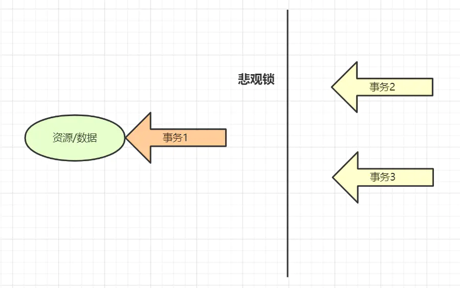

### 乐观锁：

乐观锁的“乐观情绪”体现在，它认为数据的变动不会太频繁。因此，它允许多个事务同时对数据进行变动。实现方式：乐观锁一般会使用版本号机制或CAS算法实现。

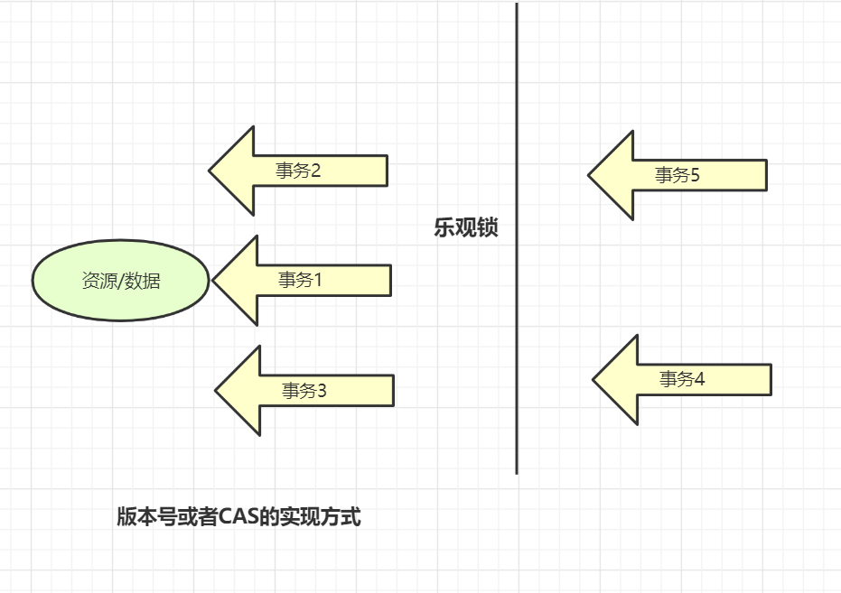

## 14. SQL优化的一般步骤是什么，怎么看执行计划（explain），如何理解其中各个字段的含义。

- `show status` 命令了解各种 sql 的执行频率
- 通过慢查询日志定位那些执行效率较低的 sql 语句
- `explain` 分析低效 sql 的执行计划（这点非常重要，日常开发中用它分析Sql，会大大降低Sql导致的线上事故）

## 15. select for update有什么含义，会锁表还是锁行还是其他。

### select for update 含义

select查询语句是不会加锁的，但是select for update除了有查询的作用外，还会加锁呢，而且它是悲观锁哦。至于加了是行锁还是表锁，这就要看是不是用了索引/主键啦。
没用索引/主键的话就是表锁，否则就是是行锁。

## 16. MySQL事务得四大特性以及实现原理

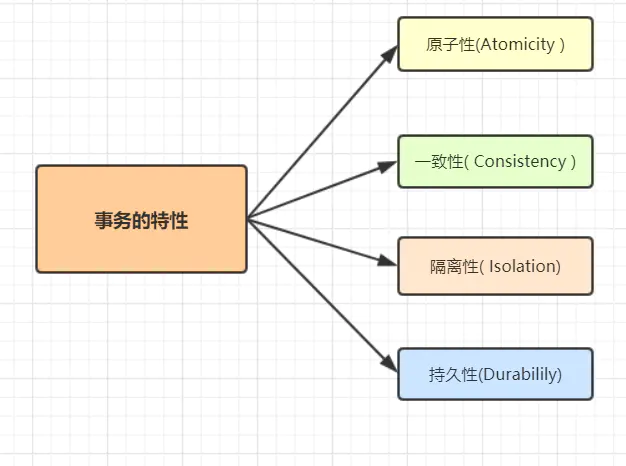

- 原子性： 事务作为一个整体被执行，包含在其中的对数据库的操作要么全部被执行，要么都不执行。
- 一致性： 指在事务开始之前和事务结束以后，数据不会被破坏，假如A账户给B账户转10块钱，不管成功与否，A和B的总金额是不变的。
- 隔离性： 多个事务并发访问时，事务之间是相互隔离的，即一个事务不影响其它事务运行效果。简言之，就是事务之间是进水不犯河水的。
- 持久性： 表示事务完成以后，该事务对数据库所作的操作更改，将持久地保存在数据库之中。

### 事务ACID特性的实现思想

- 原子性：是使用 undo log来实现的，如果事务执行过程中出错或者用户执行了rollback，系统通过undo log日志返回事务开始的状态。
- 持久性：使用 redo log来实现，只要redo log日志持久化了，当系统崩溃，即可通过redo log把数据恢复。
- 隔离性：通过锁以及MVCC,使事务相互隔离开。
- 一致性：通过回滚、恢复，以及并发情况下的隔离性，从而实现一致性。

## 17. 如果某个表有近千万数据，CRUD比较慢，如何优化。

### 分库分表

某个表有近千万数据，可以考虑优化表结构，分表（水平分表，垂直分表），当然，你这样回答，需要准备好面试官问你的分库分表相关问题呀，如

- 分表方案（水平分表，垂直分表，切分规则hash等）
- 分库分表中间件（Mycat，sharding-jdbc等）
- 分库分表一些问题（事务问题？跨节点Join的问题）
- 解决方案（分布式事务等）

### 索引优化

除了分库分表，优化表结构，当然还有所以索引优化等方案~

## 18. 如何写sql能够有效的使用到复合索引。

复合索引，也叫组合索引，用户可以在多个列上建立索引,这种索引叫做复合索引。

当我们创建一个组合索引的时候，如(k1,k2,k3)，相当于创建了（k1）、(k1,k2)和(k1,k2,k3)三个索引，这就是最左匹配原则。

```sql
select * from table where k1=A AND k2=B AND k3=D 
```

有关于复合索引，我们需要关注查询Sql条件的顺序，确保最左匹配原则有效，同时可以删除不必要的冗余索引。


## 19. mysql中in 和exists的区别。

这个，跟一下demo来看更刺激吧，啊哈哈

假设表A表示某企业的员工表，表B表示部门表，查询所有部门的所有员工，很容易有以下SQL:

```sql
select * from A where deptId in (select deptId from B);
```

这样写等价于：

>先查询部门表B
>select deptId from B
>再由部门deptId，查询A的员工
> select * from A where A.deptId = B.deptId

可以抽象成这样的一个循环：

```sql
   List<> resultSet ;
    for(int i=0;i<B.length;i++) {
          for(int j=0;j<A.length;j++) {
          if(A[i].id==B[j].id) {
             resultSet.add(A[i]);
             break;
          }
       }
    }
```

显然，除了使用in，我们也可以用exists实现一样的查询功能，如下：

```sql
select * from A where exists (select 1 from B where A.deptId = B.deptId); 
```

因为exists查询的理解就是，先执行主查询，获得数据后，再放到子查询中做条件验证，根据验证结果（true或者false），来决定主查询的数据结果是否得意保留。

那么，这样写就等价于：

> select * from A,先从A表做循环
> select * from B where A.deptId = B.deptId,再从B表做循环.

同理，可以抽象成这样一个循环：

```java 
 List<> resultSet ;
    for(int i=0;i<A.length;i++) {
          for(int j=0;j<B.length;j++) {
          if(A[i].deptId==B[j].deptId) {
             resultSet.add(A[i]);
             break;
          }
       }
    }
```

数据库最费劲的就是跟程序链接释放。假设链接了两次，每次做上百万次的数据集查询，查完就走，这样就只做了两次；相反建立了上百万次链接，申请链接释放反复重复，这样系统就受不了了。即mysql优化原则，就是小表驱动大表，小的数据集驱动大的数据集，从而让性能更优。
因此，我们要选择最外层循环小的，也就是，如果B的数据量小于A，适合使用in，如果B的数据量大于A，即适合选择exists，这就是in和exists的区别。

## 20. 数据库自增主键可能遇到什么问题。

使用自增主键对数据库做分库分表，可能出现诸如主键重复等的问题。解决方案的话，简单点的话可以考虑使用UUID哈
自增主键会产生表锁，从而引发问题
自增主键可能用完问题。

## 21. MVCC熟悉吗，它的底层原理？

MVCC,多版本并发控制,它是通过读取历史版本的数据，来降低并发事务冲突，从而提高并发性能的一种机制。

### MVCC需要关注这几个知识点：

- 事务版本号
- 表的隐藏列
- undo log
- read view

## 22. 数据库中间件了解过吗，sharding jdbc，mycat？

sharding-jdbc目前是基于jdbc驱动，无需额外的proxy，因此也无需关注proxy本身的高可用。
Mycat 是基于 Proxy，它复写了 MySQL 协议，将 Mycat Server 伪装成一个 MySQL 数据库，而 Sharding-JDBC 是基于 JDBC 接口的扩展，是以 jar 包的形式提供轻量级服务的。

## 23. MYSQL的主从延迟，你怎么解决？

嘻嘻，先复习一下主从复制原理吧，如图：


主从复制分了五个步骤进行：

- 步骤一：主库的更新事件(update、insert、delete)被写到binlog
- 步骤二：从库发起连接，连接到主库。
- 步骤三：此时主库创建一个binlog dump thread，把binlog的内容发送到从库。
- 步骤四：从库启动之后，创建一个I/O线程，读取主库传过来的binlog内容并写入到relay log
- 步骤五：还会创建一个SQL线程，从relay log里面读取内容，从Exec_Master_Log_Pos位置开始执行读取到的更新事件，将更新内容写入到slave的db

### 主从同步延迟的原因

一个服务器开放Ｎ个链接给客户端来连接的，这样有会有大并发的更新操作, 但是从服务器的里面读取binlog的线程仅有一个，当某个SQL在从服务器上执行的时间稍长 或者由于某个SQL要进行锁表就会导致，主服务器的SQL大量积压，未被同步到从服务器里。这就导致了主从不一致， 也就是主从延迟。

### 主从同步延迟的解决办法

- 主服务器要负责更新操作，对安全性的要求比从服务器要高，所以有些设置参数可以修改，比如sync_binlog=1，innodb_flush_log_at_trx_commit = 1 之类的设置等。
- 选择更好的硬件设备作为slave。
- 把一台从服务器当度作为备份使用， 而不提供查询， 那边他的负载下来了， 执行relay log 里面的SQL效率自然就高了。
- 增加从服务器喽，这个目的还是分散读的压力，从而降低服务器负载。

## 24. 说一下大表查询的优化方案

- 优化shema、sql语句+索引；
- 可以考虑加缓存，memcached, redis，或者JVM本地缓存；
- 主从复制，读写分离；
- 分库分表；

## 25. 什么是数据库连接池?为什么需要数据库连接池呢?

### 连接池基本原理：

数据库连接池原理：在内部对象池中，维护一定数量的数据库连接，并对外暴露数据库连接的获取和返回方法。

### 应用程序和数据库建立连接的过程：

- 通过TCP协议的三次握手和数据库服务器建立连接
- 发送数据库用户账号密码，等待数据库验证用户身份
- 完成身份验证后，系统可以提交SQL语句到数据库执行
- 把连接关闭，TCP四次挥手告别。

### 数据库连接池好处：

- 资源重用 (连接复用)
- 更快的系统响应速度
- 新的资源分配手段
 统一的连接管理，避免数据库连接泄漏

## 26. 一条SQL语句在MySQL中如何执行的？

先看一下Mysql的逻辑架构图吧~

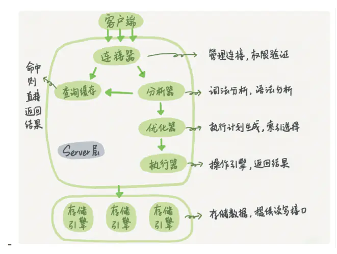

### 查询语句：

- 先检查该语句是否有权限
- 如果没有权限，直接返回错误信息
- 如果有权限，在 MySQL8.0 版本以前，会先查询缓存。
- 如果没有缓存，分析器进行词法分析，提取 sql 语句select等的关键元素。然后判断sql 语句是否有语法错误，比如关键词是否正确等等。
- 优化器进行确定执行方案
- 进行权限校验，如果没有权限就直接返回错误信息，如果有权限就会调用数据库引擎接口，返回执行结果。

## 27. InnoDB引擎中的索引策略，了解过吗？

- 覆盖索引
- 最左前缀原则
- 索引下推
- 索引下推优化是 MySQL 5.6 引入的， 可以在索引遍历过程中，对索引中包含的字段先做判断，直接过滤掉不满足条件的记录，减少回表次数。

## 28. 数据库存储日期格式时，如何考虑时区转换问题？

- datetime类型适合用来记录数据的原始的创建时间，修改记录中其他字段的值，datetime字段的值不会改变，除非手动修改它。
- timestamp类型适合用来记录数据的最后修改时间，只要修改了记录中其他字段的值，timestamp字段的值都会被自动更新。

## 29. 一条sql执行过长的时间，你如何优化，从哪些方面入手？

- 查看是否涉及多表和子查询，优化Sql结构，如去除冗余字段，是否可拆表等
- 优化索引结构，看是否可以适当添加索引
- 数量大的表，可以考虑进行分离/分表（如交易流水表）
- 数据库主从分离，读写分离
- explain分析sql语句，查看执行计划，优化sql
- 查看mysql执行日志，分析是否有其他方面的问题

## 30. MYSQL数据库服务器性能分析的方法命令有哪些?

- Show status, 一些值得监控的变量值：

> Bytes_received和Bytes_sent 和服务器之间来往的流量。
>  Com_*服务器正在执行的命令。
>  Created_*在查询执行期限间创建的临时表和文件。
>  Handler_*存储引擎操作。
>  Select_*不同类型的联接执行计划。
>  Sort_*几种排序信息。
  
- Show profiles 是MySql用来分析当前会话SQL语句执行的资源消耗情况

## 31. Blob和text有什么区别？

- Blob用于存储二进制数据，而Text用于存储大字符串。
- Blob值被视为二进制字符串（字节字符串）,它们没有字符集，并且排序和比较基于列值中的字节的数值。
- text值被视为非二进制字符串（字符字符串）。它们有一个字符集，并根据字符集的排序规则对值进行排序和比较。

## 32.  mysql里记录货币用什么字段类型比较好？

- 货币在数据库中MySQL常用Decimal和Numric类型表示，这两种类型被MySQL实现为同样的类型。他们被用于保存与金钱有关的数据。
- salary DECIMAL(9,2)，9(precision)代表将被用于存储值的总的小数位数，而2(scale)代表将被用于存储小数点后的位数。存储在salary列中的值的范围是从-9999999.99到9999999.99。
- DECIMAL和NUMERIC值作为字符串存储，而不是作为二进制浮点数，以便保存那些值的小数精度。

## 33.  Mysql中有哪几种锁，列举一下？

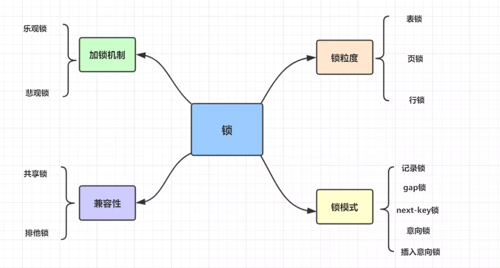

如果按锁粒度划分，有以下3种：

- 表锁： 开销小，加锁快；锁定力度大，发生锁冲突概率高，并发度最低;不会出现死锁。
- 行锁： 开销大，加锁慢；会出现死锁；锁定粒度小，发生锁冲突的概率低，并发度高。
- 页锁： 开销和加锁速度介于表锁和行锁之间；会出现死锁；锁定粒度介于表锁和行锁之间，并发度一般

## 34.  Hash索引和B+树区别是什么？你在设计索引是怎么抉择的？

- B+树可以进行范围查询，Hash索引不能。
- B+树支持联合索引的最左侧原则，Hash索引不支持。
- B+树支持order by排序，Hash索引不支持。
- Hash索引在等值查询上比B+树效率更高。
- B+树使用like 进行模糊查询的时候，like后面（比如%开头）的话可以起到优化的作用，Hash索引根本无法进行模糊查询。

## 35.  mysql 的内连接、左连接、右连接有什么区别？

- Inner join 内连接，在两张表进行连接查询时，只保留两张表中完全匹配的结果集
- left join 在两张表进行连接查询时，会返回左表所有的行，即使在右表中没有匹配的记录。
- right join 在两张表进行连接查询时，会返回右表所有的行，即使在左表中没有匹配的记录。

## 36.  说说MySQL 的基础架构图

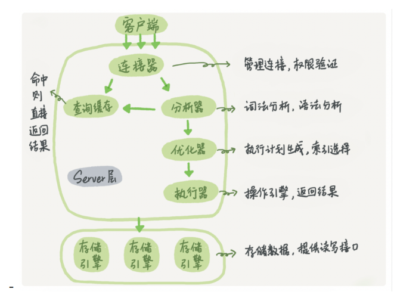

Mysql逻辑架构图主要分三层：

- 第一层负责连接处理，授权认证，安全等等
- 第二层负责编译并优化SQL
- 第三层是存储引擎。

## 37.  什么是内连接、外连接、交叉连接、笛卡尔积呢？

- 内连接（inner join）：取得两张表中满足存在连接匹配关系的记录。
- 外连接（outer join）：取得两张表中满足存在连接匹配关系的记录，以及某张表（或两张表）中不满足匹配关系的记录。
- 交叉连接（cross join）：显示两张表所有记录一一对应，没有匹配关系进行筛选，也被称为：笛卡尔积。

## 38.  说一下数据库的三大范式

- 第一范式：数据表中的每一列（每个字段）都不可以再拆分。
- 第二范式：在第一范式的基础上，分主键列完全依赖于主键，而不能是依赖于主键的一部分。
- 第三范式：在满足第二范式的基础上，表中的非主键只依赖于主键，而不依赖于其他非主键。

## 39.  mysql有关权限的表有哪几个呢？

MySQL服务器通过权限表来控制用户对数据库的访问，权限表存放在mysql数据库里，由mysql_install_db脚本初始化。这些权限表分别user，db，table_priv，columns_priv和host。

- user权限表：记录允许连接到服务器的用户帐号信息，里面的权限是全局级的。
- db权限表：记录各个帐号在各个数据库上的操作权限。
- table_priv权限表：记录数据表级的操作权限。
- columns_priv权限表：记录数据列级的操作权限。
- host权限表：配合db权限表对给定主机上数据库级操作权限作更细致的控制。这个权限表不受GRANT和REVOKE语句的影响。

## 40.  Mysql的binlog有几种录入格式？分别有什么区别？

有三种格式哈，statement，row和mixed。

- statement，每一条会修改数据的sql都会记录在binlog中。不需要记录每一行的变化，减少了binlog日志量，节约了IO，提高性能。由于sql的执行是有上下文的，因此在保存的时候需要保存相关的信息，同时还有一些使用了函数之类的语句无法被记录复制。
- row，不记录sql语句上下文相关信息，仅保存哪条记录被修改。记录单元为每一行的改动，基本是可以全部记下来但是由于很多操作，会导致大量行的改动(比如alter table)，因此这种模式的文件保存的信息太多，日志量太大。
- mixed，一种折中的方案，普通操作使用statement记录，当无法使用statement的时候使用row。


## 41.  InnoDB引擎的4大特性，了解过吗

- 插入缓冲（insert buffer)
- 二次写(double write)
- 自适应哈希索引(ahi)
- 预读(read ahead)

## 42.  索引有哪些优缺点？

**优点：**

- 唯一索引可以保证数据库表中每一行的数据的唯一性
- 索引可以加快数据查询速度，减少查询时间

**缺点：**

- 创建索引和维护索引要耗费时间
- 索引需要占物理空间，除了数据表占用数据空间之外，每一个索引还要占用一定的物理空间
- 以表中的数据进行增、删、改的时候，索引也要动态的维护。

## 43.  索引有哪几种类型？

- 主键索引: 数据列不允许重复，不允许为NULL，一个表只能有一个主键。
- 唯一索引: 数据列不允许重复，允许为NULL值，一个表允许多个列创建唯一索引。
- 普通索引: 基本的索引类型，没有唯一性的限制，允许为NULL值。
- 全文索引：是目前搜索引擎使用的一种关键技术，对文本的内容进行分词、搜索。
- 覆盖索引：查询列要被所建的索引覆盖，不必读取数据行
- 组合索引：多列值组成一个索引，用于组合搜索，效率大于索引合并

## 44.  创建索引有什么原则呢？

- 最左前缀匹配原则
- 频繁作为查询条件的字段才去创建索引
- 频繁更新的字段不适合创建索引
- 索引列不能参与计算，不能有函数操作
- 优先考虑扩展索引，而不是新建索引，避免不必要的索引
- 在order by或者group by子句中，创建索引需要注意顺序
- 区分度低的数据列不适合做索引列(如性别）
- 定义有外键的数据列一定要建立索引。
- 对于定义为text、image数据类型的列不要建立索引。
- 删除不再使用或者很少使用的索引

## 45.  创建索引的三种方式

在执行CREATE TABLE时创建索引

```sql
CREATE TABLE `employee` (
  `id` int(11) NOT NULL,
  `name` varchar(255) DEFAULT NULL,
  `age` int(11) DEFAULT NULL,
  `date` datetime DEFAULT NULL,
  `sex` int(1) DEFAULT NULL,
  PRIMARY KEY (`id`),
  KEY `idx_name` (`name`) USING BTREE
) ENGINE=InnoDB DEFAULT CHARSET=utf8;
```

使用ALTER TABLE命令添加索引

```sql
ALTER TABLE table_name ADD INDEX index_name (column);
```

使用CREATE INDEX命令创建

```sql
CREATE INDEX index_name ON table_name (column);
```

## 46. 百万级别或以上的数据，你是如何删除的？

- 我们想要删除百万数据的时候可以先删除索引
- 然后批量删除其中无用数据
- 删除完成后重新创建索引。

## 47. 什么是最左前缀原则？什么是最左匹配原则？

- 最左前缀原则，就是最左优先，在创建多列索引时，要根据业务需求，where子句中使用最频繁的一列放在最左边。
- 当我们创建一个组合索引的时候，如(k1,k2,k3)，相当于创建了（k1）、(k1,k2)和(k1,k2,k3)三个索引，这就是最左匹配原则。。

## 48.  B树和B+树的区别，数据库为什么使用B+树而不是B树？

- 在B树中，键和值即存放在内部节点又存放在叶子节点；在B+树中，内部节点只存键，叶子节点则同时存放键和值。
- B+树的叶子节点有一条链相连，而B树的叶子节点各自独立的。

- B+树索引的所有数据均存储在叶子节点，而且数据是按照顺序排列的，链表连着的。那么B+树使得范围查找，排序查找，分组查找以及去重查找变得异常简单。.
- B+树非叶子节点上是不存储数据的，仅存储键值，而B树节点中不仅存储键值，也会存储数据。innodb中页的默认大小是16KB，如果不存储数据，那么就会存储更多的键值，相应的树的阶数（节点的子节点树）就会更大，树就会更矮更胖，如此一来我们查找数据进行磁盘的IO次数有会再次减少，数据查询的效率也会更快.


## 49.  覆盖索引、回表等这些，了解过吗？

- 覆盖索引： 查询列要被所建的索引覆盖，不必从数据表中读取，换句话说查询列要被所使用的索引覆盖。
- 回表：二级索引无法直接查询所有列的数据，所以通过二级索引查询到聚簇索引后，再查询到想要的数据，这种通过二级索引查询出来的过程，就叫做回表。

## 50.  B+树在满足聚簇索引和覆盖索引的时候不需要回表查询数据？

- 在B+树的索引中，叶子节点可能存储了当前的key值，也可能存储了当前的key值以及整行的数据，这就是聚簇索引和非聚簇索引。 在InnoDB中，只有主键索引是聚簇索引，如果没有主键，则挑选一个唯一键建立聚簇索引。如果没有唯一键，则隐式的生成一个键来建立聚簇索引。
- 当查询使用聚簇索引时，在对应的叶子节点，可以获取到整行数据，因此不用再次进行回表查询。

## 51. 何时使用聚簇索引与非聚簇索引

| 动作描述 | 使用聚集索引 | 使用非聚集索引 |
| ------ | ------ |------ |
|列经常被分组排序| 应 | 应|
|返回某范围内的数据| 应 |不应|
|一个或极少不同值 | 不应 | 不应 | 
|小数目的不同值|应|不应
|大数目的不同值|不应|应
|频繁更新的列|不应|应
|外键列|应|应|
|主键列|应|应|
|频繁修改索引列|不应|应|

## 52.  非聚簇索引一定会回表查询吗？

不一定，如果查询语句的字段全部命中了索引，那么就不必再进行回表查询（哈哈，覆盖索引就是这么回事）。

举个简单的例子，假设我们在学生表的上建立了索引，那么当进行`select age from student where age < 20`的查询时，在索引的叶子节点上，已经包含了age信息，不会再次进行回表查询。

## 53. 组合索引是什么？为什么需要注意组合索引中的顺序？

组合索引，用户可以在多个列上建立索引,这种索引叫做组合索引。
因为InnoDB引擎中的索引策略的最左原则，所以需要注意组合索引中的顺序。

## 54.  什么是数据库事务？

数据库事务（简称：事务），是数据库管理系统执行过程中的一个逻辑单位，由一个有限的数据库操作序列构成，这些操作要么全部执行,要么全部不执行，是一个不可分割的工作单位。

## 55.  隔离级别与锁的关系

回答这个问题，可以先阐述四种隔离级别，再阐述它们的实现原理。隔离级别就是依赖锁和MVCC实现的。

## 56. 按照锁的粒度分，数据库锁有哪些呢？锁机制与InnoDB锁算法


- 按锁粒度分有：表锁，页锁，行锁
- 按锁机制分有：乐观锁，悲观锁

## 57.  从锁的类别角度讲，MySQL都有哪些锁呢？

从锁的类别上来讲，有共享锁和排他锁。

- 共享锁: 又叫做读锁。当用户要进行数据的读取时，对数据加上共享锁。共享锁可以同时加上多个。
- 排他锁: 又叫做写锁。当用户要进行数据的写入时，对数据加上排他锁。排他锁只可以加一个，他和其他的排他锁，共享锁都相斥。

锁兼容性如下：

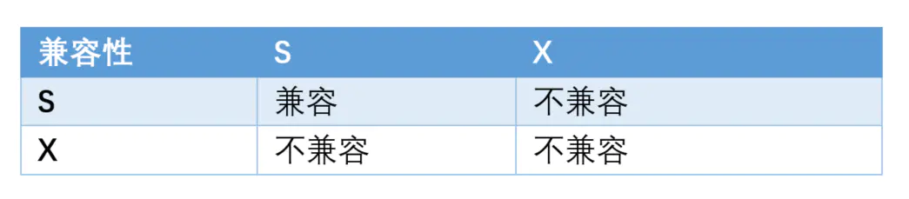

## 58. MySQL中InnoDB引擎的行锁是怎么实现的？

基于索引来完成行锁的。

```sql
select * from t where id = 666 for update;
```

for update 可以根据条件来完成行锁锁定，并且 id 是有索引键的列，如果 id 不是索引键那么InnoDB将实行表锁。

## 59.  什么是死锁？怎么解决？

死锁是指两个或多个事务在同一资源上相互占用，并请求锁定对方的资源，从而导致恶性循环的现象。看图形象一点，如下：

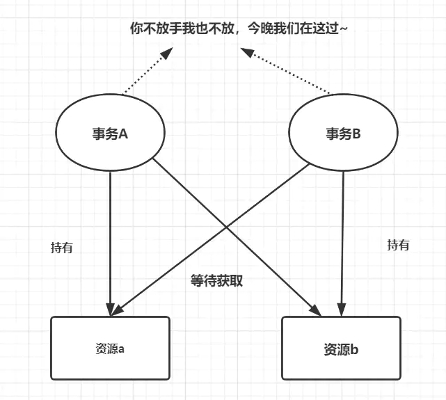

死锁有四个必要条件：互斥条件，请求和保持条件，环路等待条件，不剥夺条件。
解决死锁思路，一般就是切断环路，尽量避免并发形成环路。

- 如果不同程序会并发存取多个表，尽量约定以相同的顺序访问表，可以大大降低死锁机会。
- 在同一个事务中，尽可能做到一次锁定所需要的所有资源，减少死锁产生概率；
- 对于非常容易产生死锁的业务部分，可以尝试使用升级锁定颗粒度，通过表级锁定来减少死锁产生的概率；
- 如果业务处理不好可以用分布式事务锁或者使用乐观锁
- 死锁与索引密不可分，解决索引问题，需要合理优化你的索引，

## 60.  为什么要使用视图？什么是视图？

### 为什么要使用视图？

为了提高复杂SQL语句的复用性和表操作的安全性，MySQL数据库管理系统提供了视图特性。

### 什么是视图？

视图是一个虚拟的表，是一个表中的数据经过某种筛选后的显示方式，视图由一个预定义的查询select语句组成。

## 61.  视图有哪些特点？哪些使用场景？

### 视图特点：

- 视图的列可以来自不同的表，是表的抽象和在逻辑意义上建立的新关系。
- 视图是由基本表(实表)产生的表(虚表)。
- 视图的建立和删除不影响基本表。
- 对视图内容的更新(添加，删除和修改)直接影响基本表。
- 当视图来自多个基本表时，不允许添加和删除数据。

**视图用途：** 简化sql查询，提高开发效率，兼容老的表结构。

### 视图的常见使用场景：

- 重用SQL语句；
- 简化复杂的SQL操作。
- 使用表的组成部分而不是整个表；
- 保护数据
- 更改数据格式和表示。视图可返回与底层表的表示和格式不同的数据。

## 62.  视图的优点，缺点，讲一下？

- 查询简单化。视图能简化用户的操作
- 数据安全性。视图使用户能以多种角度看待同一数据，能够对机密数据提供安全保护
- 逻辑数据独立性。视图对重构数据库提供了一定程度的逻辑独立性

## 63.  count(1)、count(*) 与 count(列名) 的区别？

- count(*)包括了所有的列，相当于行数，在统计结果的时候，不会忽略列值为NULL
- count(1)包括了忽略所有列，用1代表代码行，在统计结果的时候，不会忽略列值为NULL
- count(列名)只包括列名那一列，在统计结果的时候，会忽略列值为空（这里的空不是只空字符串或者0，而是表示null）的计数，即某个字段值为NULL时，不统计。

## 64.  什么是游标？

游标提供了一种对从表中检索出的数据进行操作的灵活手段，就本质而言，游标实际上是一种能从包括多条数据记录的结果集中每次提取一条记录的机制。

## 65.  什么是存储过程？有哪些优缺点？

存储过程，就是一些编译好了的SQL语句，这些SQL语句代码像一个方法一样实现一些功能（对单表或多表的增删改查），然后给这些代码块取一个名字，在用到这个功能的时候调用即可。

**优点：**

- 存储过程是一个预编译的代码块，执行效率比较高
- 存储过程在服务器端运行，减少客户端的压力
- 允许模块化程序设计，只需要创建一次过程，以后在程序中就可以调用该过程任意次，类似方法的复用
-一个存储过程替代大量T_SQL语句 ，可以降低网络通信量，提高通信速率
- 可以一定程度上确保数据安全

**缺点：**

- 调试麻烦
- 可移植性不灵活
- 重新编译问题

## 66.  什么是触发器？触发器的使用场景有哪些？

触发器，指一段代码，当触发某个事件时，自动执行这些代码。

**使用场景：**

- 可以通过数据库中的相关表实现级联更改。
- 实时监控某张表中的某个字段的更改而需要做出相应的处理。
- 例如可以生成某些业务的编号。
- 注意不要滥用，否则会造成数据库及应用程序的维护困难。

## 67.   MySQL中都有哪些触发器？

MySQL 数据库中有六种触发器：

- Before Insert
- After Insert
- Before Update
- After Update
- Before Delete
- After Delete

## 68.   超键、候选键、主键、外键分别是什么？

- 超键：在关系模式中，能唯一知标识元组的属性集称为超键。
- 候选键：是最小超键，即没有冗余元素的超键。
- 主键：数据库表中对储存数据对象予以唯一和完整标识的数据列或属性的组合。一个数据列只能有一个主键，且主键的取值不能缺失，即不能为空值（Null）。
- 外键：在一个表中存在的另一个表的主键称此表的外键。。

## 69.   SQL 约束有哪几种呢？

- NOT NULL: 约束字段的内容一定不能为NULL。
- UNIQUE: 约束字段唯一性，一个表允许有多个 Unique 约束。
- PRIMARY KEY: 约束字段唯一，不可重复，一个表只允许存在一个。
- FOREIGN KEY: 用于预防破坏表之间连接的动作，也能防止非法数据插入外键。
- CHECK: 用于控制字段的值范围。

## 70.   谈谈六种关联查询，使用场景。

- 交叉连接
- 内连接
- 外连接
- 联合查询
- 全连接
- 交叉连接

## 71.  varchar(50)中50的涵义

字段最多存放 50 个字符
如 varchar(50) 和 varchar(200) 存储 "jay" 字符串所占空间是一样的，后者在排序时会消耗更多内存

## 72.   mysql中int(20)和char(20)以及varchar(20)的区别

- int(20) 表示字段是int类型，显示长度是 20
- char(20)表示字段是固定长度字符串，长度为 20
- varchar(20) 表示字段是可变长度字符串，长度为 20

## 73.   drop、delete与truncate的区别

| | 	delete |	truncate	| drop |
| ----- | ----- | ----- | ----- |
|类型	| DML |	DDL	| DDL|
|回滚	|可回滚	|不可回滚|	不可回滚|
|删除内容	|表结构还在，删除表的全部或者一部分数据行	|表结构还在，删除表中的所有数据|	从数据库中删除表，所有的数据行，索引和权限也会被删除|
|删除速度	|删除速度慢，逐行删除	|删除速度快|	删除速度最快|

## 74.   UNION与UNION ALL的区别？

- Union：对两个结果集进行并集操作，不包括重复行，同时进行默认规则的排序；
- Union All：对两个结果集进行并集操作，包括重复行，不进行排序；
- UNION的效率高于 UNION ALL

## 75.  SQL的生命周期？

- 服务器与数据库建立连接
- 数据库进程拿到请求sql
- 解析并生成执行计划，执行
- 读取数据到内存，并进行逻辑处理
- 通过步骤一的连接，发送结果到客户端
- 关掉连接，释放资源

## 76.  一条Sql的执行顺序？

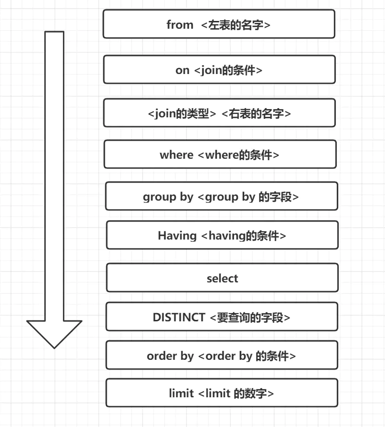

## 77.  列值为NULL时，查询是否会用到索引？

列值为NULL也是可以走索引的
计划对列进行索引，应尽量避免把它设置为可空，因为这会让 MySQL 难以优化引用了可空列的查询，同时增加了引擎的复杂度

## 78.   关心过业务系统里面的sql耗时吗？统计过慢查询吗？对慢查询都怎么优化过？

- 我们平时写Sql时，都要养成用explain分析的习惯。
- 慢查询的统计，运维会定期统计给我们

**优化慢查询：**

- 分析语句，是否加载了不必要的字段/数据。
- 分析SQl执行句话，是否命中索引等。
- 如果SQL很复杂，优化SQL结构
- 如果表数据量太大，考虑分表

## 79.  主键使用自增ID还是UUID，为什么？

如果是单机的话，选择自增ID；如果是分布式系统，优先考虑UUID吧，但还是最好自己公司有一套分布式唯一ID生产方案吧。

- 自增ID：数据存储空间小，查询效率高。但是如果数据量过大,会超出自增长的值范围，多库合并，也有可能有问题。
- uuid：适合大量数据的插入和更新操作，但是它无序的，插入数据效率慢，占用空间大。

## 80. mysql自增主键用完了怎么办？

自增主键一般用int类型，一般达不到最大值，可以考虑提前分库分表的。

自增ID用完后 一直都是最大值 如果标识了主键 则主键冲突

## 81. 字段为什么要求定义为not null？

null值会占用更多的字节，并且null有很多坑的。

## 82.  如果要存储用户的密码散列，应该使用什么字段进行存储？

密码散列，盐，用户身份证号等固定长度的字符串，应该使用char而不是varchar来存储，这样可以节省空间且提高检索效率。

## 83. Mysql驱动程序是什么？

这个jar包： mysql-connector-java-5.1.18.jar
Mysql驱动程序主要帮助编程语言与 MySQL服务端进行通信，如连接、传输数据、关闭等。

## 84.   如何优化长难的查询语句？有实战过吗？

- 将一个大的查询分为多个小的相同的查询
- 减少冗余记录的查询。
- 一个复杂查询可以考虑拆成多个简单查询
- 分解关联查询，让缓存的效率更高。

## 85.  优化特定类型的查询语句

平时积累吧：

- 比如使用select 具体字段代替 select *
- 使用count(*) 而不是count(列名)
- 在不影响业务的情况，使用缓存
- explain 分析你的SQL


## 86. MySQL数据库cpu飙升的话，要怎么处理呢？

**排查过程：**

- 使用top 命令观察，确定是mysqld导致还是其他原因。
- 如果是mysqld导致的，show processlist，查看session情况，确定是不是有消耗资源的sql在运行。
- 找出消耗高的 sql，看看执行计划是否准确， 索引是否缺失，数据量是否太大。

**处理：**

- kill 掉这些线程(同时观察 cpu 使用率是否下降)，
- 进行相应的调整(比如说加索引、改 sql、改内存参数)
- 重新跑这些 SQL。

**其他情况：**

也有可能是每个 sql 消耗资源并不多，但是突然之间，有大量的 session 连进来导致 cpu 飙升，这种情况就需要跟应用一起来分析为何连接数会激增，再做出相应的调整，比如说限制连接数等

## 87.   读写分离常见方案？

- 应用程序根据业务逻辑来判断，增删改等写操作命令发给主库，查询命令发给备库。
- 利用中间件来做代理，负责对数据库的请求识别出读还是写，并分发到不同的数据库中。（如：amoeba，mysql-proxy）

## 88. MySQL的复制原理以及流程

主从复制原理，简言之，就三步曲，如下：

- 主数据库有个bin-log二进制文件，纪录了所有增删改Sql语句。（binlog线程）
- 从数据库把主数据库的bin-log文件的sql语句复制过来。（io线程）
- 从数据库的relay-log重做日志文件中再执行一次这些sql语句。（Sql执行线程）

如下图所示：

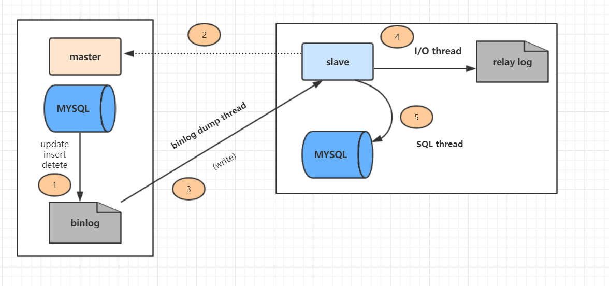

上图主从复制分了五个步骤进行：

- 步骤一：主库的更新事件(update、insert、delete)被写到binlog
- 步骤二：从库发起连接，连接到主库。
- 步骤三：此时主库创建一个binlog dump thread，把binlog的内容发送到从库。
- 步骤四：从库启动之后，创建一个I/O线程，读取主库传过来的binlog内容并写入到relay log
- 步骤五：还会创建一个SQL线程，从relay log里面读取内容，从Exec_Master_Log_Pos位置开始执行读取到的更新事件，将更新内容写入到slave的db

## 89.  MySQL中DATETIME和TIMESTAMP的区别

存储精度都为秒

**区别：**

- DATETIME 的日期范围是 1001——9999 年；TIMESTAMP 的时间范围是 1970——2038 年
- DATETIME 存储时间与时区无关；TIMESTAMP 存储时间与时区有关，显示的值也依赖于时区
- DATETIME 的存储空间为 8 字节；TIMESTAMP 的存储空间为 4 字节
- DATETIME 的默认值为 null；TIMESTAMP 的字段默认不为空(not null)，默认值为当前时间(CURRENT_TIMESTAMP)

## 90.   Innodb的事务实现原理？

- 原子性：是使用 undo log来实现的，如果事务执行过程中出错或者用户执行了rollback，系统通过undo log日志返回事务开始的状态。
- 持久性：使用 redo log来实现，只要redo log日志持久化了，当系统崩溃，即可通过redo log把数据恢复。
- 隔离性：通过锁以及MVCC,使事务相互隔离开。
- 一致性：通过回滚、恢复，以及并发情况下的隔离性，从而实现一致性。

## 91. 谈谈MySQL的Explain

Explain 执行计划包含字段信息如下：分别是 id、select_type、table、partitions、type、possible_keys、key、key_len、ref、rows、filtered、Extra 等12个字段。
我们重点关注的是type，它的属性排序如下：

```sql
system  > const > eq_ref > ref  > ref_or_null >
index_merge > unique_subquery > index_subquery > 
range > index > ALL
```

## 92. Innodb的事务与日志的实现方式


### 有多少种日志

- innodb两种日志redo和undo。

### 日志的存放形式

- redo：在页修改的时候，先写到 redo log buffer 里面， 然后写到 redo log 的文件系统缓存里面(fwrite)，然后再同步到磁盘文件（ fsync）。
- Undo：在 MySQL5.5 之前， undo 只能存放在 ibdata文件里面， 5.6 之后，可以通过设置 innodb_undo_tablespaces 参数把 undo log 存放在 ibdata之外。

### 事务是如何通过日志来实现的

- 因为事务在修改页时，要先记 undo，在记 undo 之前要记 undo 的 redo， 然后修改数据页，再记数据页修改的 redo。 Redo（里面包括 undo 的修改） 一定要比数据页先持久化到磁盘。
- 当事务需要回滚时，因为有 undo，可以把数据页回滚到前镜像的 状态，崩溃恢复时，如果 redo log 中事务没有对应的 commit 记录，那么需要用 undo把该事务的修改回滚到事务开始之前。
- 如果有 commit 记录，就用 redo 前滚到该事务完成时并提交掉。

## 93.  MySQL中TEXT数据类型的最大长度

- TINYTEXT：256 bytes
- TEXT：65,535 bytes(64kb)
- MEDIUMTEXT：16,777,215 bytes(16MB)
- LONGTEXT：4,294,967,295 bytes(4GB)

## 94.  500台db，在最快时间之内重启。

- 可以使用批量 ssh 工具 pssh 来对需要重启的机器执行重启命令。
- 也可以使用 salt（前提是客户端有安装 salt）或者 ansible（ ansible 只需要 ssh 免登通了就行）等多线程工具同时操作多台服务

## 95. 你是如何监控你们的数据库的？你们的慢日志都是怎么查询的？

监控的工具有很多，例如zabbix，lepus，我这里用的是lepus

## 96. 你是否做过主从一致性校验，如果有，怎么做的，如果没有，你打算怎么做？

主从一致性校验有多种工具 例如checksum、mysqldiff、pt-table-checksum等

## 97. 你们数据库是否支持emoji表情存储，如果不支持，如何操作？

更换字符集utf8-->utf8mb4

## 98.  MySQL如何获取当前日期？

SELECT CURRENT_DATE();

## 99. 一个6亿的表a，一个3亿的表b，通过外间tid关联，你如何最快的查询出满足条件的第50000到第50200中的这200条数据记录。

1、如果A表TID是自增长,并且是连续的,B表的ID为索引

```sql
select * from a,b where a.tid = b.id and a.tid>500000 limit 200;
```

2、如果A表的TID不是连续的,那么就需要使用覆盖索引.TID要么是主键,要么是辅助索引,B表ID也需要有索引。

```sql
select * from b , (select tid from a limit 50000,200) a where b.id = a .tid;
```

## 100. Mysql一条SQL加锁分析

一条SQL加锁，可以分9种情况进行：

- 组合一：id列是主键，RC隔离级别
- 组合二：id列是二级唯一索引，RC隔离级别
- 组合三：id列是二级非唯一索引，RC隔离级别
- 组合四：id列上没有索引，RC隔离级别
- 组合五：id列是主键，RR隔离级别
- 组合六：id列是二级唯一索引，RR隔离级别
- 组合七：id列是二级非唯一索引，RR隔离级别
- 组合八：id列上没有索引，RR隔离级别
- 组合九：Serializable隔离级别

>作者：Jay_huaxiao
>链接：https://juejin.im/post/5ec15ab9f265da7bc60e1910
>来源：掘金
>著作权归作者所有。商业转载请联系作者获得授权，非商业转载请注明出处。


