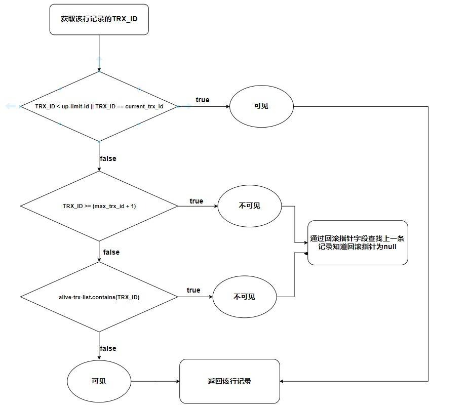
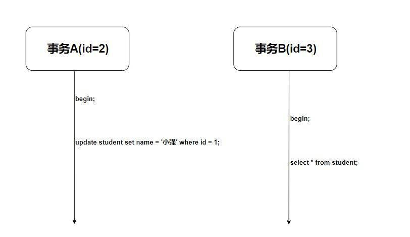
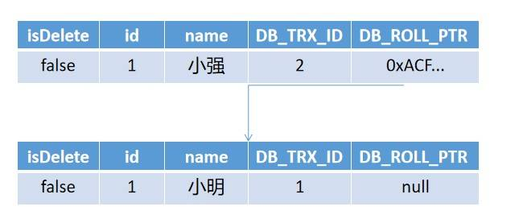
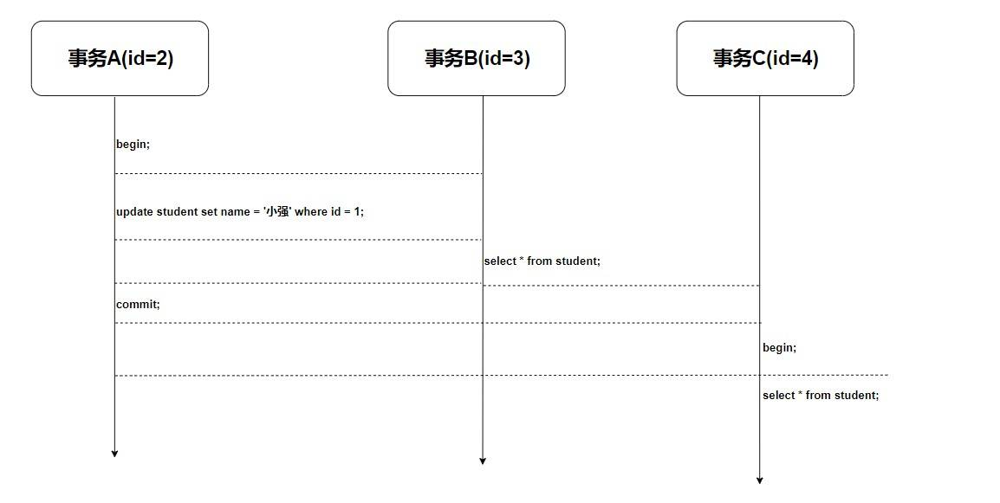
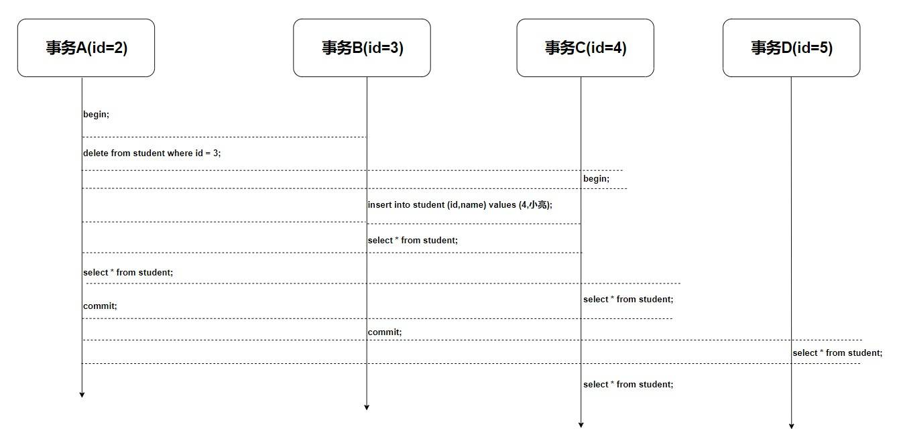
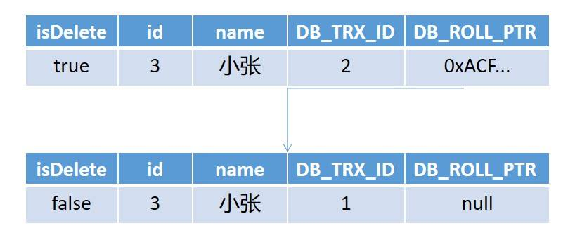
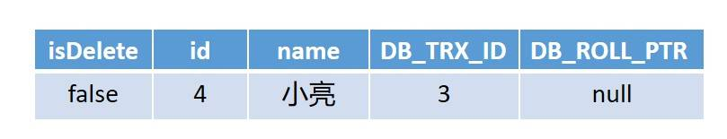
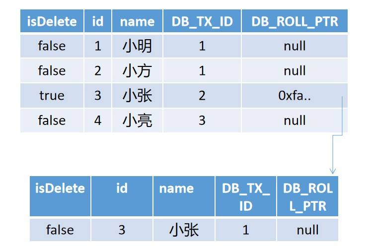

# MySQL InnoDB MVCC 机制的原理及实现


## MVCC 是什么？

### 数据库并发控制——锁

Multiversion (version) concurrency control (MCC or MVCC) 多版本并发控制 ，它是数据库管理系统一种常见的并发控制。
我们知道并发控制常用的是锁，当线程要对一个共享资源进行操作的时候，加锁是一种非常简单粗暴的方法(事务开始时给 DQL 加读锁，给 DML 加写锁)，这种锁是一种 悲观 的实现方式，也就是说这会给其他事务造成堵塞，从而影响数据库性能。
我来解释一下 乐观锁 和 悲观锁 的概念。我觉得它俩主要是概念的理解。

- 悲观锁： 当一个线程需要对共享资源进行操作的时候，首先对共享资源进行加锁，当该线程持有该资源的锁的时候，其他线程对该资源进行操作的时候会被 阻塞。比如 Java 中的 Synchronized 关键字。
- 乐观锁：当一个线程需要对一个共享资源进行操作的时候，不对它进行加锁，而是在操作完成之后进行判断。(比如乐观锁会通过一个版本号控制，如果操作完成后通过版本号进行判断在该线程操作过程中是否有其他线程已经对该共享资源进行操作了，如果有则通知操作失败，如果没有则操作成功)，当然除了 版本号 还有 CAS，如果不了解的可以去学习一下，这里不做过多涉及。

### 数据库并发控制——MVCC

很多人认为 MVCC 就是一种 乐观锁 的实现形式，而我认为 MVCC 只是一种 乐观 的实现形式，它是通过 一种 可见性算法 来实现数据库并发控制。

### MVCC 的两种读形式

在讲 MVCC 的实现原理之前，我觉很有必要先去了解一下 MVCC 的两种读形式。

- 快照读：读取的只是当前事务的可见版本，不用加锁。而你只要记住 简单的 select 操作就是快照读(select * from table where id = xxx)。
- 当前读：读取的是当前版本，比如 特殊的读操作，更新/插入/删除操作

比如：

```sql
 select * from table where xxx lock in share mode，
 select * from table where xxx for update，
 update table set....
 insert into table (xxx,xxx) values (xxx,xxx)
 delete from table where id = xxx
```

## MVCC 的实现原理

MVCC 使用了“三个隐藏字段”来实现版本并发控制，我查了很多资料，看到有很多博客上写的是通过 一个创建事务id字段和一个删除事务id字段 来控制实现的。但后来发现并不是很正确，我们先来看一看 MySQL 在建表的时候 innoDB 创建的真正的三个隐藏列吧。

|RowID	|DB_TRX_ID	|DB_ROLL_PTR|	id|	name	|password|
| ---- | ---- | ---- | ---- | ---- | ----|
|自动创建的id	|事务id	|回滚指针|	id|	name|	password|

- RowID：隐藏的自增ID，当建表没有指定主键，InnoDB会使用该RowID创建一个聚簇索引。
- DB_TRX_ID：最近修改（更新/删除/插入）该记录的事务ID。
- DB_ROLL_PTR：回滚指针，指向这条记录的上一个版本。

> 其实还有一个删除的flag字段，用来判断该行记录是否已经被删除。

而 MVCC 使用的是其中的 事务字段，回滚指针字段，是否删除字段。我们来看一下现在的表格(isDelete是我自己取的，按照官方说法是在一行开头的content里面，这里其实位置无所谓，你只要知道有就行了)。


|isDelete	|DB_TRX_ID	|DB_ROLL_PTR|	id	|name	|password|
| ---- | ---- | ---- | ---- | ---- |---- |
|true/false|	事务id	|回滚指针	|id|	name	|password|

那么如何通过这三个字段来实现 MVCC 的 可见性算法 呢？
还差点东西！ undoLog(回滚日志) 和 read-view(读视图)。


- undoLog: 事务的回滚日志，是 可见性算法 的非常重要的部分，分为两类。
    - insert undo log：事务在插入新记录产生的undo log，当事务提交之后可以直接丢弃
    - update undo log：事务在进行 update 或者 delete 的时候产生的 undo log，在快照读的时候还是需要的，所以不能直接删除，只有当系统没有比这个log更早的read-view了的时候才能删除。ps：所以长事务会产生很多老的视图导致undo log无法删除 大量占用存储空间。
- read-view: 读视图，是MySQL秒级创建视图的必要条件，比如一个事务在进行 select 操作(快照读)的时候会创建一个 read-view ，这个read-view 其实只是三个字段。
    - alive_trx_list(我自己取的)：read-view生成时刻系统中正在活跃的事务id。
    - up_limit_id：记录上面的 alive_trx_list 中的最小事务id。
    - low_limit_id：read-view生成时刻，目前已出现的事务ID的最大值 + 1。


这时候，万事俱备，只欠东风了。下面我来介绍一下，最重要的 可见性算法。
其实主要思路就是：当生成read-view的时候如何去拿获取的 DB_TRX_ID 去和 read-view 中的三个属性(上面讲了)去作比较。我来说一下三个步骤，如果不是很理解可以参考着我后面的实践结合着去理解。

- 首先比较这条记录的 DB_TRX_ID 是否是 小于 up_limit_id 或者 等于当前事务id。如果满足，那么说明当前事务能看到这条记录。如果大于则进入下一轮判断
- 然后判断这条记录的 DB_TRX_ID 是否 大于等于 low-limit-id。如果大于等于则说明此事务无法看见该条记录，不然就进入下一轮判断。
- 判断该条记录的 DB_TRX_ID 是否在活跃事务的数组中，如果在则说明这条记录还未提交对于当前操作的事务是不可见的，如果不在则说明已经提交，那么就是可见的。

> 如果此条记录对于该事务不可见且 ROLL_PTR 不为空那么就会指向回滚指针的地址，通过undolog来查找可见的记录版本。

下面我画了一个可见性的算法的流程图



## 实践

### 准备数据

首先我创建了一个非常简单的表，只有id和name的学生表。

|id	|name|
|----|----|
|学生id|	学生姓名|

这个时候我们将我们需要的隐藏列也标识出来，就变成了这样

|isDelete	|id|	|name	|DB_TRX_ID	|DB_ROLL_PTR|
|----|----|----|----|----|----|
|是否被删除	|学生id	|学生姓名|	创建删除更新该记录的事务id	|回滚指针|

这个时候插入三行数据，将表的数据变成下面这个样子。

|isDelete	|id|	name|	DB_TRX_ID|	DB_ROLL_PTR|
|----|----|----|----|----|
|false	|1	|小明	|1	|null
false	|2	|小方	|1|	null
false	|3|	小张	|1|	null

### 示例一



使用过 MySQL 的都知道，因为隔离性，事务 B 此时获取到的数据肯定是这样的。

|id|	name|
|----|----|
1	|小明
2	|小方
3	|小张

为什么事务A未提交的修改对于事务B是不可见的，MVCC 是如何做到的？我们用刚刚的可见性算法来实验一下。
首先事务A开启了事务(当然这不算开启，在RR模式下 真正获取read-view的是在进行第一次进行快照读的时候)。我们假设事务A的事务id为2，事务B的id为3。
然后事务A进行了更新操作，如图所示，更新操作创建了一个新的版本并且新版本的回滚指针指向了旧的版本(注意 undo log其实存放的是逻辑日志，这里为了方便我直接写成物理日志)。




最后 事务B 进行了快照读，注意，这是我们分析的重点。

首先，在进行快照读的时候我们会创建一个 read-view (忘记回去看一下那三个字段) 这个时候我们的 read-view 是:
```bash
  up-limit-id = 2
  alive-trx-list = [2,3]
  low-limit-id = 4
```

然后我们获取那两个没有被修改的记录(没有顺序，这里为了一起解释方便), 我们获取到(2,小方)和(3,小张)这两条记录，发现他们两的 `DB_TRX_ID = 1`,  我们先判断 DB_TRX_ID 是否小于 `up-limit-id` 或者等于当前事务id ,  发现 1<2 小于 up-limit-id ，则可见 直接返回视图。
  
然后我们获取更改了的数据行:


其实你也发现了这是一个链表，此时链表头的 DB_TRX_ID 为 2,我们进行判断 2 < 2 不符合，进入下一步判断, 判断 DB_TRX_ID >= low_limit_id 发现此时是 2 >= 4 不符合 故再进入下一步,此时判断 Db_TRX_ID 是否在 alive_trx_list 活跃事务列表中，发现这个 DB_TRX_ID 在活跃列表中，所以只能说明该行记录还未提交，不可见。最终判断不可见之后通过回滚指针查看旧版本，发现此时 DB_TRX_ID 为1,故再次进行判断 DB_TRX_ID < up-limit-id ,此时 1 < 2 符合 ，所以可见并返回, 所以最终返回的是

|id	|name|
|----|----|
1	|小明
2	|小方
3	|小张

我们再来验证一下，这个时候我们将事务A提交，重新创建一个事务C并select。

我们预期的结果应该是这样的

|id	|name|
|----|----|
1	|小强
2	|小方
3	|小张

这个操作的流程图如下



这个时候我们再来分析一下 事务c产生的 read-view。

这个时候事务A已经提交，所以事务A不在活跃事务数组中，此时 read-view 的三个属性应该是

```bash
 up-limit-id = 3
 alive-trx-list = [3,4]
 low-limit-id = 5
```

- 跟上面一样，我们首先获取(2,小方)和(3,小张)这两条记录，发现他们两的 DB_TRX_ID = 1，此时 1 < up-limit-id = 3，故符合可见性，则返回。
- 然后我们获取刚刚被修改的id为1的记录行，发现链表头部的 DB_TRX_ID 为 2, 此时 2 < up-limit-id = 3 故也符合可见性，则返回。

所以最终返回的就是

|id	|name|
|----|----|
1	|小强
2	|小方
3	|小张

### 示例二

为了加深理解，我们再使用一个相对来说比较复杂的示例来验证 可见性算法 。



首先我们在事务A中删除一条记录，这个时候就变成了下面的样子。



然后事务B进行了插入，这样就变成了下面这样。



然后事务B进行了 select 操作，我们可以发现 这个时候整张表其实会变成这样让这个 select 操作进行选取。



此时的 read-view 为

```bash
 up-limit-id = 2
 alive-trx-list = [2,3,4]
 low-limit-id = 5
```

这个时候我们进行 快照读，首先对于前面两条小明和小方的记录是一样的，此时 DB_TX_ID 为 1，我们可以判断此时 DB_TX_ID = 1 < up-limit-id = 2 成立故返回。然后判断小张这条记录，首先也是 DB_TX_ID = 2 < up-limit-id = 2 不成立故进入下一轮，DB_TX_ID = 2 >= low-limit-id 不成立再进入最后一轮判断是否在活跃事务列表中，发现 DB_TX_ID = 2 在 alive-trx-list = [2,3,4] 中故不可见(如果可见则会知道前面的删除标志是已经删除，则返回的是空)，则根据回滚指针找到上一个版本记录，此时 DB_TX_ID = 1 和上面一样可见则返回该行。
最后一个判断小亮这条记录，因为 DB_TX_ID = current_tx_id(当前事务id) 所以可见并返回。
这个时候返回的表则是这样的


|id	|name|
|----|----|
1	|小明
2	|小方
3	|小张
4	|小亮

然后是事务A进行了select的操作，我们可以得知现在的 read-view 为

```bash
 up-limit-id = 2
 alive-trx-list = [2,3,4]
 low-limit-id = 5
```

然后此时所见和上面也是一样的


这个时候我们进行 快照读，首先对于前面两条小明和小方的记录是一样的，此时 DB_TX_ID 为 1，我们可以判断此时 DB_TX_ID = 1 < up-limit-id = 2 成立故返回。然后判断小张这条记录，首先 DB_TX_ID = 2 = current_tx_id = 2 成立故返回发现前面的 isDelete 标志为true 则说明已被删除则返回空，对于第四条小亮的也是一样判断 DB_TX_ID = 4 < up-limit-id = 2 不成立进入下一步判断 DB_TX_ID = 4 >= low-limit-id = 5 不成立进入最后一步发现在活跃事务数组中故不可见且此条记录回滚指针为null所以返回空。
那么此时返回的列表应该就是这样了

|id|	name|
|----|----|
1	|小明
2	|小方

> 虽然要分析很多，但多多益善嘛，多熟悉熟悉就能更深刻理解这个算法了。

之后是事务C进行 快照读 操作。首先此时视图还是这个样子


然后对于事务C的 read-view 为

```bash
 up-limit-id = 2
 alive-trx-list = [2,3,4]
 low-limit-id = 5
```

小明和小方的两条记录和上面一样是可见的这里我就不重复分析了，然后对于小张这条记录 DB_TX_ID = 2 < up-limit-id = 2 || DB_TX_ID == curent_tx_id = 4 不成立故进入下一轮发现 DB_TX_ID >= low-limit-id = 5 更不成立故进入最后一轮发现 DB_TX_ID = 2 在活跃事务数组中故不可见，然后通过回滚指针判断 DB_TX_ID = 1 的小张记录发现可见并返回。最后的小亮也是如此 最后会发现 DB_TX_ID = 3 也在活跃事务数组中故不可见。
所以事务C select 的结果为

|id|	name|
|----|----|
1	|小明
2	|小方
3	|小张

后面事务A和事务B都进行了提交的动作，并且有一个事务D进行了快照读，此时视图还是如此


但此时的 read-view发生了变化

```bash
 up-limit-id = 4
 alive-trx-list = [4,5]
 low-limit-id = 6
```

我们首先判断小明和小方的记录——可见(不解释了)，小张的记录 DB_TX_ID = 2 < up-limit-id = 4 成立故可见，因为前面 isDelete 为 true 则说明删除了返回空，然后小亮的记录 DB_TX_ID = 3 < up-limit-id = 4 成立故可见则返回。所以这次的 select 结果应该是这样的

|id	|name|
|----|----|
1	|小明
2	|小方
4	|小亮

最后(真的最后了，不容易吧！)，事务C有一次进行了 select 操作。因为在 RR 模式下 read-view 是在第一次快照读的时候确定的，所以此时 read-view是不会更改的，然后前面视图也没有进行更改，所以此时即使前面事务A 事务B已经进行了提交，对于这个时候的事务C的select结果是没有影响的。故结果应该为


|id|name|
|----|----|
1|小明
2|小方
3|小张

总结
我们来总结一下吧。

其实 MVCC 是通过 "三个" 隐藏字段 (事务id,回滚指针,删除标志) 加上undo log和可见性算法来实现的版本并发控制。

为了你再次深入理解这个算法，我再把这张图挂上来


>作者：FrancisQ
>链接：https://juejin.im/post/5da8493ae51d4524b25add55
>来源：掘金
>著作权归作者所有。商业转载请联系作者获得授权，非商业转载请注明出处。