# Redis主从复制原理

相信很多小伙伴都已经配置过主从复制，但是对于redis主从复制的工作流程和常见问题很多都没有深入的了解。咔咔这次用时俩天时间给大家整理一份redis主从复制的全部知识点。本文实现所需环境 centos7.0 redis4.0

## 一、什么是Redis主从复制？

主从复制就是现在有俩台redis服务器，把一台redis的数据同步到另一台redis数据库上。前者称之为主节点（master），后者为从节点（slave）。数据是只能master往slave同步单向。

但是在实际过程中是不可能只有俩台redis服务器来做主从复制的，这也就意味这每台redis服务器都有可能会称为主节点（master）

下图案例中，我们的slave3既是master的从节点，也是slave的主节点。

先知道这么个概念，更多详解继续查看下文。

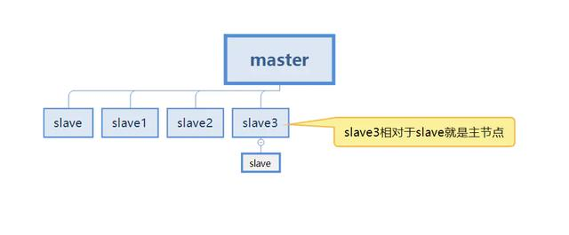

## 二、为什么需要Redis主从复制？

假设我们现在就一台redis服务器，也就是单机状态。

在这种情况下会出现的第一个问题就是服务器宕机，直接导致数据丢失。如果项目是跟￥占关系的，那造成的后果就可想而知。

第二个情况就是内存问题了，当只有一台服务器时内存肯定会到达峰值的，不可能对一台服务器进行无限升级的。

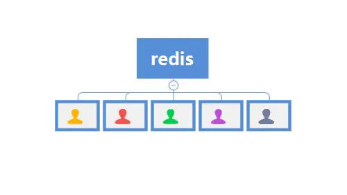

所以针对以上俩个问题，我们就多准备几台服务器，配置主从复制。将数据保存在多个服务器上。并且保证每个服务器的数据是同步的。即使有一个服务器宕机了，也不会影响用户的使用。redis可以继续实现高可用、同时实现数据的冗余备份。

这会应该会有很多疑问，master跟slave怎么连接呢？ 如何同步数据呢？ 假如master服务器宕机了呢？别着急，一点一点解决你的问题。


## 三、Redis主从复制的作用

在上边我们说了为什么使用redis的主从复制，那么主从复制的作用就是针对为什么使用它来讲了。

我们继续使用这个图来谈论

- 第一点是数据冗余了，实现了数据的热备份，是持久化之外的另一种方式。
- 第二点是针对单机故障问题。当主节点也就是master出现问题时，可以由从节点来提供服务也就是slave，实现了快速恢复故障，也就是服务冗余。
- 第三点是读写分离，master服务器主要是写，slave主要用来读数据，可以提高服务器的负载能力。同时可以根据需求的变化，添加从节点的数量。
- 第四点是负载均衡，配合读写分离，有主节点提供写服务，从节点提供读服务，分担服务器负载，尤其在写少读多的情况下，通过多个从节点分担读负载，可以大大提高redis服务器的并发量和负载。
- 第五点是高可用的基石，主从复制是哨兵和集群能够实施的基础，因此我们可以说主从复制是高可用的基石。

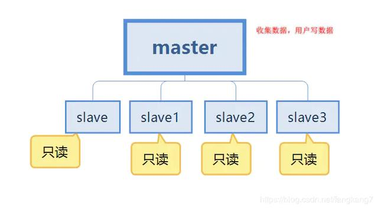

## 四、配置Redis主从复制
说了这么多，我们先简单的配置一个主从复制案例，然后在谈实现的原理。

redis存储路径为：usr/local/redis

日志跟配置文件存储在：usr/local/redis/data

首先我们先配置俩个配置文件，分别为redis6379.conf 和 redis6380.conf

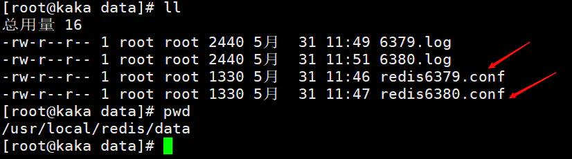

修改配置文件，主要就是修改端口。为了查看方便在把日志文件和持久化文件的名字都用各自的端口来做标识。

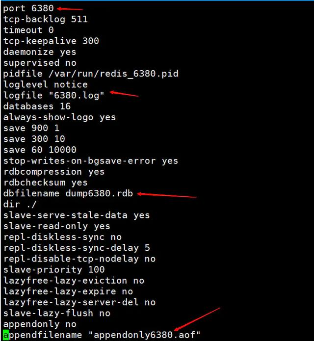

然后分别开启俩个redis服务，一个端口为6379，一个端口为6380。执行命令redis-server redis6380.conf,然后使用redis-cli -p 6380连接，因为redis的默认端口就是6379所以我们启动另外一台redis服务器直接使用redis-server redis6379.conf 然后直接使用redis-cli直接连接就可以。

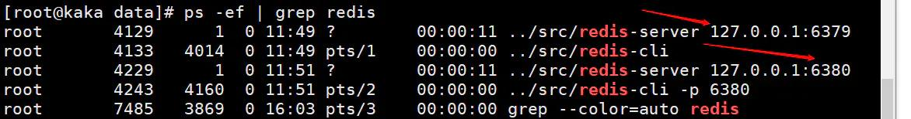

这个时候我们就成功的配置了俩个redis服务，一台为6380，一台为6379，这里只是为了演示。实际工作中是需要配置在俩台不同的服务器的。

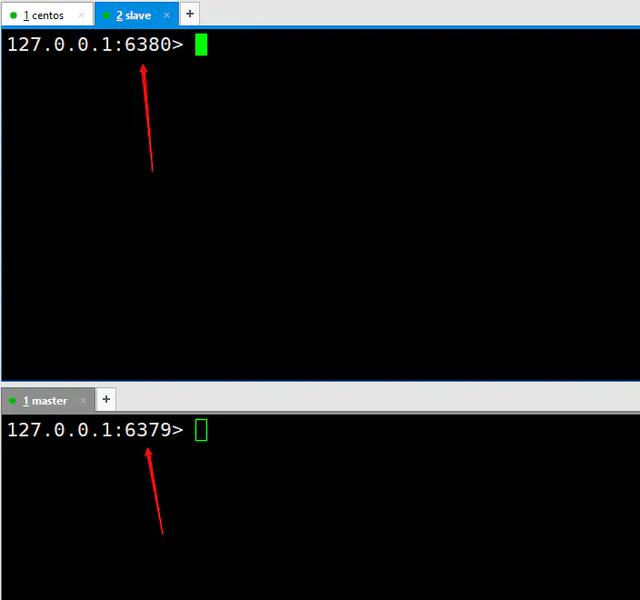

### 1. 使用客户端命令行启动

我们先得有一个概念，就是在配置主从复制时，所有的操作都是在从节点来操作，也就是slave。

那么我们在从节点执行一个命令为 slaveof 127.0.0.1 6379，执行完就代表我们连接上了。

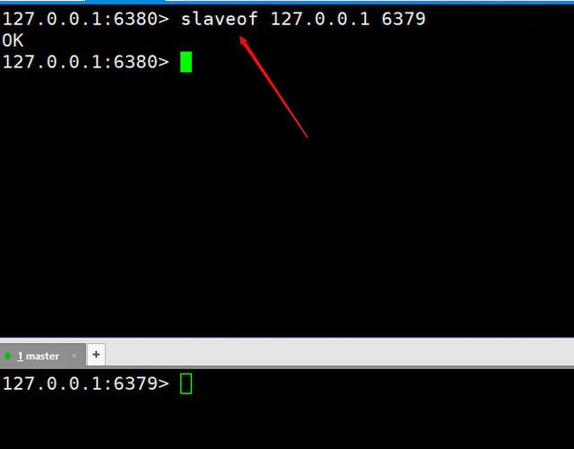

我们先测试一下看是否实现主从复制。在master这台服务器上执行俩个set kaka 123 和 set master 127.0.0.1，然后在slave6380端口是可以成功获取到的，也就说明我们的主从复制就已经配置完成了。但是在实现生产环境可不是就这样完事了，后边会在进一步对主从复制进行优化，直到实现高可用。

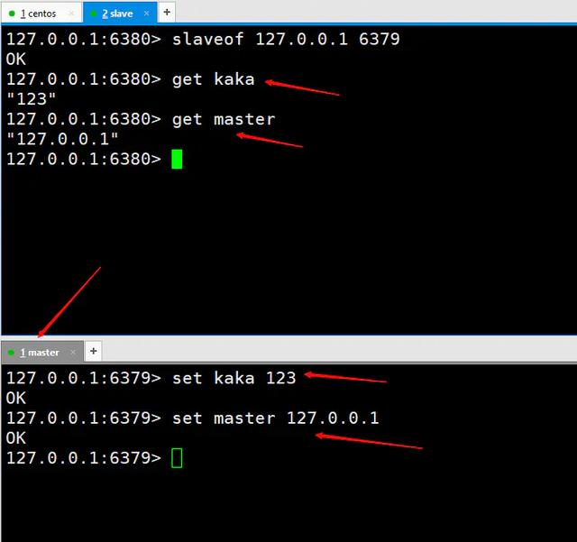

### 2. 使用配置文件启用

在使用配置文件启动主从复制之前呢！先需要把之前使用客户端命令行连接的断开，在从主机执行slaveof no one即可断开主从复制。

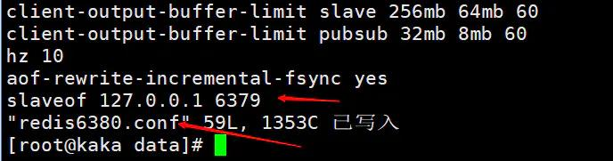

在哪可以查看从节点已经断开了主节点呢！在主节点的客户端输入命令行info查看

这张图是使用从节点使用客户端命令行连接主节点后，在主节点的客户端输入info打印的信息，可以看到有一个slave0的一个信息。

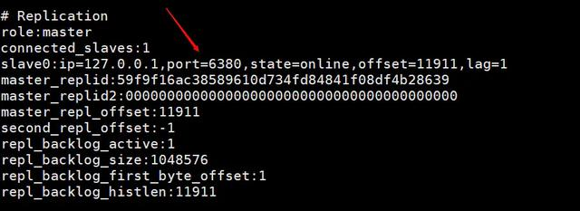

这个图是在从节点执行完slaveof no one 后，在主节点打印的info，说明从节点已经跟主节点断开连接了。

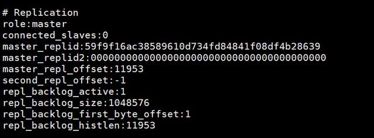

在根据配置文件启动redis服务，redis-server redis6380.conf

当在从节点重新启动后就可以在主节点直接查看到从节点的连接信息。

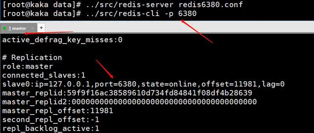

测试数据，主节点写的东西，从节点还是会自动同步的。

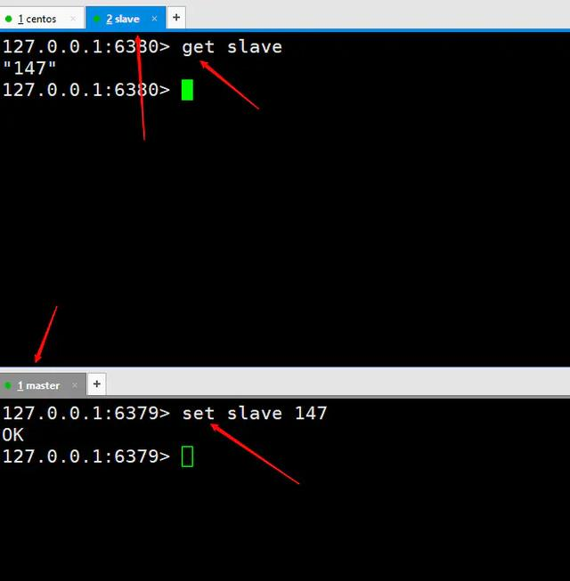

### 3. 启动redis服务器时启动

这种方式配置也是很简单，在启动redis服务器时直接就启动主从复制，执行命令：redis-server --slaveof host port 即可。

### 4. 主从复制启动后的日志信息查看

这个是主节点的日志信息

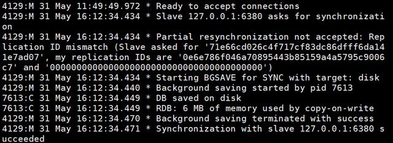

这个是从节点的信息，其中有连接主节点信息，还有RDB快照保存。

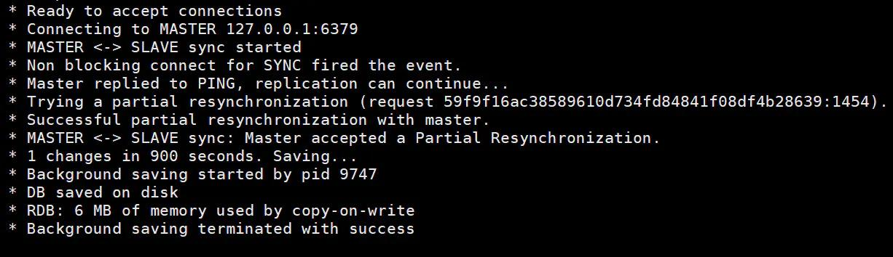

## 五、主从复制工作原理

### 1. 主从复制的三个阶段

主从复制完整的工作流程分为以下三个阶段。每一段都有自己的内部工作流程，那么我们会对这三个过程进行谈论。

- 建立连接过程：这个过程就是slave跟master连接的过程
- 数据同步过程：是master给slave同步数据的过程
- 命令传播过程：是反复同步数据

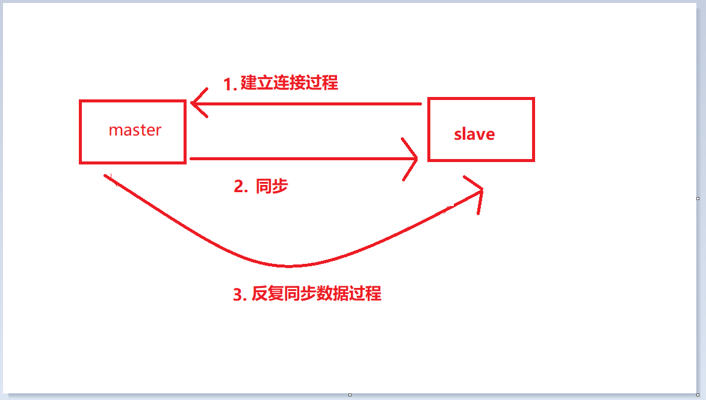

### 2. 第一阶段：建立连接过程

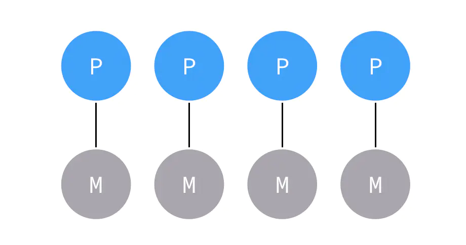

上图是一个完整主从复制建立连接工作流程。然后使用简短的话语来描述上边的工作流程。

1. 设置master的地址和端口，保存master的信息
2. 建立socket连接（这个连接做的事情下文会说）
3. 持续发送ping命令
4. 身份验证
5. 发送slave端口信息

在建立连接的过程中，从节点会保存master的地址和端口、主节点master保存从节点slave的端口。

### 3. 第二阶段：数据同步阶段过程

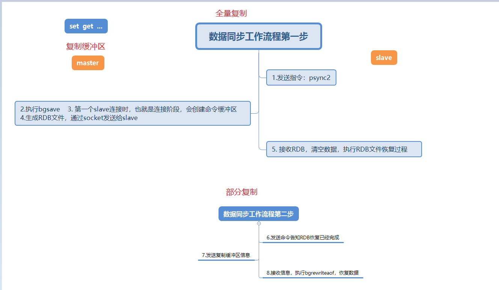

这张图是详细描述第一次从节点连接主节点时的数据同步过程。
当从节点第一次连接主节点时，先会执行一次全量复制这次的全量复制是无法避免的。
全量复制执行完成后，主节点就会发送复制积压缓冲区的数据，然后从节点就会执行bgrewriteaof恢复数据，这也就是部分复制。
在这个阶段提到了三个新点，全量复制、部分复制、复制缓冲积压区。会在下文的常见问题里详细说明这几个点。

### 4. 第三阶段：命令传播阶段

当master数据库被修改后，主从服务器的数据不一致后，此时就会让主从数据同步到一致，这个过程称之为命令传播。
master会将接收到的数据变更命令发送给slave，slave接收命令后执行命令，让主从数据达到一致。
命令传播阶段的部分复制


- 在命令传播阶段出现断网的情况，或者网络抖动时会导致连接断开（connection  lost）
- 这个时候主节点master还是会继续往replbackbuffer（复制缓冲积压区）写数据
- 从节点会继续尝试连接主机（connect to master）
- 当从节点把自己的runid和复制偏移量发送给主节点，并且执行pysnc命令同步
- 如果master判断偏移量是在复制缓冲区范围内，就会返回continue命令。并且发送复制缓冲区的数据给从节点。
- 从节点接收数据执行bgrewriteaof，恢复数据


## 六. 详细介绍主从复制原理（全量复制+部分复制）


这个过程就是主从复制最齐全的流程讲解。那么下来我们对每一步进程简单的介绍

1. 从节点发送指令psync ? 1 psync runid offset   找对应的runid索取数据。但是这里可以考虑一下，当从节点第一次连接的时候根本就不知道主节点的runid 和 offset  。所以第一次发送的指令是psync ？ 1意思就是主节点的数据我全要。
2. 主节点开始执行bgsave生成RDB文件，记录当前的复制偏移量offset
3. 主节点这个时候会把自己的runid  和  offset  通过 +FULLRESYNC  runid  offset   指令  通过socket发送RDB文件给从节点。
4. 从节点接收到+FULLRESYNC  保存主节点的runid和offset    然后清空当前所有数据，通过socket接收RDB文件，开始恢复RDB数据。
5. 在全量复制后，从节点已经获取到了主节点的runid和offset，开始发送指令 psync runid offset
6. 主节点接收指令，判断runid是否匹配，判断offset是否在复制缓冲区中。
7. 主节点判断runid和offset有一个不满足，就会在返回到步骤2继续执行全量复制。这里的runid不匹配只有的可能是从节点重启了这个问题后边会解决，offset（偏移量）不匹配就是复制积压缓冲区溢出了。 如果runid或offset校验通过，从节点的offset和主节点的offset相同时则忽略。 如果runid或offset检验通过，从节点的offset与offset不相同，则会发送 +CONTINUE  offset(这个offset为主节点的)，通过socket发送复制缓冲区中从节点offset到主节点offset的数据。
8. 从节点收到+CONTINUE 保存master的offset  通过socket接收到信息后，执行bgrewriteaof，恢复数据。

**1-4是全量复制    5-8是部分复制**

在主节点的第3步下面  主节点在主从复制的期间是一直在接收客户端的数据，主节点的offset是一直变化的。只有有变化就会给每个slave进行发送，这个发送的过程称之为心跳机制

## 七. 心跳机制

在命令传播阶段是，主节点与从节点之间一直都需要进行信息互换，使用心跳机制进行维护，实现主节点和从节点连接保持在线。


- master心跳
    - 指令：ping
    - 默认10秒进行一次，是由参数repl-ping-slave-period决定的
    - 主要做的事情就是判断从节点是否在线
    - 可以使用info replication  来查看从节点租后一次连接时间的间隔，lag为0或者为1就是正常状态。
- slave心跳任务
    - 指令：replconf ack {offset}
    - 每秒执行一次
    - 主要做的事情是给主节点发送自己的复制偏移量，从主节点获取到最新的数据变更命令，还做一件事情就是判断主节点是否在线。

**心跳阶段的注意事项** 主节点为保障数据稳定性，当从节点挂掉的数量或者延迟过高时。将会拒绝所有信息同步。

这里有俩个参数可以进行配置调整：

```bash
min-slaves-to-write   2
min-slaves-max-lag 8
```

这俩个参数表示从节点的数量就剩余2个，或者从节点的延迟大于8秒时，主节点就会强制关闭maste功能，停止数据同步。

那么主节点是如何知道从节点挂掉的数量和延迟时间呢！  在心跳机制里边slave 会每隔一秒发送perlconf  ack  这个指令，这个指令可携带偏移量，也可以携带从节点的延迟时间和从节点的数量。

## 八、部分复制的三个核心要素

### 1. 服务器的运行id （run id）

我们先看一下这个run id是什么，执行info命令即可看到。在上文中我们查看启动日志信息也可以看到。

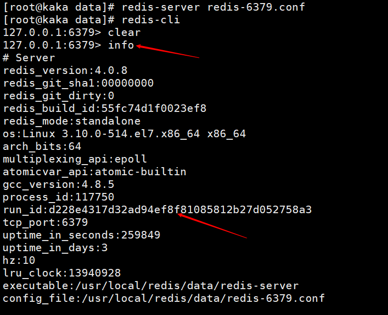

redis在启动时会自动生成一个随机的id（这里需要注意的是每次启动的id都会不一样），是由40个随机的十六进制字符串组成，用来唯一识别一个redis节点。
在主从复制初次启动时，master会把自己的runid发送给slave，slave会保存master的这个id，我们可以使用info命令查看

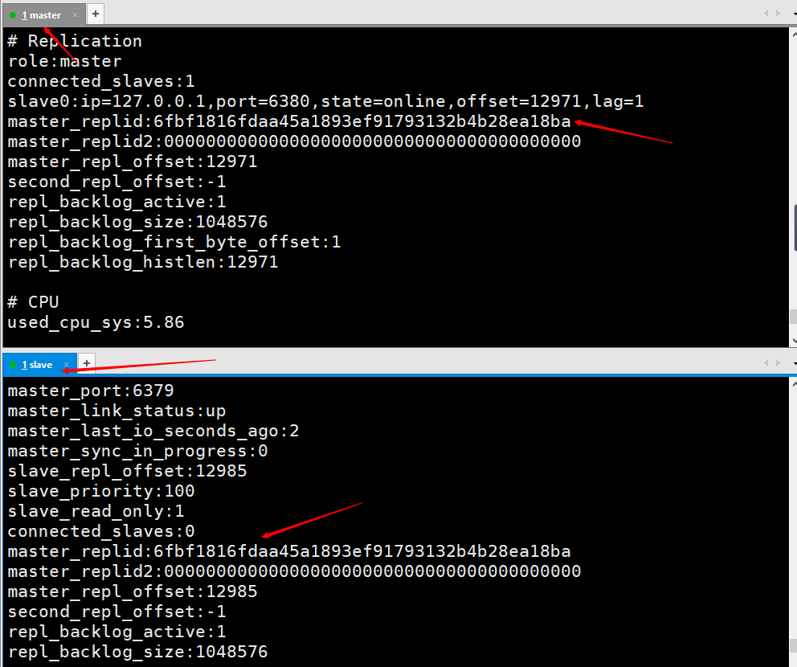

当断线重连时，slave把这个id发送给master，如果slave保存的runid与master现在的runid相同，master会尝试使用部分复制（这块能否复制成功还有一个因素就是偏移量）。如果slave保存的runid与master现在的runid不同，则会直接进行全量复制。

### 2. 复制积压缓冲区

复制缓冲积压区是一个先进先出的队列，用户存储master收集数据的命令记录。复制缓冲区的默认存储空间是1M。
可以在配置文件修改repl-backlog-size 1mb来控制缓冲区大小，这个比例可以根据自己的服务器内存来修改，咔咔这边是预留出了30%左右。

**复制缓冲区到底存储的是什么？**

当执行一个命令为set name kaka时，我们可以查看持久化文件查看

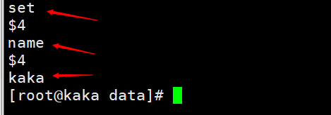

那么复制积压缓冲区就是存储的aof持久化的数据，并且以字节分开，并且每个字节都有自己的偏移量。这个偏移量也就是复制偏移量（offset）


那为什么会说复制缓冲积压区有可能会导致全量复制呢
在命令传播阶段，主节点会把收集的数据存储到复制缓冲区中，然后在发送给从节点。就是这里出现了问题，当主节点数据量在一瞬间特别大的时候，超出了复制缓冲区的内存，就会有一部分数据会被挤出去，从而导致主节点和从节点的数据不一致。从而进行全量复制。如果这个缓冲区大小设置不合理那么很大可能会造成死循环，从节点就会一直全量复制，清空数据，全量复制。

### 3. 复制偏移量（offset）

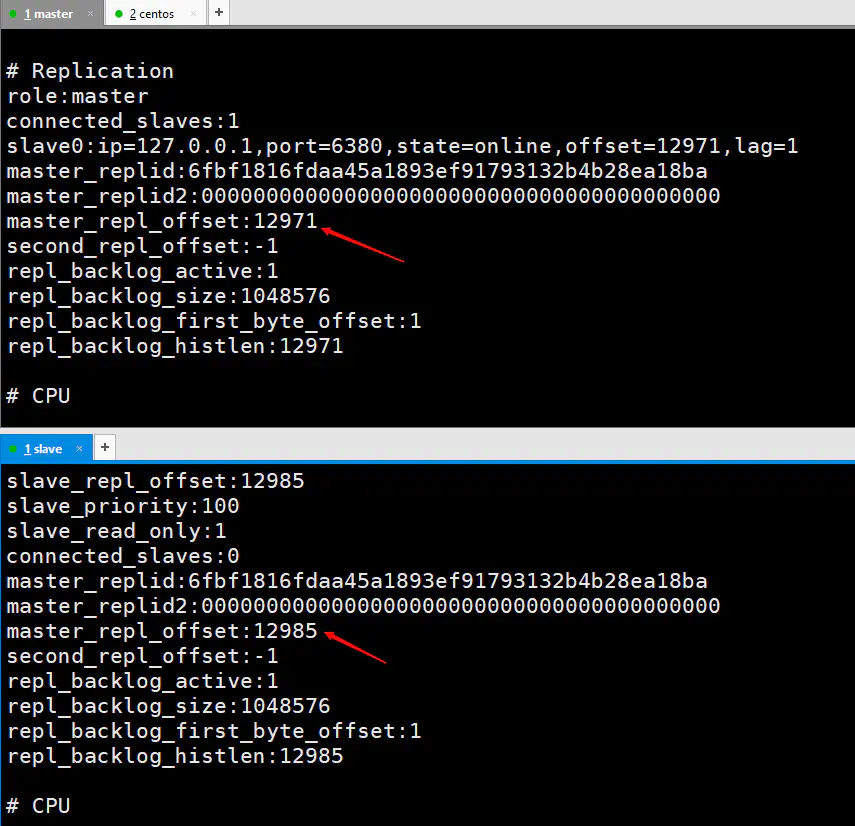

主节点复制偏移量是给从节点发送一次记录一次，从节点是接收一次记录一次。
用于同步信息，对比主节点和从节点的差异，当slave断联时恢复数据使用。
这个值也就是来自己于复制缓冲积压区里边的那个偏移量。

## 九. 主从复制常见的问题

### 1. 主节点重启问题（内部优化）

当主节点重启后，runid的值将发生变化，会导致所有的从节点进行全量复制。

这个问题我们无需考虑，知道系统是怎么优化的即可。

在建立完主从复制后主节点会创建master-replid变量，这个生成的策略跟runid一样，长度是41位，runid长度是40位，然后发送给从节点。

在主节点执行shutdown  save命令时，进行了一次RDB持久化会把runid 和 offset保存到RDB文件中。可以使用命令redis-check-rdb查看该信息。

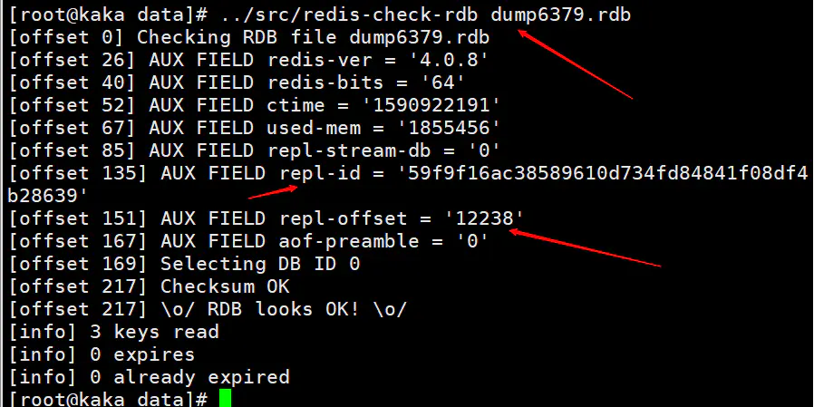

主节点重启后加载RDB文件，将文件中的repl-id  和repl-offset加载到内存中。纵使让所有从节点认为还是之前的主节点。

### 2. 从节点网络中断偏移量越界导致全量复制

由于网络环境不佳，从节点网络中断。复制积压缓冲区内存过小导致数据溢出，伴随着从节点偏移量越界，导致全量复制。有可能会导致反复的全量复制。
解决方案：修改复制积压缓冲区的大小：repl-backlog-size
设置建议：测试主节点连接从节点的时间，获取主节点每秒平均产生的命令总量write_size_per_second
复制缓冲区空间设置  =   2  *  主从连接时间   *   主节点每秒产生的数据总量

### 3. 频繁的网路中断

由于主节点的cpu占用过高，或者从节点频繁连接。出现这种情况造成的结果就是主节点各种资源被严重占用，其中包括但不限于缓冲区，宽带，连接等。
为什么会出现主节点资源被严重占用？
在心跳机制中，从节点每秒会发送一个指令replconf  ack指令到主节点。
从节点执行了慢查询，占用大量的cpu
主节点每秒调用复制定时函数replicationCron，然后从节点长时间没有相应。

**解决方案：**

- 设置从节点超时释放
- 设置参数：repl-timeout
- 这个参数默认为60秒。超过60秒，释放slave。

### 4. 数据不一致问题

由于网络因素，多个从节点的数据会不一致。这个因素是没有办法避免的。

**关于这个问题给出俩个解决方案：**

- 第一个数据需要高度一致配置一台redis服务器，读写都用一台服务器，这种方式仅限于少量数据，并且数据需高度一直。
- 第二个监控主从节点的偏移量，如果从节点的延迟过大，暂时屏蔽客户端对该从节点的访问。设置参数为slave-serve-stale-data  yes|no。  这个参数一但设置就只能响应info  slaveof等少数命令。

**5. 从节点故障**

这个问题直接在客户端维护一个可用节点列表，当从节点故障时，切换到其他节点进行工作，这个问题在后边集群会说到。

## 十. 总结

本文主要讲解了什么是主从复制、主从复制工作的三大阶段以及工作流程、部分复制的三大核心。命令传播阶段的心跳机制。最后说明了主从复制常见问题。


>作者：原来是咔咔
>链接：https://juejin.im/post/5ed5ccb66fb9a047df7ca9a4
>来源：掘金
>著作权归作者所有。商业转载请联系作者获得授权，非商业转载请注明出处。


