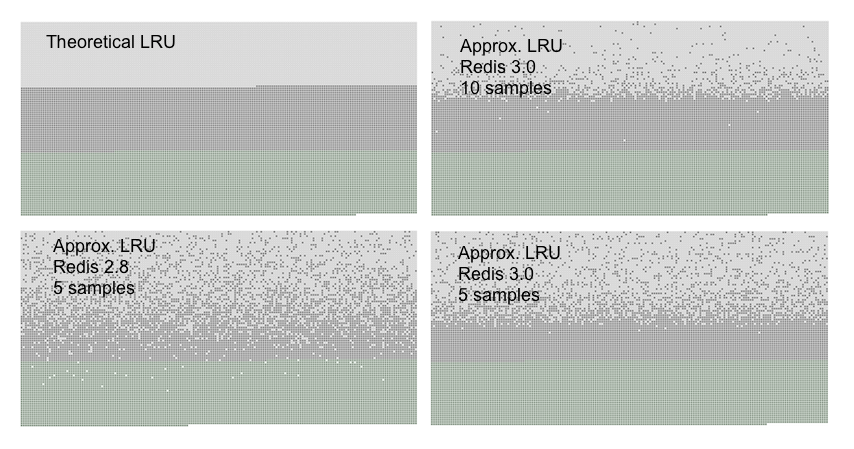

# Redis中内存淘汰算法实现

Redis的`maxmemory`支持的内存淘汰机制使得其成为一种有效的缓存方案，成为memcached的有效替代方案。

当内存达到`maxmemory`后，Redis会按照`maxmemory-policy`启动淘汰策略。

Redis 3.0中已有淘汰机制：

- noeviction
- allkeys-lru
- volatile-lru
- allkeys-random
- volatile-random
- volatile-ttl

| maxmemory-policy	| 含义	|特性 |
| ----- | ----- | ----- |
noeviction	|不淘汰	|内存超限后写命令会返回错误(如OOM, del命令除外)	
allkeys-lru	|所有key的LRU机制	在|所有key中按照最近最少使用LRU原则剔除key，释放空间	
volatile-lru	|易失key的LRU	|仅以设置过期时间key范围内的LRU(如均为设置过期时间，则不会淘汰)	
allkeys-random	|所有key随机淘汰|	一视同仁，随机	
volatile-random	|易失Key的随机	|仅设置过期时间key范围内的随机	
volatile-ttl	|易失key的TTL淘汰|	按最小TTL的key优先淘汰

其中LRU(less recently used)经典淘汰算法在Redis实现中有一定优化设计，来保证内存占用与实际效果的平衡，这也体现了工程应用是空间与时间的平衡性。

> PS：值得注意的，在主从复制模式Replication下，从节点达到maxmemory时不会有任何异常日志信息，但现象为增量数据无法同步至从节点。

## Redis 3.0中近似LRU算法

Redis中LRU是近似LRU实现，并不能取出理想LRU理论中最佳淘汰Key，而是通过从小部分采样后的样本中淘汰局部LRU键。

Redis 3.0中近似LRU算法通过增加待淘汰元素池的方式进一步优化，最终实现与精确LRU非常接近的表现。

> 精确LRU会占用较大内存记录历史状态，而近似LRU则用较小内存支出实现近似效果。

以下是理论LRU和近似LRU的效果对比：



- 按时间顺序接入不同键，此时最早写入也就是最佳淘汰键
- 浅灰色区域：被淘汰的键
- 灰色区域：未被淘汰的键
- 绿色区域：新增写入的键

总结图中展示规律，

- 图1Theoretical LRU符合预期：最早写入键逐步被淘汰
- 图2Approx LRU Redis 3.0 10 samples：Redis 3.0中近似LRU算法(采样值为10)
- 图3Approx LRU Redis 2.8 5 samples：Redis 2.8中近似LRU算法(采样值为5)
- 图4Approx LRU Redis 3.0 5 samples：Redis 3.0中近似LRU算法(采样值为5)

结论：

- 通过图4和图3对比：得出相同采样值下，3.0比2.8的LRU淘汰机制更接近理论LRU
- 通过图4和图2对比：得出增加采样值，在3.0中将进一步改善LRU淘汰效果逼近理论LRU
- 对比图2和图1：在3.0中采样值为10时，效果非常接近理论LRU

采样值设置通过maxmemory-samples指定，可通过CONFIG SET maxmemory-samples <count>动态设置，也可启动配置中指定maxmemory-samples <count>

源码解析

```cgo
int freeMemoryIfNeeded(void){
    while (mem_freed < mem_tofree) {
        if (server.maxmemory_policy == REDIS_MAXMEMORY_NO_EVICTION)
        return REDIS_ERR; /* We need to free memory, but policy forbids. */

        if (server.maxmemory_policy == REDIS_MAXMEMORY_ALLKEYS_LRU ||
                server.maxmemory_policy == REDIS_MAXMEMORY_ALLKEYS_RANDOM)
            {......}
        /* volatile-random and allkeys-random policy */
        if (server.maxmemory_policy == REDIS_MAXMEMORY_ALLKEYS_RANDOM ||
                server.maxmemory_policy == REDIS_MAXMEMORY_VOLATILE_RANDOM)
            {......}
        /* volatile-lru and allkeys-lru policy */
        else if (server.maxmemory_policy == REDIS_MAXMEMORY_ALLKEYS_LRU ||
            server.maxmemory_policy == REDIS_MAXMEMORY_VOLATILE_LRU)
        {
            // 淘汰池函数
            evictionPoolPopulate(dict, db->dict, db->eviction_pool);
            while(bestkey == NULL) {
                evictionPoolPopulate(dict, db->dict, db->eviction_pool);
                // 从后向前逐一淘汰
                for (k = REDIS_EVICTION_POOL_SIZE-1; k >= 0; k--) {
                    if (pool[k].key == NULL) continue;
                    de = dictFind(dict,pool[k].key); // 定位目标

                    /* Remove the entry from the pool. */
                    sdsfree(pool[k].key);
                    /* Shift all elements on its right to left. */
                    memmove(pool+k,pool+k+1,
                        sizeof(pool[0])*(REDIS_EVICTION_POOL_SIZE-k-1));
                    /* Clear the element on the right which is empty
                     * since we shifted one position to the left.  */
                    pool[REDIS_EVICTION_POOL_SIZE-1].key = NULL;
                    pool[REDIS_EVICTION_POOL_SIZE-1].idle = 0;

                    /* If the key exists, is our pick. Otherwise it is
                     * a ghost and we need to try the next element. */
                    if (de) {
                        bestkey = dictGetKey(de); // 确定删除键
                        break;
                    } else {
                        /* Ghost... */
                        continue;
                    }
                }
            }
        }
        /* volatile-ttl */
        else if (server.maxmemory_policy == EDIS_MAXMEMORY_VOLATILE_TTL) {......}

        // 最终选定待删除键bestkey
        if (bestkey) {
            long long delta;
            robj *keyobj = createStringObject(bestkey,sdslenbestkey)); // 目标对象
            propagateExpire(db,keyobj);
            latencyStartMonitor(eviction_latency); // 延迟监控开始
            dbDelete(db,keyobj); // 从db删除对象
            latencyEndMonitor(eviction_latency);// 延迟监控结束
            latencyAddSampleIfNeeded("eviction-del",iction_latency); // 延迟采样
            latencyRemoveNestedEvent(latency,eviction_latency);
            delta -= (long long) zmalloc_used_memory();
            mem_freed += delta; // 释放内存计数
            server.stat_evictedkeys++; // 淘汰key计数，info中可见
            notifyKeyspaceEvent(REDIS_NOTIFY_EVICTED, "evicted", keyobj, db->id); // 事件通知
            decrRefCount(keyobj); // 引用计数更新
            keys_freed++;
            // 避免删除较多键导致的主从延迟，在循环内同步
            if (slaves) flushSlavesOutputBuffers();
        }
    }
}
```


## Redis 4.0中新的LFU算法

从Redis4.0开始，新增LFU淘汰机制，提供更好缓存命中率。LFU(Least Frequently Used)通过记录键使用频率来定位最可能淘汰的键。

对比LRU与LFU的差别：

- 在LRU中，某个键很少被访问，但在刚刚被访问后其被淘汰概率很低，从而出现这类异常持续存在的缓存；相对的，其他可能被访问的键会被淘汰
- 而LFU中，按访问频次淘汰最少被访问的键

Redis 4.0中新增两种LFU淘汰机制：

- volatile-lfu：设置过期时间的键按LFU淘汰
- allkeys-lfu：所有键按LFU淘汰

LFU使用Morris counters计数器占用少量位数来评估每个对象的访问频率，并随时间更新计数器。此机制实现与近似LRU中采样类似。但与LRU不同，LFU提供明确参数来指定计数更新频率。

- lfu-log-factor：0-255之间，饱和因子，值越小代表饱和速度越快
- lfu-decay-time：衰减周期，单位分钟，计数器衰减的分钟数

这两个因子形成一种平衡，通过少量访问 VS 多次访问 的评价标准最终形成对键重要性的评判。

> 原文： <http://fivezh.github.io/2019/01/10/Redis-LRU-algorithm/>


